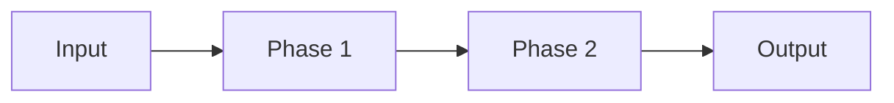
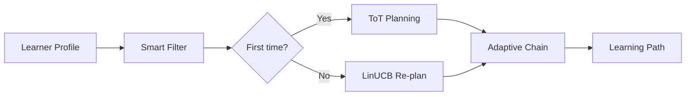

# Full Technical Specification Workflow

Generates a comprehensive 4-layer technical document for thesis defense.

---

## Quick Start Template

Copy this condensed prompt:

```
# ROLE
Principal AI Engineer preparing Master's Thesis defense documentation.

# SYSTEM CONTEXT
Agentic Personalized Learning Path - 6 agents phối hợp để tạo lộ trình học cá nhân hóa:
- Agent 1: Knowledge Extraction (LightRAG) - 6 phases
- Agent 2: Profiler (Semantic LKT) - 5 phases  
- Agent 3: Path Planner (ToT+LinUCB) - 6 phases
- Agent 4: Tutor (CoT+Socratic) - 7 phases
- Agent 5: Evaluator (JudgeLM) - 8 phases
- Agent 6: KAG/MemGPT (Tiered Memory) - 5 phases

# TARGET
Analyze: [AGENT_NAME]
Code: backend/agents/[agent]_agent.py
Docs: docs/AGENT_[N]_WHITEBOX.md

# GENERATE 5 SECTIONS:
1. HLD (Architecture Pattern, Data Flow, Integration Points)
2. Decomposition (Sub-modules, SOLID rationale, Dependencies)
3. LLD/Whitebox (State, Algorithm, Schemas, Guardrails, Errors)
4. Complexity Analysis (Time/Space, Latency, LLM calls)
5. AI Artifacts (Model config, System prompt, Techniques)

# FORMAT
Vietnamese explanations + English technical terms. Academic tone.
```

---

## Agent Reference (Pre-filled Context)

| Agent | Role | Phases | Code Path | Scientific Basis |
|-------|------|--------|-----------|------------------|
| Agent 1 | Knowledge Extraction | 6 | `backend/agents/knowledge_agent.py` | LightRAG (Guo 2024) |
| Agent 2 | Profiler | 5 | `backend/agents/profiler_agent.py` | Semantic LKT |
| Agent 3 | Path Planner | 6 | `backend/agents/path_planner_agent.py` | ToT + LinUCB |
| Agent 4 | Tutor | 7 | `backend/agents/tutor_agent.py` | CoT + Socratic |
| Agent 5 | Evaluator | 8 | `backend/agents/evaluator_agent.py` | JudgeLM (Zhu 2023) |
| Agent 6 | KAG/MemGPT | 5 | `backend/agents/kag_agent.py` | MemGPT (Packer 2023) |

---

## Full Output Structure (5 Sections)

### 1. HIGH-LEVEL DESIGN (HLD)

```markdown
#### 1.1 Architectural Pattern
- Pattern: [Multi-Agent / Pipeline / Event-driven]
- Justification: [WHY this pattern]

#### 1.2 Data Flow (Mermaid)


#### 1.3 Integration Points
| System | Protocol | Purpose |
|--------|----------|---------|
| Neo4j | Bolt | Graph storage |
| Redis | TCP | Cache/State |
| Gemini | REST | LLM calls |
```

---

### 2. TECHNICAL DECOMPOSITION

```markdown
#### 2.1 Sub-Modules
| Module | Method | Responsibility | Coupling |
|--------|--------|---------------|----------|
| Context Loader | `_load_context()` | Load from KG | Low |
| Core Logic | `_process()` | Main algorithm | Medium |
| Output Builder | `_build_response()` | Format result | Low |

#### 2.2 SOLID Rationale
- **S**ingle Responsibility: Each phase = 1 method
- **O**pen/Closed: Extensible via config
- **D**ependency Inversion: Inject Neo4j/Redis

#### 2.3 Dependency Map
| Dependency | Version | Purpose |
|------------|---------|---------|
| neo4j | 5.x | Graph queries |
| redis | 4.x | State cache |
| google-genai | 0.4.x | LLM API |
```

---

### 3. LOW-LEVEL DESIGN (LLD) & WHITEBOX

```markdown
#### 3.1 Internal State Management
- Storage: Redis with key pattern `agent:{learner_id}:{session_id}`
- TTL: 1 hour
- Invalidation: On evaluation completion

#### 3.2 Algorithm (Pseudocode)
```python
async def execute(self, input: AgentInput) -> AgentOutput:
    # Phase 1: Context
    ctx = await self._load_context(input.learner_id)
    
    # Phase 2: Process
    result = await self._core_logic(ctx)
    
    # Phase 3: Validate
    validated = self._validate(result)
    
    # Phase 4: Persist
    await self._save_state(validated)
    
    return AgentOutput(data=validated)
```

#### 3.3 Data Schemas
**Input:**
```json
{"learner_id": "uuid", "concept_id": "str", "context": {...}}
```
**Output:**
```json
{"result": {...}, "reasoning": "str", "confidence": 0.85}
```

#### 3.4 Guardrails & Validation
| Check | Implementation | Fail-Safe |
|-------|---------------|-----------|
| Input | Pydantic BaseModel | 400 Error |
| LLM Output | JSON parse + Regex | Retry 3x |
| Timeout | asyncio.timeout(30) | Cached fallback |

#### 3.5 Error Handling Matrix
| Error | Detection | Recovery | Log Level |
|-------|-----------|----------|-----------|
| LLM Timeout | 30s limit | Use cache | ERROR |
| Empty Response | len==0 | Default | WARN |
| Parse Error | JSONDecodeError | Retry | WARN |

#### 3.6 Testing Strategy
| Test Type | Coverage | Tools |
|-----------|----------|-------|
| Unit | Each phase method | pytest |
| Integration | Full execute() | pytest-asyncio |
| E2E | API endpoint | httpx |
```

---

### 4. COMPLEXITY ANALYSIS (NEW)

```markdown
#### 4.1 Time Complexity
| Phase | Complexity | Bottleneck |
|-------|------------|------------|
| Context Load | O(1) | Redis lookup |
| KG Query | O(log n) | Neo4j index |
| LLM Call | O(1) | API latency |

#### 4.2 Latency Analysis
| Scenario | LLM Calls | Est. Time |
|----------|-----------|-----------|
| Cache hit | 0 | ~50ms |
| Normal | 1 | ~500ms |
| Complex | 2-3 | ~1.5s |

#### 4.3 Resource Usage
| Resource | Usage | Limit |
|----------|-------|-------|
| Memory | ~50MB | Per request |
| Tokens | ~2K input + 1K output | Per LLM call |
| Neo4j connections | 1 | Pool: 50 |
```

---

### 5. AI ENGINEER ARTIFACTS

```markdown
#### 5.1 Model Configuration
| Parameter | Value | Justification |
|-----------|-------|---------------|
| Model | gemini-1.5-flash | Cost/speed balance |
| Temperature | 0.3 | Controlled output |
| Top_P | 0.95 | Focused diversity |
| Max Tokens | 2048 | Sufficient for task |

#### 5.2 System Prompt
```
You are an expert [ROLE] for personalized education...
[ACTUAL PROMPT FROM CODE]
```

#### 5.3 Prompt Engineering Techniques
| Technique | Used? | Example |
|-----------|-------|---------|
| Role-Play | ✅ | "You are an expert tutor" |
| Chain-of-Thought | ✅ | "Think step by step" |
| Few-Shot | ❌ | N/A |
| Output Format | ✅ | "Return JSON: {...}" |
| Negative Constraints | ✅ | "DO NOT reveal answer" |

#### 5.4 Prompt → Theory Mapping
| Prompt Section | Technique | Paper |
|----------------|-----------|-------|
| "expert tutor" | Persona | Park 2023 |
| "step by step" | CoT | Wei 2022 |
| "DO NOT" | Negative | Constitutional AI |
```

---

## Sample Output: Agent 3 (Path Planner)

<details>
<summary>Click to expand sample output</summary>

```markdown
# Agent 3: Path Planner - Full Technical Specification

## 1. HIGH-LEVEL DESIGN

### 1.1 Architectural Pattern
**Pattern:** Hybrid Decision Engine (ToT for initial, LinUCB for re-plan)
**Justification:** ToT provides deep reasoning for complex path decisions, while LinUCB enables efficient exploration-exploitation for ongoing optimization.

### 1.2 Data Flow


### 1.3 Integration Points
| System | Protocol | Purpose |
|--------|----------|---------|
| Neo4j | Bolt | Concept graph queries |
| Redis | TCP | LinUCB state persistence |
| Gemini | REST | ToT reasoning |

## 2. TECHNICAL DECOMPOSITION

### 2.1 Sub-Modules
| Method | Responsibility |
|--------|---------------|
| `_load_context()` | Load learner + concept data |
| `_smart_filter()` | Apply mastery gate |
| `_select_algorithm()` | Choose ToT vs LinUCB |
| `_tot_plan()` | Tree of Thoughts planning |
| `_linucb_replan()` | Bandit-based re-planning |
| `_adaptive_chain()` | Determine SEQUENTIAL/PARALLEL/SKIP |

## 3. LLD/WHITEBOX

### 3.1 State Management
- LinUCB state: Redis key `linucb:{learner_id}:{concept_id}`
- Format: `{A: matrix, b: vector, theta: vector}`
- TTL: 7 days

### 3.2 Algorithm
```python
async def execute(self, input):
    ctx = await self._load_context(input.learner_id)
    filtered = self._smart_filter(ctx.concepts, ctx.mastery)
    
    if ctx.is_first_time:
        path = await self._tot_plan(filtered)
    else:
        path = await self._linucb_replan(filtered, ctx.linucb_state)
    
    chained = self._adaptive_chain(path, ctx.learning_style)
    return PathOutput(path=chained, reasoning=path.reasoning)
```

## 4. COMPLEXITY ANALYSIS

| Scenario | LLM Calls | Time |
|----------|-----------|------|
| First time (ToT) | 3 | ~1.5s |
| Re-plan (LinUCB) | 0 | ~100ms |

## 5. AI ARTIFACTS

### Model Config
| Param | Value |
|-------|-------|
| Model | gemini-1.5-flash |
| Temperature | 0.7 (creative for ToT) |

### Techniques
- ✅ Tree of Thoughts (Yao 2023)
- ✅ LinUCB (Li 2010)
- ✅ Output JSON constraint
```

</details>

---

## Scientific Basis Quick Reference

| Technique | Paper | Year |
|-----------|-------|------|
| Chain-of-Thought | Wei et al. | 2022 |
| Tree of Thoughts | Yao et al. | 2023 |
| JudgeLM | Zhu et al. | 2023 |
| MemGPT | Packer et al. | 2023 |
| LightRAG | Guo | 2024 |
| LinUCB | Li et al. | 2010 |
| BKT | Corbett & Anderson | 1994 |
| Harvard 7 Principles | Chickering & Gamson | 1987 |
| Socratic Method | Plato | ~400 BCE |
| Protege Effect | Fiorella & Mayer | 2016 |

---

## Workflow Steps

1. **Select Agent** - Choose from Agent 1-6
2. **Copy Template** - Use Quick Start Template above
3. **Fill Placeholders** - Replace [AGENT_NAME] with target
4. **Run with LLM** - Use Claude/GPT-4 to generate
5. **Verify Output** - Cross-check with WHITEBOX.md
6. **Save** - Store in `docs/technical_specs/AGENT_N_FULL_SPEC.md`

---

## Output Directory

```
docs/technical_specs/
├── AGENT_1_FULL_SPEC.md
├── AGENT_2_FULL_SPEC.md
├── AGENT_3_FULL_SPEC.md
├── AGENT_4_FULL_SPEC.md
├── AGENT_5_FULL_SPEC.md
└── AGENT_6_FULL_SPEC.md
```
