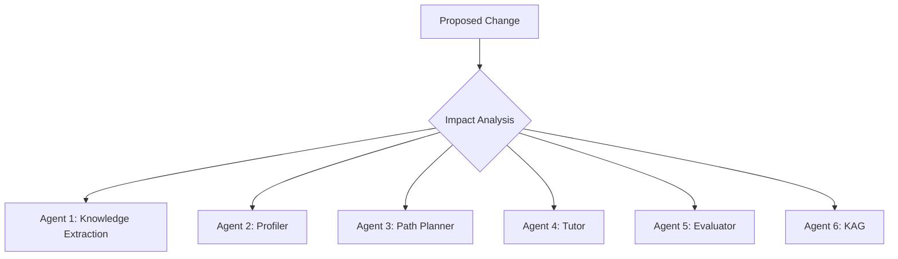

# MIS Strategic Review Workflow

This workflow applies the **MIS GRAVITY Check Framework** for strategic decision-making. Use this when evaluating new features, architecture changes, or thesis direction.

## Pre-requisites
- Load Memory Bank: `/load-memory`
- Review current `task.md` for context

## 8-Step Framework Execution

### Step 1: Define Current State
```
Command: Review relevant codebase files and documentation
Output: Structured table of current capabilities, limitations, and technical debt
```

### Step 2: Strategic Alignment Check
- [ ] How does this serve the **thesis goal** (Agentic Personalized Learning Path)?
- [ ] What is the **business value** (research contribution, scalability)?
- [ ] Does it align with existing architecture (6-Agent Multi-Agent System)?

### Step 3: Gap Analysis
| Current State | Desired State | Gap |
|---------------|---------------|-----|
| ... | ... | ... |

### Step 4: Governance & Risk Assessment
- [ ] **Compliance**: Are there any ethical implications (AI bias, data privacy)?
- [ ] **Security**: Does this introduce new attack vectors?
- [ ] **Technical Debt**: Will this increase or decrease debt?

### Step 5: Architecture Impact (Functional Decomposition)

- [ ] Which agents are affected?
- [ ] What are the dependencies?

### Step 6: Execution Roadmap
| Phase | Task | Owner | ETA |
|-------|------|-------|-----|
| 1 | ... | ... | ... |

### Step 7: Evaluation Criteria (KPIs)
- [ ] Define measurable success metrics
- [ ] For Research: Impact Factor, Acceptance Rate, Review Time, Scope Alignment
- [ ] For Engineering: Latency, Throughput, Error Rate, Test Coverage

### Step 8: Review & Decision
- [ ] Document decision in `implementation_plan.md`
- [ ] Update `task.md` with new items
- [ ] Notify stakeholders

## Output Format
Always conclude with a structured decision matrix:

| Criterion | Score (1-5) | Notes |
|-----------|-------------|-------|
| Strategic Alignment | | |
| Risk Level | | |
| Effort | | |
| Impact | | |
| **Recommendation** | GO / NO-GO / NEEDS MORE INFO |
