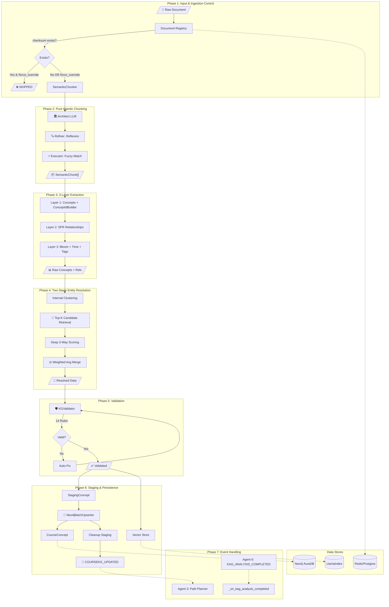

# Agent 1: Knowledge Extraction Agent

## Overview

**File:** `backend/agents/knowledge_extraction_agent.py`  
**Purpose:** Automatically builds the Course Knowledge Graph from educational documents using an **Ontology-Guided Hybrid Extraction Pipeline**. It ensures idempotency, data integrity via validation, and semantic consistency through entity resolution.

---

## 🏗️ Detailed Architecture & Pipeline



---

## 🧠 Core Technical Mechanisms

### 1. Ingestion Control & Idempotency

- **Mechanism:** SHA-256 Hashing of raw UTF-8 content.
- **Persistence:** Document status is cached in Redis (`doc_registry:{checksum}`) and persisted for 30 days.
- **Workflow:** If checksum exists, the pipeline early-exits with `SKIPPED` status unless `force_reprocess=True` is passed.
- **Force Override:** When `force_reprocess=True`, the `DocumentRegistry.register()` method receives `force_override=True`, bypassing the duplicate check and creating a new record.

### 2. Pure Agentic Chunking (AI-First)

- **Phase 1: Architect:** Uses Gemini 2.0 Flash to identify pedagogical boundaries (intro → theory → example → practice).
- **Phase 2: Refiner (Reflexion):** A secondary LLM pass critiques the proposed segmentation to ensure context integrity.
- **Phase 3: Executor:** Fuzzy string matching maps LLM text boundaries to exact character offsets.

> [!NOTE]
> `overlap_size` and `preserve_code_blocks` parameters are deprecated in `SemanticChunker`. These are handled automatically by the AI pipeline.

### 3. Iterative 3-Layer Extraction

Sequential sub-tasks to minimize LLM cognitive load:

1. **Layer 1: Concept Extraction:** Identifies discrete learning units (Nodes). Standardizes names using `ConceptIdBuilder`.
2. **Layer 2: Relationship Extraction:** Maps dependencies based on **SPR Spec**.
3. **Layer 3: Metadata Enrichment:** Adds Bloom's Taxonomy and learning time estimates.

### 4. Two-Stage Entity Resolution (CRITICAL - Scalable)

**Logic:** Resolution happens in-memory *before* any database write to ensure data purity.

- **Step A: Internal Clustering:** Merges duplicate concepts found within the same document (e.g., "Variable" in Slide 1 and "Variables" in Slide 10).
- **Step B: External Merging (Two-Stage):**
  - **Stage 1 - Candidate Retrieval:** Uses pre-computed `GeminiEmbedding` vectors to quickly find **Top-K (default: 20)** most similar existing concepts. Complexity: O(N*K) instead of O(N*M).
  - **Stage 2 - Deep Comparison:** Runs full 3-way scoring (Semantic, Structural, Contextual) only on the Top-K candidates.
- **Multi-Factor Scoring Engine:**
  - **Semantic (W=0.6):** Cosine Similarity of `GeminiEmbedding`.
    - **Signature:** `Name | Context | Description | Tags` (4-Pillar Contextual Embedding).
  - **Structural (W=0.3):** Jaccard Similarity of prerequisite sets.
  - **Contextual (W=0.1):** Overlap of semantic tags.
- **Threshold:** `0.85` for automatic `MERGE`.
- **Conflict Resolution (Weighted Average):**
  - When merging attributes (Difficulty, Time Estimate), the system calculates a weighted average based on extraction `confidence`.
  - Formula: $V_{final} = \frac{\sum (V_i \times Confidence_i)}{\sum Confidence_i}$
  - Prevents "last-write-wins" data loss and ensures scientifically rigorous updates.

### 5. Persistence & Promotion

| Step | Input | Process | Output |
|------|-------|---------|--------|
| **Staging** | Resolved Concepts/Rels | Write as `:StagingConcept` for audit trail | Neo4j Staging Nodes |
| **Batch Upsert** | Resolved Concepts/Rels | Cypher `UNWIND + MERGE` for performance | `:CourseConcept` Production Nodes |
| **Vector Store** | SemanticChunks | Embed via GeminiEmbedding → LlamaIndex | `./storage/vector_index` for RAG |
| **Event Emit** | Resolution Stats | `send_message("planner", "COURSEKG_UPDATED")` | Triggers Agent 3 re-planning |

### 6. Staging & Validation Algorithm

- **Validation (KGValidator):** Runs on **RESOLVED** (clean) data.
  - **Cycle Detection:** DFS algorithm to prevent circular dependencies.
  - **Auto-Fixer:** Resolves minor integrity issues.
- **Staging Pattern:** Cleaned data is written as `:StagingConcept` for auditing before final promotion to `:CourseConcept`.

---

## 🔧 Developer Reference

### Class-Level Constants

```python
# KnowledgeExtractionAgent
MERGE_THRESHOLD = 0.85  # Entity resolution merge threshold
TOP_K_CANDIDATES = 20  # Number of candidates for entity resolution
BATCH_SIZE = 100  # Neo4j batch upsert size
CHUNK_MIN_SIZE = 500  # Minimum chunk size
CHUNK_MAX_SIZE = 4000  # Maximum chunk size

# Domain detection for ConceptIdBuilder (3-tier strategy)
# Tier 1: KNOWN_DOMAINS lookup (fast, 0 tokens)
KNOWN_DOMAINS = {
    "sql": "sql", "database": "sql", "python": "python", ...
}
# Tier 2: LLM Classification fallback (~100 tokens, async)
# Tier 3: First word of title (ultimate fallback)

# EntityResolver (backend/utils/entity_resolver.py)
W_SEMANTIC = 0.60    # Semantic similarity weight
W_STRUCTURAL = 0.30  # Structural similarity weight
W_CONTEXTUAL = 0.10  # Contextual similarity weight
DEFAULT_CONFIDENCE_EXISTING = 1.0  # DB concepts
DEFAULT_CONFIDENCE_NEW = 0.7       # New extraction

# KGValidator (backend/utils/kg_validator.py)
DIFFICULTY_RANGE = (1, 5)         # Node validation
TIME_ESTIMATE_RANGE = (15, 120)   # Minutes validation
CYCLE_CHECK_REL_TYPES = ["REQUIRES", "NEXT", "IS_SUB_CONCEPT_OF"]
ID_PATTERN = r'^[A-Za-z0-9_]+$'   # Mixed case support

# Neo4jBatchUpserter (backend/utils/neo4j_batch_upsert.py)
DEFAULT_BATCH_SIZE = 100          # Records per UNWIND batch
DEFAULT_DIFFICULTY = 2            # Fallback difficulty
DEFAULT_BLOOM_LEVEL = "UNDERSTAND"
DEFAULT_TIME_ESTIMATE = 30        # Minutes
DEFAULT_CONFIDENCE = 0.8          # Relationship confidence
DEFAULT_WEIGHT = 0.8              # SPR relationship weight
DEFAULT_DEPENDENCY = "MODERATE"   # SPR dependency level
```

### Event Subscriptions

| Event | Source | Handler |
| ----- | ------ | ------- |
| `KAG_ANALYSIS_COMPLETED` | Agent 6 (KAG) | `_on_kag_analysis_completed()` |

### Outbound Events

| Event | Receiver | Payload Schema |
| ----- | -------- | -------------- |
| `COURSEKG_UPDATED` | Agent 3 (Planner) | `{document_id, document_title, concepts_added, concepts_merged, total_concepts, total_relationships, extraction_version, was_overwrite?}` |

### Event Handler Features

- **KAG_ANALYSIS_COMPLETED Handler**:
  - Persists recommendations to `:KAGAnalysis` node
  - Atomic bottleneck update (reset + set in single transaction)
  - Creates `is_bottleneck` and `avg_mastery` flags on `:CourseConcept`

### Key Methods

- `execute()`: Primary entry point
- `execute_with_provenance()`: Provenance-aware execution with snapshot pattern
- `_extract_concepts_from_chunk()`: Layer 1 - Concept extraction with ConceptIdBuilder
- `_extract_relationships_from_chunk()`: Layer 2 - SPR-compliant relationship extraction
- `_enrich_metadata()`: Layer 3 - Bloom level, time estimates, semantic tags
- `entity_resolver.resolve()`: Two-Stage in-memory de-duplication
- `entity_resolver.clear_embedding_cache()`: Free memory after resolution
- `validator.validate()`: Post-resolution integrity check (14 rules)
- `validator.auto_fix()`: Automatic correction for fixable issues
- `_on_kag_analysis_completed()`: Handle KAG analysis recommendations (atomic)
