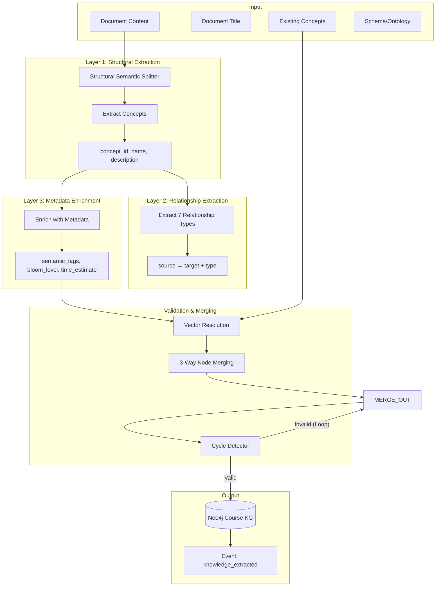

# Agent 1: Knowledge Extraction Agent

## Overview

**File:** `backend/agents/knowledge_extraction_agent.py`  
**Purpose:** Automatically builds the Course Knowledge Graph from educational documents using an Ontology-Guided Hybrid Extraction Pipeline.

---

## 🏗️ Architecture (Phase 7 Refinement)



---

## 🧠 Business Logic & Mechanisms

Agent 1 does not simply wrap an LLM. It implements a robust **Ontology-Guided Hybrid Extraction Pipeline**:

### Mechanism 1: Structural Semantic Chunking
Instead of arbitrary token splitting, documents are parsed based on their hierarchical structure (Headers 1-3, Chapters).
- **Why?** Preserves context for "nested" concepts effectively.
- **Logic:** `MarkdownSplitter` splits by `#`, `##` boundaries. LLM processes coherent sections.

### Mechanism 2: Vector-Based Entity Resolution
Prevents duplicate nodes (e.g., "JS" vs "JavaScript") using local vector search.
- **Process:**
    1. Generate embedding for new concept name.
    2. Search existing Concept Vector Index (local).
    3. If `similarity > 0.85` -> **MERGE** (Automatic Alias).
    4. If `0.7 < similarity < 0.85` -> **FLAG** for Review.

### Mechanism 3: Graph Topology Validation (DAG Enforcement)
Ensures the Knowledge Graph remains a Directed Acyclic Graph (DAG) for valid learning paths.
- **Cycle Detector:** Before committing `A REQUIRES B`, run DFS check.
- **Rule:** If adding `A->B` creates a cycle -> **REJECT** relationship & Log Warning.

---

## 📋 Features

| Feature                  | Description                                                                                         |
| ------------------------ | --------------------------------------------------------------------------------------------------- |
| **SPR Generator**        | 3-layer extraction (Concept → Relationship → Metadata)                                              |
| **7 Relationship Types** | REQUIRES, IS_PREREQUISITE_OF, NEXT, REMEDIATES, HAS_ALTERNATIVE_PATH, SIMILAR_TO, IS_SUB_CONCEPT_OF |
| **3-Way Node Merging**   | Semantic + Structural + Contextual similarity                                                       |
| **Enhanced Metadata**    | SemanticTags, Bloom's Level, TimeEstimate                                                           |

---

## 📊 Data Structures

### Enums

#### RelationshipType
```python
class RelationshipType(str, Enum):
    REQUIRES = "REQUIRES"                      # Forward dependency
    IS_PREREQUISITE_OF = "IS_PREREQUISITE_OF"  # Reverse dependency
    NEXT = "NEXT"                              # Recommended sequence
    REMEDIATES = "REMEDIATES"                  # Correction link
    HAS_ALTERNATIVE_PATH = "HAS_ALTERNATIVE_PATH"
    SIMILAR_TO = "SIMILAR_TO"
    IS_SUB_CONCEPT_OF = "IS_SUB_CONCEPT_OF"    # Hierarchy
```

#### BloomLevel
```python
class BloomLevel(str, Enum):
    REMEMBER, UNDERSTAND, APPLY, ANALYZE, EVALUATE, CREATE
```

---

## 🔧 Methods

### `execute(**kwargs)`
Main ingestion pipeline.
1. **Layer 1:** Extract core concepts using `structural_chunking`.
2. **Layer 2:** Extract relationships.
3. **Layer 3:** Enrich metadata.
4. **Validation:** Run `Vector Resolution` and `Cycle Detection`.
5. **Persist:** Save to Neo4j.

### `_merge_nodes(new, existing)`
Implements 3-Way Similarity:
- **Semantic:** Text similarity (Embeddings).
- **Structural:** Prerequisite overlap.
- **Contextual:** Tag overlap.

---

## ⚠️ Limitations

| Issue                     | Mitigation                  |
| ------------------------- | --------------------------- |
| **Token limit**           | Structural Chunking         |
| **LLM hallucination**     | Cycle Detection, Ontology   |
| **Ambiguity**             | Vector Resolution           |

---

## 📝 Configuration

```python
SEMANTIC_THRESHOLD = 0.85
STRUCTURAL_THRESHOLD = 0.7
```
