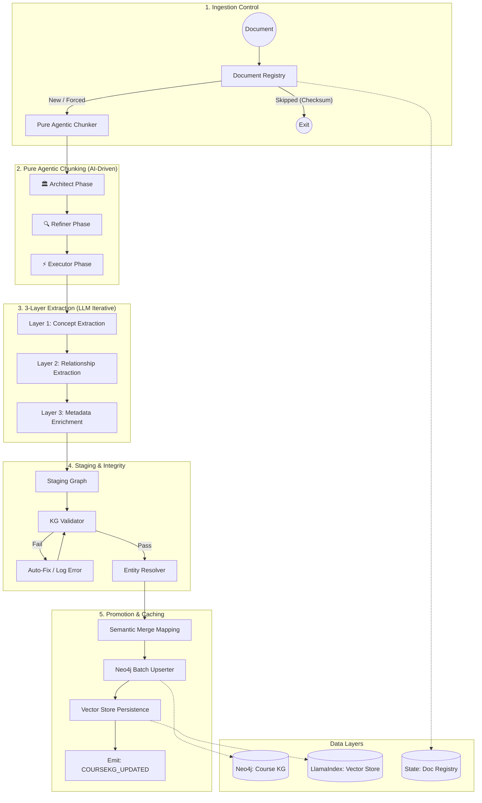

# Agent 1: Knowledge Extraction Agent

## Overview

**File:** `backend/agents/knowledge_extraction_agent.py`  
**Purpose:** Automatically builds the Course Knowledge Graph from educational documents using an **Ontology-Guided Hybrid Extraction Pipeline**. It ensures idempotency, data integrity via validation, and semantic consistency through entity resolution.

---

## 🏗️ Detailed Architecture & Pipeline



---

## 🧠 Core Technical Mechanisms

### 1. Document Registry & Idempotency

- **Mechanism:** Calculates SHA-256 checksum of raw content.
- **Why:** In production, re-uploading the same file shouldn't waste LLM tokens or corrupt the graph with duplicates.
- **Logic:** Compares current checksum with `DocumentRecord` in PostgreSQL/Redis.

### 2. Pure Agentic Chunking (NEW - AI-First Approach)

**Philosophy:** Maximize AI capabilities, minimize traditional code logic. No regex, no rule-based splitting.

**3-Phase AI Pipeline:**

1. **🏛️ Architect Phase:** LLM reads the entire document and creates a logical Table of Contents based on the *flow of ideas*, regardless of document formatting.
2. **🔍 Refiner Phase:** LLM self-reviews the proposed boundaries using the **Reflexion** technique. It asks: "Did I accidentally split examples from their concepts?" and fixes errors.
3. **⚡ Executor Phase:** Extract content based on the refined, AI-approved structure.

**Key Benefits:**

- **Format Agnostic:** Works on plain text, slides, books - no Markdown required.
- **Pedagogically Aware:** AI understands what constitutes a "complete learning unit".
- **Future-Proof:** Better LLM = better chunking without code changes.
- **Self-Correcting:** Reflexion loop catches and fixes boundary errors.

**Configuration:**

```python
AgenticChunker(
    llm=Gemini("gemini-2.0-flash"),
    max_chunk_size=4000,
    min_chunk_size=500
)
```

### 3. Staging Graph Pattern

- **Concept:** New extractions are first marked as `StagingConcept`.
- **Validation:** `KGValidator` checks for:
  - Circular dependencies (Cycle Detection).
  - Missing descriptions or essential metadata.
  - Invalid relationship types.
- **Integrity:** Only validated data is "promoted" to the master `CourseConcept`.

### 4. Vector-Based Entity Resolution

- **Module:** `EntityResolver`
- **Mechanism:** Uses `GeminiEmbedding` (`models/embedding-001`) to map new concepts to existing ones.
- **Merge Logic:**
  - If Similarity > 0.85: Automatically treats as an alias/same node.
  - If Similarity > 0.7: Flags for potential connection (`SIMILAR_TO`).
- **Result:** Prevents graph fragmentation (e.g., merging "Variables" and "Variable Basics").

### 5. Neo4j Batch Upserting

- **Module:** `Neo4jBatchUpserter`
- **Performance:** Optimized for AuraDB using `UNWIND` cypher patterns.
- **Provenance:** Every node stores a list of `source_document_ids`, tracking exactly where knowledge originated.

---

## 📋 Relationship Types (Thesis Specification)

| Type                   | Semantic Meaning                                         |
| :--------------------- | :------------------------------------------------------- |
| **REQUIRES**           | Node A cannot be understood without B.                   |
| **IS_PREREQUISITE_OF** | Higher-level dependency link.                            |
| **NEXT**               | Suggested pedagogical sequence.                          |
| **REMEDIATES**         | Advanced: Link to content that fixes a specific misconception. |
| **IS_SUB_CONCEPT_OF**  | Hierarchical parent-child relationship.                  |

---

## 🔧 Key Methods

- `execute_with_provenance()`: Handles full audit trail and document-level overwrites.
- `_enrich_metadata()`: LLM call to classify Bloom's Taxonomy and estimate learning hours.
- `_persist_vector_index()`: Updates the LlamaIndex persistent storage for Agent 4 (Tutor) to use in RAG.
