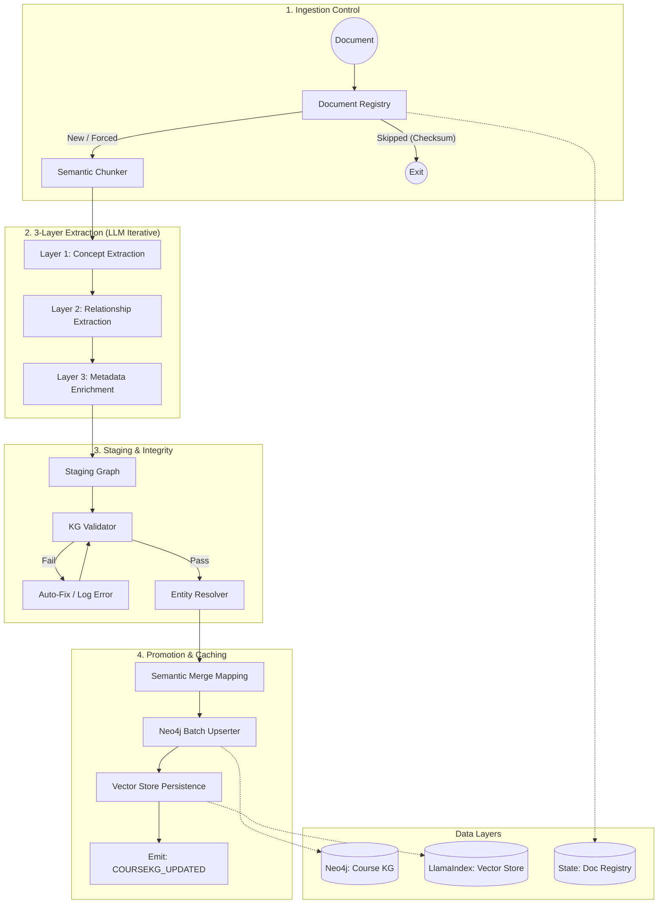

# Agent 1: Knowledge Extraction Agent

## Overview

**File:** `backend/agents/knowledge_extraction_agent.py`  
**Purpose:** Automatically builds the Course Knowledge Graph from educational documents using an **Ontology-Guided Hybrid Extraction Pipeline**. It ensures idempotency, data integrity via validation, and semantic consistency through entity resolution.

---

## 🏗️ Detailed Architecture & Pipeline

---

## 🧠 Core Technical Mechanisms

### 1. Document Registry & Idempotency
- **Mechanism:** Calculates SHA-256 checksum of raw content.
- **Why:** In production, re-uploading the same file shouldn't waste LLM tokens or corrupt the graph with duplicates.
- **Logic:** Compares current checksum with `DocumentRecord` in PostgreSQL/Redis.

### 2. Hybrid Reliable Agentic Chunking (Improved)
- **Mechanism:** Moves beyond Markdown Regex towards a Pedagogical-aware segmentation.
- **Step 1: Structural Anchoring:** Pre-processes internal text into a sequence of Sentence-level IDs. This prevents AI from splitting mid-sentence.
- **Step 2: Agentic Mapping (Gemini 2.0 Flash):** LLM analyzes the entire document flow to suggest boundaries based on learning objectives and concept shifts.
- **Step 3: Semantic Gap Verification (Math Gate):** 
    - At each proposed boundary, the system calculates the Cosine Similarity between the last sentences of Chunk A and the first sentences of Chunk B.
    - If Similarity is too high (> 0.9), the boundary is rejected (merging the chunks) to prevent context fragmentation.
- **Step 4: Recursive Fallback:** If a pedagogical chunk is still too large (> 4000 chars), a mathematical "Semantic Percentile" split is applied as a last resort.
- **Advantage:** Ensures chunks are semantically complete, context-rich, and mathematically verified, regardless of the input format (Slide, Book, etc.).

### 3. Staging Graph Pattern
- **Concept:** New extractions are first marked as `StagingConcept`.
- **Validation:** `KGValidator` checks for:
    - Circular dependencies (Cycle Detection).
    - Missing descriptions or essential metadata.
    - Invalid relationship types.
- **Integrity:** Only validated data is "promoted" to the master `CourseConcept`.

### 4. Vector-Based Entity Resolution
- **Module:** `EntityResolver`
- **Mechanism:** Uses `GeminiEmbedding` (`models/embedding-001`) to map new concepts to existing ones.
- **Merge Logic:** 
    - If Similarity > 0.85: Automatically treats as an alias/same node.
    - If Similarity > 0.7: Flags for potential connection (`SIMILAR_TO`).
- **Result:** Prevents graph fragmentation (e.g., merging "Variables" and "Variable Basics").

### 5. Neo4j Batch Upserting
- **Module:** `Neo4jBatchUpserter`
- **Performance:** Optimized for AuraDB using `UNWIND` cypher patterns.
- **Provenance:** Every node stores a list of `source_document_ids`, tracking exactly where knowledge originated.

---

## 📋 Relationship Types (Thesis Specification)

| Type | Semantic Meaning |
| :--- | :--- |
| **REQUIRES** | Node A cannot be understood without B. |
| **IS_PREREQUISITE_OF** | Higher-level dependency link. |
| **NEXT** | Suggested pedagogical sequence. |
| **REMEDIATES** | Advanced: Link to content that fixes a specific misconception. |
| **IS_SUB_CONCEPT_OF** | Hierarchical parent-child relationship. |

---

## 🔧 Key Methods

- `execute_with_provenance()`: Handles full audit trail and document-level overwrites.
- `_enrich_metadata()`: LLM call to classify Bloom's Taxonomy and estimate learning hours.
- `_persist_vector_index()`: Updates the LlamaIndex persistent storage for Agent 4 (Tutor) to use in RAG.
