# Agent 1: Knowledge Extraction Agent

## Overview

**File:** `backend/agents/knowledge_extraction_agent.py`  
**Purpose:** Automatically builds the Course Knowledge Graph from educational documents using an **Ontology-Guided Hybrid Extraction Pipeline**. It ensures idempotency, data integrity via validation, and semantic consistency through entity resolution.

---

## 🏗️ Detailed Architecture & Pipeline

```mermaid
graph TD
    subgraph "1. Ingestion Control"
        IN1[/"📄 Input: Raw Document (PDF/MD/DOCX)"/]
        IN1 --> REG[Document Registry]
        REG -- "New / Forced" --> CHUNK[Pure Agentic Chunker]
        REG -- "Skipped" --> OUT1[/"❌ Output: SKIPPED Status"/]
    end

    subgraph "2. Pure Agentic Chunking"
        CHUNK --> ARCH[🏛️ Architect: LLM plans TOC]
        ARCH --> REF[🔍 Refiner: Reflexion self-correction]
        REF --> EXEC[⚡ Executor: Fuzzy text matching]
        EXEC --> OUT2[/"📦 Output: SemanticChunk[]"/]
    end

    subgraph "3. 3-Layer Extraction"
        OUT2 --> L1[Layer 1: Concept Extraction]
        L1 --> L2[Layer 2: Relationship Extraction]
        L2 --> L3[Layer 3: Metadata Enrichment]
        L3 --> OUT3[/"📊 Output: Concepts[] + Relationships[]"/]
    end

    subgraph "4. Two-Stage Entity Resolution"
        OUT3 --> RESOLVE[🧩 Entity Resolver]
        RESOLVE --> INTERNAL[Internal Clustering & Averaging]
        INTERNAL --> CAND[🔎 Candidate Retrieval: Top-K Vector]
        CAND --> DEEP[Deep 3-Way Scoring]
        DEEP --> CONFLICT[⚖️ Weighted Conflict Resolution]
        CONFLICT --> VAL[🛡️ KG Validator: Cycle Detection]
        VAL -- Fail --> FIX[Auto-Fix]
        FIX --> VAL
        VAL --> OUT4[/"✅ Output: Resolved & Validated Data"/]
    end

    subgraph "5. Persistence & Promotion"
        OUT4 --> STAGE[Staging Graph]
        STAGE --> BATCH[🚀 Neo4j Batch Upserter]
        BATCH --> OUT5A[/"🗄️ Output: :CourseConcept Nodes"/]
        OUT4 --> VECTOR[Vector Store Persistence]
        VECTOR --> OUT5B[/"🔍 Output: LlamaIndex VectorStore"/]
        OUT4 --> EVENT[Emit: COURSEKG_UPDATED]
        EVENT --> OUT5C[/"📡 Output: Event to Agent 3"/]
    end

    subgraph "Data Stores"
        NEO[(Neo4j: Course KG)]
        VEC[(LlamaIndex: Vector Store)]
        DB[(Redis/Postgres: Doc Registry)]
    end

    REG -.-> DB
    BATCH -.-> NEO
    VECTOR -.-> VEC
```

---

## 🧠 Core Technical Mechanisms

### 1. Ingestion Control & Idempotency

- **Mechanism:** SHA-256 Hashing of raw UTF-8 content.
- **Persistence:** Document status is cached in Redis (`doc_registry:{checksum}`) and persisted for 30 days.
- **Workflow:** If checksum exists, the pipeline early-exists with `SKIPPED` status unless `force_reprocess=True` is passed.

### 2. Pure Agentic Chunking (AI-First)

- **Phase 1: Architect:** Uses Gemini 2.0 Flash to identify pedagogical boundaries (intro -> theory -> example -> practice).
- **Phase 2: Refiner (Reflexion):** A secondary LLM pass critics the proposed segmentation to ensure context integrity.
- **Phase 3: Executor:** Fuzzy string matching maps LLM text boundaries to exact character offsets.

### 3. Iterative 3-Layer Extraction

Sequential sub-tasks to minimize LLM cognitive load:

1. **Layer 1: Concept Extraction:** Identifies discrete learning units (Nodes). Standardizes names using `ConceptIdBuilder`.
2. **Layer 2: Relationship Extraction:** Maps dependencies based on **SPR Spec**.
3. **Layer 3: Metadata Enrichment:** Adds Bloom's Taxonomy and learning time estimates.

### 4. Two-Stage Entity Resolution (CRITICAL - Scalable)

**Logic:** Resolution happens in-memory *before* any database write to ensure data purity.

- **Step A: Internal Clustering:** Merges duplicate concepts found within the same document (e.g., "Variable" in Slide 1 and "Variables" in Slide 10).
- **Step B: External Merging (Two-Stage):**
  - **Stage 1 - Candidate Retrieval:** Uses pre-computed `GeminiEmbedding` vectors to quickly find **Top-K (default: 20)** most similar existing concepts. Complexity: O(N*K) instead of O(N*M).
  - **Stage 2 - Deep Comparison:** Runs full 3-way scoring (Semantic, Structural, Contextual) only on the Top-K candidates.
- **Multi-Factor Scoring Engine:**
  - **Semantic (W=0.6):** Cosine Similarity of `GeminiEmbedding`.
  - **Structural (W=0.3):** Jaccard Similarity of prerequisite sets.
  - **Contextual (W=0.1):** Overlap of semantic tags.
- **Threshold:** `0.85` for automatic `MERGE`.
- **Conflict Resolution (Weighted Average):**
  - When merging attributes (Difficulty, Time Estimate), the system calculates a weighted average based on extraction `confidence`.
  - Formula: $V_{final} = \frac{\sum (V_i \times Confidence_i)}{\sum Confidence_i}$
  - Prevents "last-write-wins" data loss and ensures scientifically rigorous updates.

### 5. Persistence & Promotion

| Step | Input | Process | Output |
|------|-------|---------|--------|
| **Staging** | Resolved Concepts/Rels | Write as `:StagingConcept` for audit trail | Neo4j Staging Nodes |
| **Batch Upsert** | Resolved Concepts/Rels | Cypher `UNWIND + MERGE` for performance | `:CourseConcept` Production Nodes |
| **Vector Store** | SemanticChunks | Embed via GeminiEmbedding → LlamaIndex | `./storage/vector_index` for RAG |
| **Event Emit** | Resolution Stats | `send_message("planner", "COURSEKG_UPDATED")` | Triggers Agent 3 re-planning |

### 6. Staging & Validation Algorithm

- **Validation (KGValidator):** Runs on **RESOLVED** (clean) data.
  - **Cycle Detection:** DFS algorithm to prevent circular dependencies.
  - **Auto-Fixer:** Resolves minor integrity issues.
- **Staging Pattern:** Cleaned data is written as `:StagingConcept` for auditing before final promotion to `:CourseConcept`.

---

## 🔧 Developer Reference

- `execute_with_provenance()`: Primary entry point.
- `_architect_phase()`: Generates logical TOC via LLM.
- `entity_resolver.resolve()`: Two-Stage in-memory de-duplication engine.
- `entity_resolver._retrieve_candidates()`: Vector-based Top-K candidate retrieval.
- `validator.validate()`: Post-resolution integrity check.
