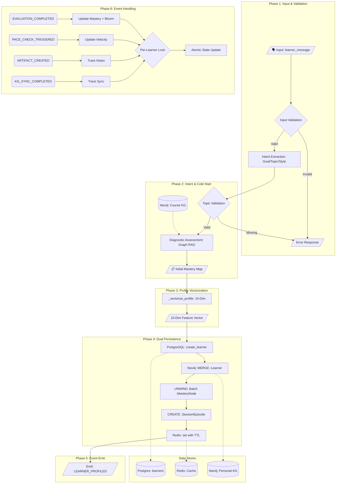

# Agent 2: Learner Profiler Agent

## Overview

**File:** `backend/agents/profiler_agent.py`  
**Purpose:** Constructs and maintains a multidimensional **Learner Profile** (10-dim vector + Personal Knowledge Graph). It acts as the "State Manager" for the personalized learning experience, evolving in real-time based on learner interactions.

---

## 🏗️ Detailed Architecture & Pipeline



---

## 🔧 Class-Level Constants

```python
REDIS_PROFILE_TTL = 3600      # 1 hour cache expiry
PROFILE_VECTOR_DIM = 10       # 10-dimensional feature vector
```

---

## 🧠 Core Technical Mechanisms (Deep Dive)

### 1. Input Validation (Phase 1)

| Validation | Check | Action |
|------------|-------|--------|
| `learner_message` | Non-empty string | Return error if invalid |
| `learner_name` | String type | Fallback to "Learner" |
| `topic` | Exists in profile_data | Return error if missing |

### 2. Intent Extraction & Cold-Start (Phase 2)

| Step | Input | Process | Output |
|------|-------|---------|--------|
| **Intent Extraction** | User Message | LLM Extracts: Topic, Purpose, Constraint, Level | Structured Goal JSON |
| **Diagnostic** | Topic + Level | Graph RAG → Top-5 Anchors → Question Gen | `mastery_estimates` |
| **Fallback** | Failed diagnostic | Log warning, proceed with empty mastery | Empty `{}` |

### 3. Profile Vectorization (10-Dimensional)

| Dim | Field | Description |
|-----|-------|-------------|
| 0 | `knowledge_state` | Average Mastery (0-1) |
| 1-4 | `learning_style` | One-hot: Visual/Audit/Read/Kinesthetic |
| 5 | `skill_level` | Normalized: 0.2/0.5/0.8 |
| 6 | `time_available` | Normalized hours |
| 7 | `bloom_avg` | Weighted Bloom's Taxonomy |
| 8 | `learning_velocity` | Concepts/hour |
| 9 | `topic_length` | Normalized scope |

### 4. Dual Persistence (Phase 4)

| Store | Operation | Key Features |
|-------|-----------|--------------|
| **PostgreSQL** | `create_learner()` | Structured profile data |
| **Neo4j** | `MERGE :Learner` | Idempotent upsert with ON CREATE/ON MATCH |
| **Neo4j** | `UNWIND :MasteryNode` | Batch O(1) creation |
| **Redis** | `set()` with TTL | Hot cache, `REDIS_PROFILE_TTL` seconds |

**Neo4j Learner Node Pattern:**
```cypher
MERGE (l:Learner {learner_id: $learner_id})
ON CREATE SET l.name = $name, l.created_at = datetime(), ...
ON MATCH SET l.goal = $goal, l.last_updated = datetime()
```

### 5. Personal KG Schema

| Entity Type | Cypher Pattern | Purpose |
|-------------|----------------|---------|
| `:Learner` | `(l:Learner {learner_id: ...})` | Root node (MERGE ensures no duplicates) |
| `:MasteryNode` | `(l)-[:HAS_MASTERY]->(m)-[:MAPS_TO_CONCEPT]->(c)` | Bridge to Course Concepts |
| `:SessionEpisode` | `(l)-[:HAS_SESSION]->(s)` | Learning session tracking |

### 6. Real-Time Event Handling

#### Event: `EVALUATION_COMPLETED`
- **Source:** Agent 5 (Evaluator)
- **Process:**
  1. Acquire **Async Lock** (`learner_id`)
  2. **LKT Update**: Predict new mastery using Semantic History (`_predict_mastery_lkt`)
  3. **Bloom Logic:** $Bloom = 0.6 \times Score + 0.25 \times Difficulty + 0.15 \times QuestionType$
  4. **Interest Decay:** $\lambda = 0.95$

#### Event: `PACE_CHECK_TRIGGERED`
- **Source:** Agent 3 / Timer
- **Process:**
  1. Calculate `learning_velocity`
  2. Auto-adjust difficulty

---

## 📤 Outbound Events

| Event | Receiver | Payload Schema |
|-------|----------|----------------|
| `LEARNER_PROFILED` | Agent 3 (Planner) | `{learner_id, goal, topic, time_available, initial_mastery}` |

---

## 🔧 Developer Reference

### Key Methods

| Method | Purpose |
|--------|---------|
| `execute()` | Main entry point for initial profiling |
| `_parse_goal_with_intent()` | LLM-based goal structuring |
| `_run_diagnostic_assessment()` | Graph RAG hybrid retrieval |
| `_vectorize_profile()` | Converts object to 10-dim vector |
| `_on_evaluation_completed()` | Critical event handler for mastery |
| `_on_pace_check()` | Velocity-based difficulty adjustment |

### Exceptions

| Exception | When Raised |
|-----------|-------------|
| `VersionConflictError` | Optimistic locking fails during concurrent updates |

### ID Generation

- **Format:** `user_{uuid.hex[:12]}` (12 hex chars = 48 bits = 281T unique IDs)
- **Example:** `user_a1b2c3d4e5f6`
