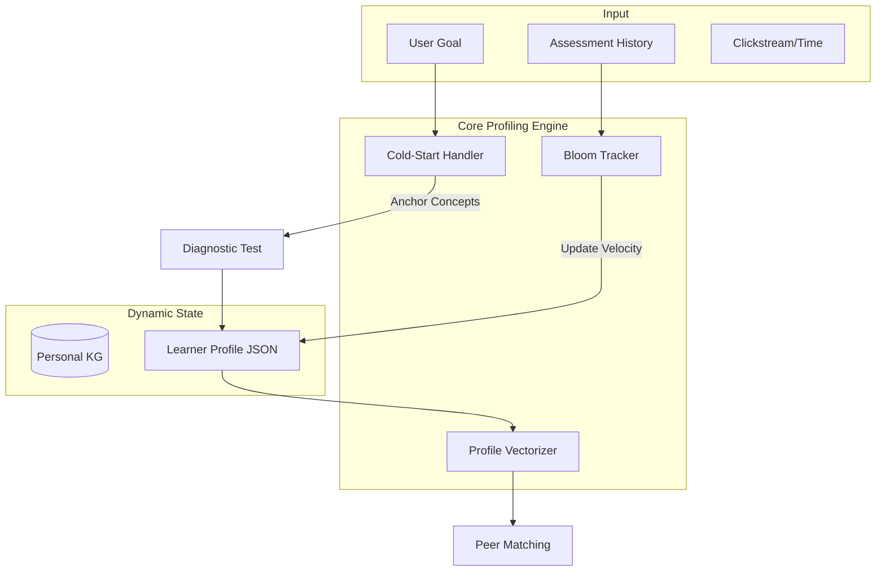

# Agent 2: Profiler Agent

## Overview

**File:** `backend/agents/profiler_agent.py`  
**Purpose:** Builds and maintains 17-dimensional Learner Profile with real-time event updates.

---

## 🏗️ Architecture (Phase 7 Refinement)

---

## 🧠 Business Logic & Mechanisms

### 1. Cold-Start Heuristic (Anchor Concepts)
Solves the "New Learner Problem" by intelligently seeding the profile.
- **Problem:** No history to make recommendations.
- **Logic:**
    1. Select 5 **Anchor Concepts** from Course KG (Nodes with highest Degree Centrality).
    2. Administer a mini-diagnostic test on these anchors.
    3. Result determines initial `current_level` (Beginner/Intermediate/Advanced) and `concept_mastery_map`.

### 2. Bloom Taxonomy Tracking
Differentiates between "Rote Memorization" and "Deep Understanding".
- **Problem:** A score of 0.8 could mean 80% on multiple choice (Remembering), not necessarily understanding.
- **Logic:**
    - Track mastery individually for each Bloom Level:
        - `mastery_remember`: 0.9
        - `mastery_analyze`: 0.3
    - **Action:** If `analyze < 0.4`, the Profiler signals the Tutor to switch to `SocraticState.PROBING` to force deeper thinking.

### 3. Dynamic Interest Decay
Ensures the profile stays relevant to the learner's *current* focus.
- **Logic:** Apply a time-decay factor ($\lambda = 0.95$) to `focused_tags`.
- **Effect:** Interests from 3 months ago fade out unless reinforced.

---

## 📋 17-Dimensional Profile Structure

| Dimension | Field | Description |
| :--- | :--- | :--- |
| 1-3 | ID, Name, Goal | Basic identity and objective |
| 4 | `current_level` | Beginner/Intermediate/Advanced |
| 5 | `preferred_style` | Visual/Textual/Kinesthetic |
| 7 | `learning_velocity` | Dynamic pace estimation |
| 9 | `concept_mastery_map` | Detailed breakdown of knowledge |
| 11 | `error_patterns` | Recurring taxonomies of mistakes |
| 16 | `profile_version` | Optimistic locking for concurrency |

---

## 🔧 Event Handlers

- `_on_evaluation_completed`: Updates mastery (dim 9, 10, 11, 15) when Evaluator finishes.
- `_on_pace_check`: Recalculates learning velocity (dim 7).
- `_on_artifact_created`: Tracks notes and summaries generated by Agent 6.
