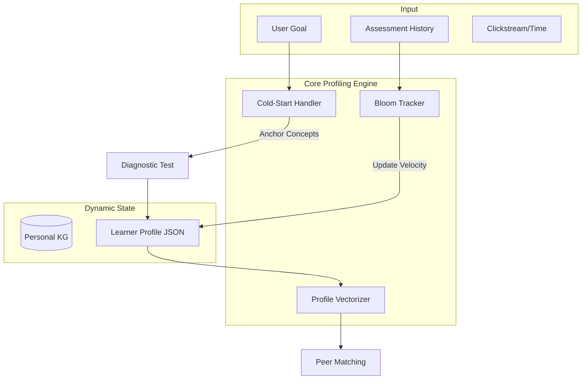

# Agent 2: Profiler Agent

## Overview

**File:** `backend/agents/profiler_agent.py`  
**Lines:** 846 | **Methods:** 19

Builds and maintains 17-dimensional Learner Profile with real-time event updates.

## Key Features

1. **Goal Parsing & Intent Extraction** - Topic, Purpose, Constraint, Level
2. **Diagnostic Assessment** - 3-5 concept probes for initial mastery
3. **Profile Vectorization** - Embedding for similarity search
4. **Real-time Event Updates** - Optimistic locking for concurrency

---

## 🏗️ Architecture (Phase 7 Refinement)



## 🧠 Business Logic & Mechanisms

Agent 2 implements a **Multi-Dimensional Profiling System**:

### Mechanism 1: Cold-Start Heuristic (Anchor Concepts)
Solves the "New Learner Problem" by intelligently seeding the profile.
- **Problem:** No history to make recommendations.
- **Logic:**
    1. Select 5 **Anchor Concepts** from Course KG (Nodes with highest Degree Centrality).
    2. Administer a mini-diagnostic test on these anchors.
    3. Result determines initial `current_level` (Beginner/Intermediate/Advanced) and `concept_mastery_map`.

### Mechanism 2: Bloom Taxonomy Tracking
Differentiates between "Rote Memorization" and "Deep Understanding".
- **Problem:** A score of 0.8 could mean 80% on multiple choice (Remembering), not necessarily understanding.
- **Logic:**
    - Track mastery individually for each Bloom Level:
        - `mastery_remember`: 0.9
        - `mastery_analyze`: 0.3
    - **Action:** If `analyze < 0.4`, the Profiler signals the Tutor to switch to `SocraticState.PROBING` to force deeper thinking.

### Mechanism 3: Dynamic Interest Decay
Ensures the profile stays relevant to the learner's *current* focus.
- **Logic:** Apply a time-decay factor ($\lambda = 0.95$) to `focused_tags`.
- **Effect:** Interests from 3 months ago fade out unless reinforced.

## Diagnostic States

```python
DiagnosticState:
    NOT_STARTED, IN_PROGRESS, COMPLETED
```

## Main Methods

| Method                         | Purpose                                        |
| ------------------------------ | ---------------------------------------------- |
| `execute()`                    | Create/update learner profile                  |
| `_parse_goal_with_intent()`    | Extract Topic, Purpose, Constraint, Level      |
| `_run_diagnostic_assessment()` | Generate & assess 3-5 diagnostic questions     |
| `_vectorize_profile()`         | Create embedding [KnowledgeState, Style, Goal] |
| `_on_evaluation_completed()`   | Update mastery when Evaluator finishes         |
| `_on_pace_check()`             | Update learning_velocity                       |
| `_on_artifact_created()`       | Track generated notes                          |
| `_estimate_bloom_level()`      | 3-signal Bloom estimation                      |

## 17-Dimensional Profile

```
1. learner_id          10. completed_concepts
2. name                11. error_patterns
3. goal                12. time_budget
4. current_level       13. hours_used
5. preferred_style     14. preferred_content_types
6. session_count       15. avg_mastery_level
7. learning_velocity   16. profile_version (locking)
8. attention_span      17. last_updated
9. concept_mastery_map
```

## Event Subscriptions

| Event                  | Handler                    | Updates           |
| ---------------------- | -------------------------- | ----------------- |
| `EVALUATION_COMPLETED` | `_on_evaluation_completed` | dim 9,10,11,15    |
| `PACE_CHECK`           | `_on_pace_check`           | dim 7             |
| `ARTIFACT_CREATED`     | `_on_artifact_created`     | artifact tracking |

## Dependencies

- `LearnerProfile` model - 17 dimensions
- `VersionConflictError` - Optimistic locking
- Neo4j Personal KG - ErrorEpisode, ArtifactEpisode nodes
