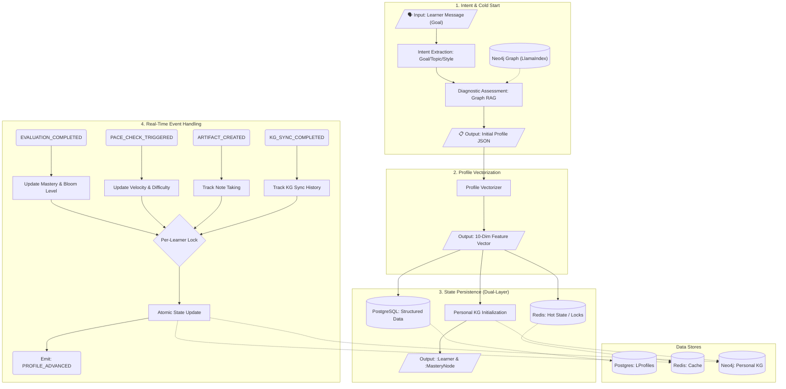

# Agent 2: Learner Profiler Agent

## Overview

**File:** `backend/agents/profiler_agent.py`  
**Purpose:** Constructs and maintains a multidimensional **Learner Profile** (10-dim vector + Personal Knowledge Graph). It acts as the "State Manager" for the personalized learning experience, evolving in real-time based on learner interactions.

---

## 🏗️ Detailed Architecture & Pipeline

---

## 🧠 Core Technical Mechanisms (Deep Dive)

### 1. Intent Extraction & Cold-Start

| Step | Input | Process | Output |
|------|-------|---------|--------|
| **Intent Extraction** | User Message ("I want to learn SQL for my job") | LLM Extracts: Topic (SQL), Purpose (Job), Constraint (Time) | Structured Goal JSON |
| **Diagnostic** | Topic + Skill Level | **Graph RAG Strategy**: 1. **Hybrid Retrieval**: `PropertyGraphIndex` searches Vector + Text + Graph Traversal. 2. **Centrality Reranking**: Sort candidates by Neo4j Degree Centrality. 3. **Selection**: Pick Top-5 Anchors. 4. **Question Gen**: Dynamic LLM generation. | Initial `concept_mastery_map` |

### 2. Profile Vectorization (10-Dimensional)

Converts the rich profile object into a mathematical vector for similarity matching (Peer Matching) and difficulty adjustment.

**Key Dimensions:**
- **Dim 0:** `knowledge_state` (Average Mastery)
- **Dim 1-4:** `learning_style` (One-hot: Visual/Audit/Read/Kinesthetic)
- **Dim 5:** `skill_level` (Normalized: 0.2/0.5/0.8)
- **Dim 6:** `time_available` (Normalized)
- **Dim 7:** `bloom_avg` (Weighted average of Bloom's Taxonomy level)
- **Dim 8:** `learning_velocity` (Concepts completed / hour)
- **Dim 9:** `topic_length` (Normalized scope)

### 3. Personal KG Initialization (Dual-KG Layer 3)

Instead of just storing a JSON profile, Agent 2 initializes a private subgraph for the learner in Neo4j.

| Entity Type | Cypher Pattern | Purpose |
|-------------|----------------|---------|
| `:Learner` | `(l:Learner {learner_id: ...})` | Root node for the learner. |
| `:MasteryNode` | `(l)-[:HAS_MASTERY]->(m)-[:MAPS_TO_CONCEPT]->(c)` | Bridge node linking Learner to Course Concepts. Stores `score`, `bloom_level`. |
| `:SessionEpisode` | `(l)-[:HAS_SESSION]->(s)` | Tracks active learning sessions. |

### 4. Real-Time Event Handling (Async State Machine)

Agent 2 acts as a reactive state machine, handling events from other agents.

#### Event: `EVALUATION_COMPLETED`
- **Source:** Agent 5 (Evaluator)
- **Trigger:** Learner finishes a quiz/test.
- **Process:**
  1. Acquire **Async Lock** (`learner_id`) to prevent race conditions.
  2. Update `concept_mastery_map` with new score.
  3. **Bloom Logic:** Calculate Bloom Level using multi-signal formula:
     $$Bloom = 0.6 \times Score + 0.25 \times Difficulty + 0.15 \times QuestionType$$
  4. **Interest Decay:** Apply $\lambda = 0.95$ to fade old tags.
  5. **Optimistic Locking:** Increment `version` to ensure consistency.

#### Event: `PACE_CHECK_TRIGGERED`
- **Source:** System Timer / Agent 3
- **Trigger:** Periodic check of learning speed.
- **Process:**
  1. Calculate `learning_velocity = concepts_done / hours_spent`.
  2. **Auto-Adjust:**
     - If `velocity > 1.2` (Too fast) → Set `difficulty_next = HARD`.
     - If `velocity < 0.8` (Too slow) → Set `difficulty_next = EASY`.

---

## 🔧 Developer Reference

- `execute()`: Main entry point for initial profiling.
- `_parse_goal_with_intent()`: LLM-based goal structuring.
- `_vectorize_profile()`: Converts object to 10-dim list.
- `_on_evaluation_completed()`: Critical event handler for mastery updates.
- `VersionConflictError`: Raised if Optimistic Locking fails.
