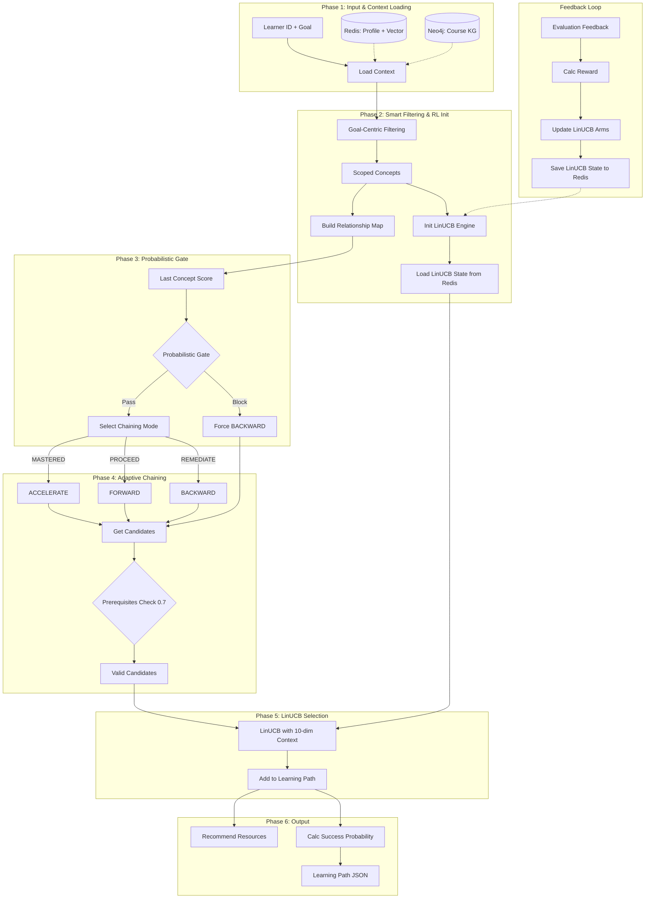

# Agent 3: Path Planner Agent

## Overview

**File:** `backend/agents/path_planner_agent.py`  
**Purpose:** Generates optimal, personalized learning sequences using **LinUCB (Contextual Bandit)** with adaptive chaining and **Probabilistic Gating**.

---

## 🏗️ Architecture & Control Flow



---

## 🧠 Key Technical Mechanisms

### 1. Goal-Centric Filtering (Phase 2)

Instead of loading ALL concepts from the KG, Agent 3 uses **smart scoping**:

| Strategy | When | Logic |
| -------- | ---- | ----- |
| **Personal Subgraph** | User has history | Start from `:MasteryNode` nodes, expand to neighbors |
| **Topic + Centrality** | Cold-start user | Filter by topic, rank by graph centrality |
| **Limit** | Always | Max 100 concepts to prevent overload |

### 2. LinUCB (Contextual Bandit)

Scientific Basis: Li et al., 2010 - Yahoo! Research

| Component | Description |
| --------- | ----------- |
| **Context** | 10-dim profile vector from Agent 2 |
| **A Matrix** | 10×10 covariance matrix (per concept) |
| **b Vector** | 10×1 reward accumulator |
| **α (alpha)** | Exploration parameter |

**State Persistence:** `linucb:{concept_id}` → Redis (A, b matrices serialized as JSON).

### 3. Probabilistic Gating (Phase 3)

Replaces hard 0.8 threshold with soft probability:

```python
gate_prob = min(1.0, score / 0.8)
```

- Score 0.8+ → 100% pass
- Score 0.6 → 75% pass (25% chance of remediation)
- Score 0.4 → 50% pass

### 4. Adaptive Chaining (Phase 4)

| Feature | Description |
| ------- | ----------- |
| **Prerequisites Threshold** | Unified to **0.7** across all checks |
| **Cold-Start Root Selection** | Selects concepts with NO prerequisites |
| **ACCELERATE Look-ahead** | 2-step look-ahead WITH prereq check |
| **REVIEW Spaced Repetition** | Prioritizes concepts with mastery 0.7-0.9 (needs review) |

### 5. LinUCB Selection (Phase 5)

| Feature | Description |
| ------- | ----------- |
| **Time Filtering** | Concepts exceeding `time_available` are excluded before selection |
| **Initial Mastery** | Calculated based on difficulty: `max(0.1, 0.5 - difficulty × 0.08)` |
| **Prereq Check** | Removed from RL Engine (already done by `_get_chain_candidates`) |

### 6. Output Generation (Phase 6)

| Feature | Description |
| ------- | ----------- |
| **Success Probability** | Uses live `current_mastery` (not outdated profile) |
| **Resources** | Placeholder types (TODO: integrate with CMS) |
| **Primary Type** | Consolidated with `_recommend_content_type` logic |

---

## 🔄 Adaptive Chaining Modes

| Mode | Trigger | Graph Edges Used |
| ---- | ------- | ---------------- |
| **FORWARD** | Score 0.8-0.9 | `NEXT`, `IS_PREREQUISITE_OF` |
| **BACKWARD** | Score < 0.6 | `REQUIRES` (prerequisites) |
| **LATERAL** | Stuck | `SIMILAR_TO`, `HAS_ALTERNATIVE_PATH` |
| **ACCELERATE** | Score > 0.95 | `NEXT` (2-step), `IS_SUB_CONCEPT_OF` |
| **REVIEW** | New session (10%) | Past concepts with mastery 0.7-0.9 |

---

## 📦 Output Structure

| Field | Description |
| ----- | ----------- |
| `learning_path` | Ordered list of concept objects with metadata |
| `success_probability` | `0.4×avg_mastery + 0.4×time_fit - 0.2×difficulty_penalty` |
| `pacing` | `RELAXED`, `MODERATE`, or `AGGRESSIVE` |
| `chain_mode` | The logic used (e.g., `FORWARD`) |
| `resources` | List with `primary_type` + `recommended_resources` per concept |

---

## � Feedback Loop

Processes evaluation results from Agent 5 to update RL models.

| Feature | Description |
| ------- | ----------- |
| **Reward Formula** | `R = 0.6×score + 0.4×completion - penalty` |
| **LinUCB Arm Loading** | Loads from Redis if not in memory before update |
| **Context Recovery** | Loads `linucb_context:{id}` from Redis if not in event |
| **In-Memory Sync** | Syncs MAB stats after Redis update |
| **Retry Mechanism** | 3 attempts with exponential backoff |

---

## �🔗 Dependencies

| From | Data |
| ---- | ---- |
| **Agent 2 (Profiler)** | `profile_vector` (10-dim), `topic`, `time_available` |
| **Agent 5 (Evaluator)** | `EVALUATION_COMPLETED` event with score, passed, context_vector |
| **Neo4j** | `:CourseConcept`, `:Learner`, `:MasteryNode` nodes |
| **Redis** | `profile:{id}`, `linucb:{concept_id}`, `mab_stats:{id}`, `linucb_context:{id}` |
