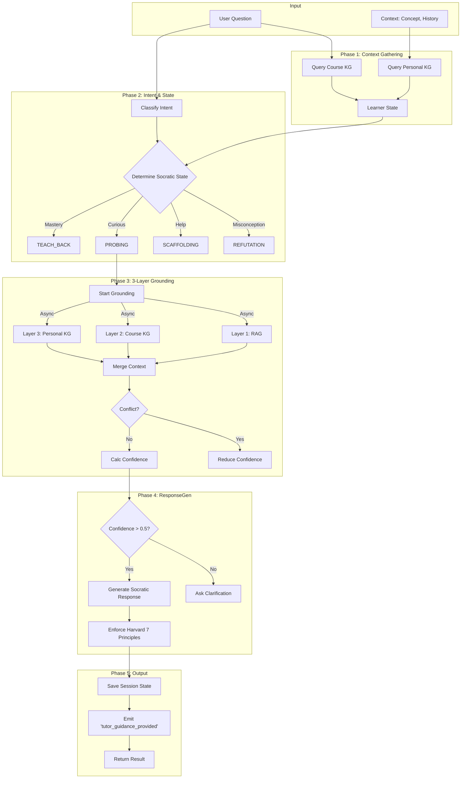

# Agent 4: Tutor Agent Flow

## 1. High-Level Control Flow

The Tutor Agent executes a **Reverse Socratic Method** driven by a state machine and supported by varying layers of data grounding.

## 2. Key Components

### 2.1 Reverse Socratic State Machine
Logic determines the next pedagogical step based on `hint_level`, `conversation_turns`, and `mastery`.

| State | Condition | Goal |
| :--- | :--- | :--- |
| **PROBING** | Default or SENSE_MAKING intent | Deepen understanding via questions. |
| **SCAFFOLDING** | HELP_SEEKING or `hint_level=1` | Provide conceptual support. |
| **GUIDING** | `hint_level=2` | Give structural hints (analogies). |
| **EXPLAINING** | `hint_level=3` | Direct explanation. |
| **CONCLUSION** | `hint_level=4` or >5 turns | Synthesize and close. |
| **REFUTATION** | Misconception detected | Correct factual errors. |
| **TEACH_BACK** | Mastery > 0.7 (40% chance) | Ask learner to explain. |

### 2.2 3-Layer Grounding (Async)
Parallel retrieval from three sources to ensure hallucination-free responses.

1.  **RAG (Layer 1)**: `_rag_retrieve` (Vector Store). weight=0.4
2.  **Course KG (Layer 2)**: `_course_kg_retrieve` (Neo4j). weight=0.35
3.  **Personal KG (Layer 3)**: `_personal_kg_retrieve` (Neo4j). weight=0.25

**Conflict Detection**: If RAG content contradicts Course KG (semantic similarity < 0.6), Course KG is trusted, and confidence is penalized.

### 2.3 Harvard Enforcer
Post-processing step that validates the response against principles like:
-   **Active Learning**: Does it ask a question?
-   **Cognitive Load**: Is it short (2-4 sentences)?
-   **Feedback**: Does it acknowledge the user's input?
