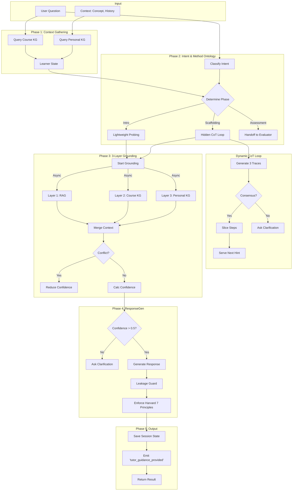

# Agent 4: Tutor Agent Flow

## 1. High-Level Control Flow

The Tutor Agent executes a **Reverse Socratic Method** driven by a state machine and supported by varying layers of data grounding.

## 2. Key Components

### 2.1 Hybrid Architecture: Method Ontology + CoT
The Agent uses a high-level **Method Ontology** (Chandrasekaran 1999) to manage the pedagogical goal, and **Chain-of-Thought** (Wei 2022) to generate the content.

| Phase | Condition | Mechanism |
| :--- | :--- | :--- |
| **INTRO** | New Concept | Lightweight Probing (Socratic Question). |
| **SCAFFOLDING** | Concept identified | **Hidden CoT**: Generates internal traces, slices them, and serves step-by-step hints. |
| **ASSESSMENT** | Mastery check needed | **Handoff**: Transfers control to Agent 5 (Evaluator) for grading. |

### 2.2 3-Layer Grounding (Async)
Parallel retrieval from three sources to ensure hallucination-free responses.

1.  **RAG (Layer 1)**: `_rag_retrieve` (Vector Store). weight=0.4
2.  **Course KG (Layer 2)**: `_course_kg_retrieve` (Neo4j). weight=0.35
3.  **Personal KG (Layer 3)**: `_personal_kg_retrieve` (Neo4j). weight=0.25

**Conflict Detection**: If RAG content contradicts Course KG (semantic similarity < 0.6), Course KG is trusted, and confidence is penalized.

### 2.3 Harvard Enforcer
Post-processing step that validates the response against principles like:
-   **Active Learning**: Does it ask a question?
-   **Cognitive Load**: Is it short (2-4 sentences)?
-   **Feedback**: Does it acknowledge the user's input?
