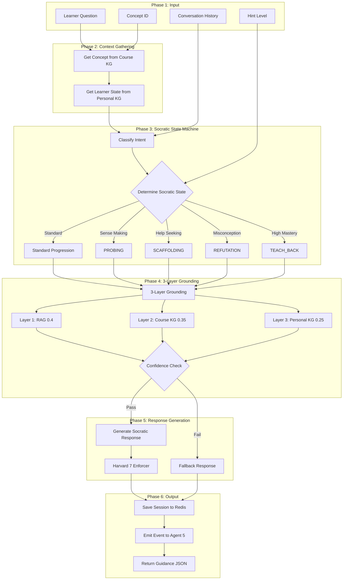

# Agent 4: Tutor Agent

## Overview

**File:** `backend/agents/tutor_agent.py`  
**Purpose:** Teaches using Harvard 7 Principles and a Reverse Socratic Method supported by a 3-layer grounding system.

---

## 🏗️ Architecture & Control Flow



---

## 🧠 Reverse Socratic State Machine (8 States)

| State | Trigger | Purpose |
| ----- | ------- | ------- |
| **PROBING** | Default / Sense-Making intent | Ask open-ended questions |
| **SCAFFOLDING** | Help-Seeking intent | Provide conceptual hints |
| **GUIDING** | hint_level ≥ 2 | Structural hints / analogies |
| **EXPLAINING** | hint_level ≥ 3 | Direct instruction |
| **CONCLUSION** | hint_level ≥ 4 or 5+ turns | Synthesize answer |
| **REFUTATION** | Misconception detected | Challenge incorrect beliefs |
| **ELABORATION** | Near-correct answer | Expand on partial understanding |
| **TEACH_BACK** | High mastery (>0.7) + 40% random | Learner explains back (Protégé Effect) |

### State Progression Flow

```text
Standard: PROBING → SCAFFOLDING → GUIDING → EXPLAINING → CONCLUSION
Special:  REFUTATION → PROBING (verify correction)
          ELABORATION → CONCLUSION (wrap up)
          TEACH_BACK → CONCLUSION (end cycle)
```

### Scientific Basis
- **Socratic Dialogue Framework**: Collins & Stevens, 1982
- **Protégé Effect**: Bargh & Schul, 1980


---

## 🛡️ 3-Layer Grounding (Anti-Hallucination Stack)

### Scientific Basis (2024 Research)

| Framework | Source | Application |
| --------- | ------ | ----------- |
| **HybridRAG** | arXiv 2024 | Combines vector RAG with KG retrieval |
| **TruthfulRAG** | ResearchGate 2024 | KG-based factual conflict resolution |
| **HybGRAG** | GraphRAG.com 2024 | Retriever bank + Critic module |

### Layer Weights & Roles

| Layer | Source | Weight | Role |
| ----- | ------ | ------ | ---- |
| **Layer 1: RAG** | Vector DB (LlamaIndex) | 0.40 | Examples, broad coverage |
| **Layer 2: Course KG** | Neo4j | 0.35 | Definitions, misconceptions (curated) |
| **Layer 3: Personal KG** | Neo4j | 0.25 | Learner's past errors, notes |

### Trust Hierarchy (Conflict Resolution)

```text
1. Course KG (Curated, validated) - HIGHEST TRUST
2. Personal KG (Learner-specific context)
3. RAG (Raw documents) - LOWEST TRUST
```

### Conflict Detection Mechanism

```python
# New Feature: Automatic conflict detection between RAG and KG
CONFLICT_THRESHOLD = 0.6   # Semantic similarity < 0.6 = conflict
CONFLICT_PENALTY = 0.1     # Reduce confidence when conflict detected

async def _detect_conflict(rag_chunks, kg_definition):
    # Method 1: LLM-based semantic comparison (primary)
    # Method 2: Jaccard word similarity (fallback)
    
    if similarity < CONFLICT_THRESHOLD:
        return True, similarity  # Conflict detected
    return False, similarity
```

| Scenario | Action |
| -------- | ------ |
| RAG matches KG | Use both, full confidence |
| RAG conflicts with KG | Trust KG, apply confidence penalty |
| Only RAG available | Use RAG, flag as "low confidence" |
| Only KG available | Use KG, high confidence |

**Conflict Strategy**: If RAG content contradicts KG definition → Trust KG, log warning, reduce confidence by 0.1.

### Dynamic Course KG Scoring

```python
score = (
    0.30 if definition else 0.0 +   # Critical
    0.20 if examples else 0.0 +      # Learning aid
    0.20 if misconceptions else 0.0 + # Anti-hallucination
    0.15 if prerequisites else 0.0 +  # Context
    0.15 if similar_concepts else 0.0 # Related
)
```

### Parallel Execution

```python
results = await asyncio.gather(
    self._rag_retrieve(query, concept_id),
    self._course_kg_retrieve(concept_id),
    self._personal_kg_retrieve(learner_id, concept_id)
)
```

### Confidence Calculation

```python
confidence = W_DOC * doc_score + W_KG * kg_score + W_PERSONAL * personal_score
# If confidence < 0.5 → Fallback to ask clarification
```

---

## 🎓 Harvard 7 Principles Enforcement

Every response is audited by `Harvard7Enforcer`:

| Principle | Application |
| --------- | ----------- |
| **Active Learning** | Socratic questions engage learner |
| **Immediate Feedback** | Real-time response on understanding |
| **Prior Knowledge** | Personal KG provides learner history |
| **Cognitive Load** | State machine manages hint progression |
| **Time on Task** | Session state tracks conversation turns |
| **High Expectations** | TEACH_BACK challenges advanced learners |
| **Diverse Talents** | Intent classification adapts to learner needs |

---

## 🔧 Interaction Cycle (execute method)

1. **Get Concept**: Query Course KG for concept details
2. **Get Learner State**: Query Personal KG for mastery, misconceptions, learning_style
3. **Classify Intent**: LLM classifies question (HELP_SEEKING / SENSE_MAKING / GENERAL)
4. **Determine Socratic State**: Based on hint_level, mastery, intent
5. **3-Layer Grounding**: RAG + Course KG + Personal KG (parallel with asyncio.gather)
6. **Confidence Check**: If < 0.5, return fallback response
7. **Generate Response**: LLM with Socratic prompt template
8. **Harvard Enforcer**: Apply Harvard 7 Principles to response
9. **Save Session**: Store state in Redis
10. **Emit Event**: Notify Agent 5 (Evaluator)

---

## 📦 Output Structure

| Field | Description |
| ----- | ----------- |
| `success` | Boolean indicating completion |
| `guidance` | The tutoring response text (Harvard enforced) |
| `follow_up_question` | Socratic question to continue dialogue |
| `socratic_state` | Current state (e.g., `PROBING`) |
| `next_state` | Predicted next state in progression |
| `confidence` | Grounding confidence score (0-1) |
| `grounding_sources` | Which layers contributed to response |
| `hint_level` | Current hint level (0-4) |
| `timestamp` | ISO timestamp |

---

## � Event Payload (to Agent 5)

| Field | Description |
| ----- | ----------- |
| `learner_id` | Learner identifier |
| `concept_id` | Concept being taught |
| `socratic_state` | Current Socratic state |
| `hint_level` | Current hint level (0-4) |
| `guidance` | Response content for evaluation |
| `follow_up_question` | Socratic question asked |

---

## �🔗 Dependencies

| From | Data |
| ---- | ---- |
| **Agent 3** | `PATH_PLANNED` event with first concept |
| **Agent 5** | `EVALUATION_COMPLETED` event with results |
| **Neo4j** | `:CourseConcept`, `:Learner`, `:MasteryNode` |
| **Vector DB** | Document embeddings for RAG |
| **Redis** | `tutor_session:{learner_id}:{concept_id}` (TTL: 24h) |

