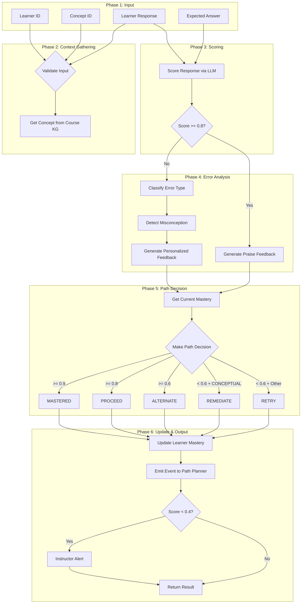

# Agent 5: Evaluator Agent

## Overview

**File:** `backend/agents/evaluator_agent.py`  
**Purpose:** Assesses learner understanding, classifies errors, tracks mastery via weighted moving average, and makes 5-path pedagogical decisions.

---

## 🏗️ Architecture & Control Flow



---

## 📥 Input Validation (Phase 1)

### Required Inputs

| Field | Type | Required | Validation |
| ----- | ---- | -------- | ---------- |
| `learner_id` | String | ✅ Yes | Strip + format check |
| `concept_id` | String | ✅ Yes | Strip + format check |
| `learner_response` | String | ✅ Yes | Strip + non-empty |
| `expected_answer` | String | ⚠️ Optional | Warning if missing |

### ID Format Validation

```python
ID_PATTERN = re.compile(r'^[a-zA-Z0-9_-]+$')
```

Valid: alphanumeric, underscore, hyphen only.

### Event Input Support

Supports both `learner_response` and `learner_answer` naming for backward compatibility.

---

## 📂 Context Gathering (Phase 2)

### Concept Cache with TTL

```python
self._concept_cache = {}  # {concept_id: {"data": concept, "timestamp": time}}
self._cache_ttl = 3600  # 1 hour TTL
```

### Cache Logic

| State | Action |
| ----- | ------ |
| Cache hit + TTL valid | Return `copy()` from cache |
| Cache miss | Query KG, store `copy()` with timestamp |
| Cache stale (TTL expired) | Re-query KG, update cache |

### Cypher Query

```cypher
MATCH (c:CourseConcept {concept_id: $concept_id})
OPTIONAL MATCH (c)-[:HAS_PREREQUISITE]->(prereq:CourseConcept)
RETURN c, c.common_misconceptions as misconceptions,
       collect(DISTINCT prereq.concept_id) as prerequisites
```

---

## 🎯 Scoring Engine

Agent 5 uses **LLM-based scoring**:

```python
score = LLM_Score(learner_response, expected_answer)  # 0-1 float
score = max(0.0, min(1.0, score))  # Clamp to valid range
```

### Score Thresholds

| Score | Interpretation |
| ----- | -------------- |
| ≥ 0.9 | Fully correct (MASTERED) |
| ≥ 0.8 | Correct (PROCEED or generate praise) |
| 0.6-0.79 | Partially correct (ALTERNATE/RETRY) |
| < 0.6 | Mostly incorrect (REMEDIATE/RETRY) |
| < 0.4 | Critical failure (Trigger Instructor Alert) |

### Fallback Scoring

If LLM response fails to parse:

```python
# Word overlap fallback (capped at 0.8)
overlap = len(learner_words & expected_words) / len(expected_words)
score = min(0.8, overlap)
```

---

## 🔍 Error Types

| Type | Condition | Example |
| :--- | :--- | :--- |
| **CORRECT** | Score ≥ 0.8 | Correct answer |
| **CARELESS** | Simple typo or arithmetic mistake | "SELCT" instead of "SELECT" |
| **INCOMPLETE** | Partially correct but lacks detail | Correct but missing edge cases |
| **PROCEDURAL** | Wrong approach or steps | Right concept, wrong method |
| **CONCEPTUAL** | Fundamental misunderstanding | "WHERE joins tables" (confuses with JOIN) |

---

## 🧠 Path Decision Engine (Thesis Table 3.10)

| Decision | Score Condition | Action |
| -------- | --------------- | ------ |
| **MASTERED** | ≥ 0.9 | Advance to next concept |
| **PROCEED** | ≥ 0.8 | Advance, flag for light review |
| **ALTERNATE** | 0.6-0.79 | Try different example or explanation |
| **REMEDIATE** | < 0.6 + CONCEPTUAL | Go back to prerequisites |
| **RETRY** | < 0.6 + (CARELESS/INCOMPLETE/PROCEDURAL) | Same concept, new question |

---

## 📋 Mastery Tracking

Uses a **Weighted Moving Average**:

```python
new_mastery = (current_mastery * 0.4) + (score * 0.6)
```

| Factor | Weight | Rationale |
| ------ | ------ | --------- |
| Current Mastery | 0.4 | Historical performance |
| New Score | 0.6 | Recent performance weighted higher |

---

## 🔧 Interaction Cycle (execute method)

1. **Validate Input**: Check learner_id, concept_id, learner_response
2. **Get Concept**: Query Course KG for concept details
3. **Score Response**: LLM scores learner response (0-1)
4. **Classify Error**: If score < 0.8, determine error type
5. **Detect Misconception**: Identify mistaken belief
6. **Generate Feedback**: Personalized, addresses specific misconception
7. **Make Path Decision**: Based on score and error type
8. **Update Mastery**: Weighted moving average update
9. **Emit Event**: Notify Path Planner of decision
10. **Instructor Alert**: If score < 0.4, trigger notification

---

## 📦 Output Structure

| Field | Type | Description |
| ----- | ---- | ----------- |
| `success` | Boolean | Evaluation completed |
| `score` | Float | 0-1 score |
| `error_type` | String | CORRECT/CARELESS/INCOMPLETE/PROCEDURAL/CONCEPTUAL |
| `misconception` | String/None | Detected misconception |
| `feedback` | String | Personalized feedback |
| `decision` | String | MASTERED/PROCEED/ALTERNATE/REMEDIATE/RETRY |
| `new_mastery` | Float | Updated mastery level |
| `timestamp` | String | ISO timestamp |

---

## 📡 Event Payload (to Path Planner)

| Field | Description |
| ----- | ----------- |
| `learner_id` | Learner identifier |
| `concept_id` | Concept evaluated |
| `score` | Evaluation score |
| `decision` | Path decision (MASTERED/PROCEED/etc.) |
| `new_mastery` | Updated mastery level |

---

## 🔔 Event Triggers

| Event | Direction | Description |
| ----- | --------- | ----------- |
| `TUTOR_ASSESSMENT_READY` | Inbound | Listen for Tutor's assessment request |
| `evaluation_complete` | Outbound | Notify Path Planner of result |
| `INSTRUCTOR_ALERT` | Outbound | Notify instructor of critical failure (score < 0.4) |

---

## 🔗 Dependencies

| From | Data |
| ---- | ---- |
| **Agent 4** | `tutor_guidance_provided` event with context |
| **Agent 3** | Receives `evaluation_complete` for path adjustment |
| **Neo4j** | `:CourseConcept` for concept details |
| **Redis** | `learner_mastery:{learner_id}:{concept_id}` |
| **InstructorNotificationService** | For critical failure alerts |
