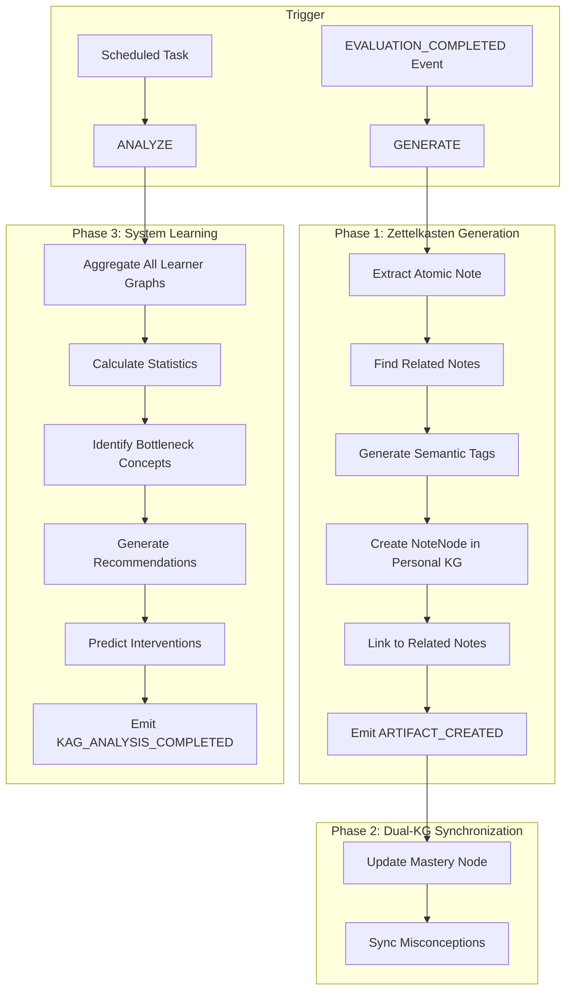

# Agent 6: KAG Agent Flow (Knowledge Graph Aggregator)

## 1. High-Level Architecture

The KAG Agent is responsible for **Knowledge Alignment**, **Artifact Generation**, and **System-Wide Learning**.

## 2. Core Workflows

### 2.1 Zettelkasten Generation (Real-time)
Triggered by `EVALUATION_COMPLETED` (Score >= 0.8).
1.  **Extraction**: LLM extracts `key_insight`, `personal_example`, `common_mistake` from session.
2.  **Grounding**: Finds related existing notes in Personal KG for context.
3.  **Storage**: Creates `NoteNode` and links via `[:LINKS_TO]`.

### 2.2 Dual-KG Sync (Personal <-> Course)
Ensures Personal KG stays aligned with Course KG updates.
-   **Mastery Sync**: Updates `[:HAS_MASTERY]` based on Evaluator scores.
-   **Misconception Sync**: Logs `[:HAS_MISCONCEPTION]` for persistent error tracking.

### 2.3 System Learning (Batch/Async)
Aggregates data across ALL learners (N > 5).
-   **Bottleneck Detection**:
    -   `Avg Mastery < 0.4` -> Difficult Concept.
    -   `Struggle Rate > 0.6` -> Priority Intervention.
-   **Recommendation Engine**: Suggests content improvements (e.g., "Add more examples for SQL_JOIN").
