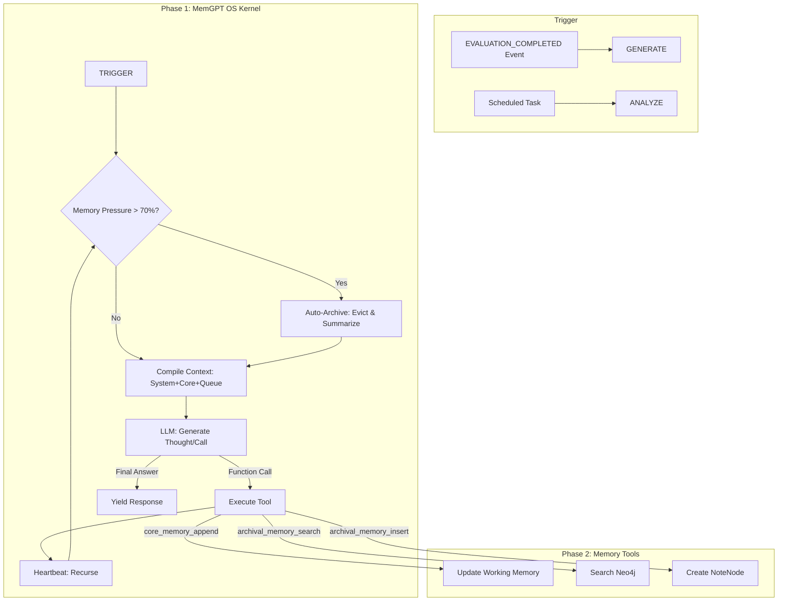

# Agent 6: KAG Agent Flow (Knowledge Graph Aggregator)

## 1. High-Level Architecture

The KAG Agent is responsible for **Knowledge Alignment**, **Artifact Generation**, and **System-Wide Learning**.

## 2. Core Workflows

### 2.1 OS Kernel (Heartbeat Loop)
The `execute` method runs a recursive loop (max 5 steps):
1.  **Monitor**: Checks `WorkingMemory.is_pressure_high()` (Token Limit).
2.  **Interrupt**: If high, evicts 50% of queue, summarizes, and stores to Archive.
3.  **Act**: LLM decides to call a tool (e.g., `archival_memory_search`) or answer.
4.  **Recurse**: If tool called, loop continues (Heartbeat) with tool output in context.

### 2.2 Zettelkasten Generation (Legacy/Tool)
*Exposed as `generate_artifact` tool.*
1.  **Extraction**: LLM extracts `key_insight`, `personal_example`.
2.  **Grounding**: Finds related existing notes.
3.  **Storage**: Creates `NoteNode` in Neo4j.

### 2.3 System Learning (Batch)
Aggregates data across ALL learners to find bottleneck concepts.
