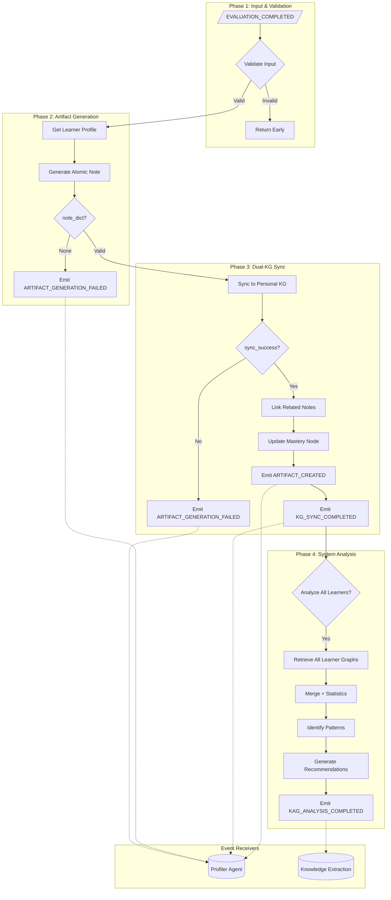

# Agent 6: KAG Agent (Knowledge Graph Aggregator)

## Overview

**File:** `backend/agents/kag_agent.py`  
**Purpose:** Aggregator responsible for Zettelkasten artifact generation, Dual-KG synchronization, and Cross-Learner system analysis.

---

## 🏗️ Architecture & Control Flow



---

## 📥 Input Validation (Phase 1)

### Class-Level Constants

```python
# Input Validation
ID_PATTERN = re.compile(r'^[a-zA-Z0-9_-]+$')
MIN_LEARNERS_FOR_ANALYSIS = 5

# Phase 2: Artifact Generation
MASTERY_THRESHOLD = 0.8  # Bloom's research (80-90%)

# Phase 4: Pattern Identification
DIFFICULT_THRESHOLD = 0.4
EASY_THRESHOLD = 0.8
STRUGGLE_MASTERY_THRESHOLD = 0.5
PRIORITY_STRUGGLE_THRESHOLD = 0.6
MODERATE_STRUGGLE_THRESHOLD = 0.3
```

### Required Inputs

| Field | Type | Required | Validation |
| ----- | ---- | -------- | ---------- |
| `learner_id` | String | ✅ Yes | Strip + ID_PATTERN |
| `concept_id` | String | ✅ Yes | Strip + ID_PATTERN |
| `session_data` | Dict | ⚠️ Optional | Contains question, answer, feedback |

### Action Types

| Action | Method | Description |
| ------ | ------ | ----------- |
| `generate_artifact` | `_generate_artifact()` | Create Zettelkasten note |
| `sync_kg` | `_sync_dual_kg()` | Sync Personal KG |
| `analyze` | `_analyze_system()` | Cross-learner analysis |

### Error Event

```python
message_type="KAG_EXECUTION_FAILED"  # Uppercase convention
```

---

## 📝 Zettelkasten Artifact Generation (Phase 2)

### Process Flow

```python
# Step 1: Extract Atomic Note from session
atomic_note = await self._extract_atomic_note(concept_id, session_data)

# Step 2: Find related notes via semantic similarity
related_notes = await self._find_related_notes(learner_id, atomic_note)

# Step 3: Generate semantic tags
tags = await self._generate_tags(atomic_note)

# Step 4: Create NoteNode in Personal KG
note_id = await self._create_note_node(learner_id, concept_id, atomic_note, related_notes, tags)

# Step 5: Create links to related notes
await self._create_note_links(note_id, related_notes)
```

### Artifact Types

| Type | Condition | Content |
| ---- | --------- | ------- |
| **ATOMIC_NOTE** | score >= 0.8 | Key insight + personal example |
| **MISCONCEPTION_NOTE** | score < 0.8 | Error documentation for future reference |

### Node Schema

```cypher
(Learner) -[:CREATED_NOTE]-> (NoteNode)
(NoteNode) -[:ABOUT]-> (CourseConcept)
(NoteNode) -[:LINKS_TO]-> (ExistingNoteNode)
```

---

## 🔄 Dual-KG Synchronization (Phase 3)

### KG Boundaries

| KG | Access | Purpose |
| -- | ------ | ------- |
| **Course KG** | Read-only | Shared, static knowledge |
| **Personal KG** | Read-Write | Dynamic learner progress |

### Defensive Checks

```python
# Check neo4j is available
if not self.state_manager or not self.state_manager.neo4j:
    return {"success": False, "error": "Neo4j not available"}
```

### Sync Operations (Parallel with asyncio.gather)

```python
# Parallel mastery updates
mastery_tasks = [update_mastery(c, l) for c, l in mastery_updates.items()]
results = await asyncio.gather(*mastery_tasks, return_exceptions=True)

# Error handling
for result in results:
    if isinstance(result, Exception):
        self.logger.warning(f"Sync error: {result}")
```

### Cypher Queries

```cypher
-- Update mastery level
MERGE (l)-[m:HAS_MASTERY]->(c)
SET m.level = $level, m.updated_at = datetime()

-- Create misconception
CREATE (e:ErrorNode {...})
CREATE (l)-[:HAS_MISCONCEPTION]->(e)
CREATE (e)-[:ABOUT]->(c)
```

### Event Emitted

```python
message_type="KG_SYNC_COMPLETED"  # To profiler
```

---

## 📊 System Analysis (Phase 4)

### Class Constants

```python
DIFFICULT_THRESHOLD = 0.4  # avg_mastery < 0.4 = difficult
EASY_THRESHOLD = 0.8  # avg_mastery > 0.8 = easy
STRUGGLE_MASTERY_THRESHOLD = 0.5  # mastery < 0.5 = struggling
PRIORITY_STRUGGLE_THRESHOLD = 0.6  # High priority intervention
MODERATE_STRUGGLE_THRESHOLD = 0.3  # Moderate intervention
```

### Analysis Flow

| Step | Method | Description |
| ---- | ------ | ----------- |
| 1 | `_retrieve_all_learner_graphs()` | Get all Personal KGs |
| 2 | `_merge_graphs()` | Aggregate into unified view |
| 3 | `_calculate_statistics()` | Compute mastery stats |
| 4 | `_identify_patterns()` | Find bottleneck concepts |
| 5 | `_generate_recommendations()` | Suggest improvements |

### Bottleneck Detection

| Metric | Threshold | Constant | Action |
| ------ | --------- | -------- | ------ |
| Struggle Rate | > 60% | `PRIORITY_STRUGGLE_THRESHOLD` | Flag as bottleneck |
| Struggle Rate | > 30% | `MODERATE_STRUGGLE_THRESHOLD` | Add examples |
| Mastery | < 50% | `STRUGGLE_MASTERY_THRESHOLD` | Count as struggling |
| Avg Mastery | < 40% | `DIFFICULT_THRESHOLD` | Mark as difficult |

### Event Emitted

```python
message_type="KAG_ANALYSIS_COMPLETED"  # To knowledge_extraction
```

---

## 📦 Output Structure

| Field | Type | Description |
| ----- | ---- | ----------- |
| `success` | Boolean | Operation completed |
| `agent_id` | String | "kag" |
| `note_id` | String | Created note ID |
| `artifact_type` | String | ATOMIC_NOTE or MISCONCEPTION_NOTE |
| `related_notes` | Int | Count of linked notes |
| `tags` | List | Semantic tags |
| `timestamp` | String | ISO timestamp |

---

## 🔔 Event Triggers

### Inbound Events

| Event | Source | Handler |
| ----- | ------ | ------- |
| `EVALUATION_COMPLETED` | Agent 5 (Evaluator) | `_on_evaluation_completed()` |

### Outbound Events (Success)

| Event | Receiver | Description |
| ----- | -------- | ----------- |
| `ARTIFACT_CREATED` | Profiler | Note successfully created |
| `KG_SYNC_COMPLETED` | Profiler | KG sync completed |
| `KAG_ANALYSIS_COMPLETED` | Knowledge Extraction | System analysis done |

### Outbound Events (Failure)

| Event | Receiver | Description |
| ----- | -------- | ----------- |
| `KAG_EXECUTION_FAILED` | - | Execution error |
| `ARTIFACT_GENERATION_FAILED` | Profiler | Note generation failed |

---

## 🔧 Key Methods

| Method | Purpose |
| ------ | ------- |
| `_generate_artifact()` | Create Zettelkasten note |
| `_extract_atomic_note()` | Extract key insight from session |
| `_find_related_notes()` | Semantic search for note-linking |
| `_generate_tags()` | Create semantic tags |
| `_create_note_node()` | Store NoteNode in Neo4j |
| `_sync_dual_kg()` | Update mastery/misconceptions |
| `_analyze_system()` | Batch analysis of all learners |
| `_identify_patterns()` | Find bottleneck concepts |
| `_generate_recommendations()` | Suggest course improvements |
| `_predict_interventions()` | Predict future intervention points |

---

## 🔗 Dependencies

| From | Data |
| ---- | ---- |
| **Agent 5** | `EVALUATION_COMPLETED` event |
| **Agent 2** | Receives `ARTIFACT_CREATED` for profile update |
| **Neo4j** | `:Learner`, `:NoteNode`, `:CourseConcept` |
| **AtomicNoteGenerator** | LLM-based note extraction |
| **KGSynchronizer** | Neo4j operations |
