```mermaid
graph TD
    Start((Current State)) --> B1[Path A: Easy]
    Start --> B2[Path B: Hard]
    
    subgraph "Lookahead (Depth=2)"
        B1 --> C1[Future: Dead End]
        B2 --> C2[Future: High Mastery]
    end
    
    C1 -- Score: 0.2 --> Prune[X]
    C2 -- Score: 0.9 --> Select[✓]
```

# SOTA Agents: Demo Workflows & Presentation Guide

**Target Audience**: Thesis Supervisor / Scientific Review Board
**Goal**: Demonstrate that the system is not just a "Wrapper" but implements specific, verifiable **Algorithmic Mechanisms** (2024-2025 Research).

---

## 🔬 Scientific Narrative
"Many AI Tutors are just simple Prompt Engineering. This system implements **Agentic Cognitive Architectures** inspired by human cognition:"
1.  **Hippocampal Indexing** (LightRAG) -> Agent 1
2.  **Semantic Memory** (LKT) -> Agent 2
3.  **System 2 Planning** (Tree of Thoughts) -> Agent 3
4.  **Metacognition** (Chain of Thought) -> Agent 4
5.  **Critical Thinking** (JudgeLM) -> Agent 5
6.  **Working Memory** (MemGPT) -> Agent 6

---

## 🤖 Agent 1: Knowledge Extraction (The "Hippocampus")
**Scientific Basis**: *LightRAG (Guo 2024)* - Dual-Graph Indexing.
**Demo Goal**: Show retrieval of non-obvious connections via "Thematic Edges".

### 1. Visual Flow

### 2. Live Demo Script
**Command**: `python scripts/test_agent_1.py`
**Look For**:
*   `[GRAPH]`: Creating relationship with `keywords` property.
*   `[RETRIEVAL]`: "Found via Theme" logs.

---

## 🧠 Agent 2: Profiler (The "Semantic Mapped")
**Scientific Basis**: *Semantic LKT (Lee 2024)* - Zero-Shot Knowledge Tracing.
**Demo Goal**: Show "Cold Start" prediction without historical data.

### 1. Visual Flow

### 2. Live Demo Script
**Command**: `python scripts/test_agent_2_lkt.py`
**Look For**:
*   `[LKT]`: "Cold Start Detected".
*   `[PREDICTION]`: "Semantic Probability: 0.XX".

---

## 🧭 Agent 3: Path Planner (The "Strategist")
**Scientific Basis**: *Tree of Thoughts (Yao 2023)* - Lookahead Search.
**Demo Goal**: Show the agent rejecting a "greedy" easy path in favor of a "strategic" hard path.

### 1. Visual Flow

### 2. Live Demo Script
**Command**: `python scripts/test_agent_3_tot.py`
**Look For**:
*   `[ToT]`: "Expanding 3 thoughts...".
*   `[EVAL]`: "Path A Score: 0.2", "Path B Score: 0.9".
*   `[DECISION]`: "Selected Path B".

---

## 🧑‍🏫 Agent 4: Tutor (The "Metacognitive Teacher")
**Scientific Basis**: *Chain of Thought (Wei 2022)* - Thinking before Speaking.
**Demo Goal**: Show the "Hidden Thought Trace" where the agent plans the hint before showing it.

### 1. Visual Flow

### 2. Live Demo Script
**Command**: `python scripts/test_agent_4_cot.py`
**Look For**:
*   `[CoT TRACE]`: (Internal Monologue).
*   `[RESPONSE]`: (Final Output only).

---

## ⚖️ Agent 5: Evaluator (The "AI Judge")
**Scientific Basis**: *JudgeLM (Zhu 2023)* - Reference-Based Evaluation.
**Demo Goal**: Show "Rubric Alignment" and "Position Bias Mitigation".

### 1. Visual Flow

### 2. Live Demo Script
**Command**: `python scripts/test_agent_5_judgelm.py`
**Look For**:
*   `"justification_trace": "Student missed keyword..."`.
*   `"score": 0.8`.

---

## 💾 Agent 6: KAG (The "Operating System")
**Scientific Basis**: *MemGPT (Packer 2023)* - Tiered Memory & Interrupts.
**Demo Goal**: Show the "Heartbeat Loop" autonomy.

### 1. Visual Flow

### 2. Live Demo Script
**Command**: `python scripts/test_agent_6_memgpt.py`
**Look For**:
*   `💓 Heartbeat triggered`.
*   `💾 Auto-Archiving...`.
