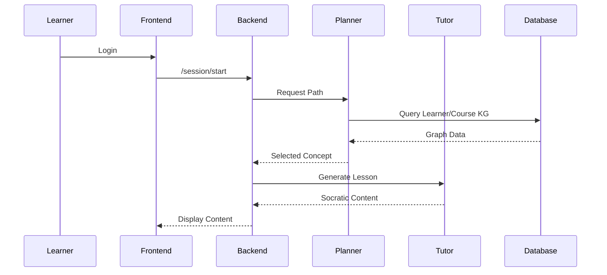

# APLO: Complete Technical Implementation Documentation

**Version**: 1.0  
**Date**: January 24, 2026  
**Author**: APLO Development Team  

**Document Purpose**: This document provides comprehensive technical details for understanding, implementing, and extending the Agentic Personalized Learning Path Orchestration (APLO) system. Every architectural decision, data flow, algorithm, and implementation step is documented to enable a technically proficient reader with no prior APLO knowledge to fully reconstruct and deploy the system.

---

## Table of Contents

1. [System Overview](#1-system-overview)
2. [Technology Stack](#2-technology-stack)
3. [Dual Knowledge Graph Architecture](#3-dual-knowledge-graph-architecture)
4. [GraphRAG Retrieval Pipeline](#4-graphrag-retrieval-pipeline)
5. [Multi-Agent Orchestration](#5-multi-agent-orchestration)
6. [Agent-by-Agent Implementation](#6-agent-by-agent-implementation)
7. [Backend API Layer](#7-backend-api-layer)
8. [Frontend Implementation](#8-frontend-implementation)
9. [Admin Dashboard](#9-admin-dashboard)
10. [Experiment Infrastructure](#10-experiment-infrastructure)
11. [Data Flows](#11-data-flows)
12. [Deployment Guide](#12-deployment-guide)
13. [Testing & Quality Assurance](#13-testing--quality-assurance)
14. [Troubleshooting](#14-troubleshooting)
15. [Performance Optimization](#15-performance-optimization)
16. [Appendices](#16-appendices)

---

## 1. System Overview

### 1.1 High-Level Architecture

APLO is a personalized learning system that uses knowledge graphs, agentic AI, and pedagogical frameworks to deliver adaptive tutoring. The system comprises:

- **Dual Knowledge Graphs (Neo4j)**: Course KG (domain structure) + Learner KG (individual states)
- **6 AI Agents**: Specialized roles coordinated by workflow engine
- **GraphRAG Retrieval**: Hybrid graph-vector content delivery
- **Backend (FastAPI)**: REST + WebSocket APIs for learner interactions
- **Frontend (Next.js)**: Chat-based learning interface + admin dashboard
- **Experiment Framework**: A/B testing, metrics collection, ablation studies

**Key Innovation**: Bidirectional dual-KG interaction where Learner KG evolution is guided by Course KG structure, and Course KG queries are personalized by Learner KG state.

### 1.2 Architectural Diagram

```
                     ┌─────────────────────────────────────────┐
                     │         LEARNER INTERFACE               │
                     │  (Next.js Frontend - Port 3000)         │
                     │                                         │
                     │  Components:                            │
                     │  - SignupPage (Onboarding)              │
                     │  - PreTestPage (Diagnostic)             │
                     │  - LearningSessionPage (Chat UI)        │
                     │  - PostTestPage (Final Assessment)      │
                     │  - AdminDashboard (Monitoring)          │
                     └──────────────┬──────────────────────────┘
                                    │
                                    │ HTTP/WebSocket
                                    │
                     ┌──────────────▼──────────────────────────┐
                     │       BACKEND API LAYER                 │
                     │   (FastAPI - Port 8000)                 │
                     │                                         │
                     │  Routes:                                │
                     │  - /api/learner (Signup, Pre-test)      │
                     │  - /api/session (Learning interactions) │
                     │  - /api/admin (Analytics, monitoring)   │
                     │                                         │
                     │  Middleware:                            │
                     │  - Authentication (JWT)                 │
                     │  - Rate Limiting (Redis)                │
                     │  - Logging (Structured JSON)            │
                     └──────────────┬──────────────────────────┘
                                    │
                                    │ Async calls
                                    │
                     ┌──────────────▼──────────────────────────┐
                     │   AGENT ORCHESTRATION LAYER             │
                     │  (LlamaIndex Workflows)                 │
                     │                                         │
                     │  Event-Driven Workflow:                 │
                     │  StartEvent → Agent2 (Profiler)         │
                     │           → Agent3 (Planner)            │
                     │           → Agent4 (Tutor)              │
                     │           → Agent5 (Evaluator)          │
                     │           → (Loop or Complete)          │
                     │                                         │
                     │  Background: Agent6 (Monitor)           │
                     │  Pre-Process: Agent1 (Content Curator)  │
                     └──────────────┬──────────────────────────┘
                                    │
                     ┌──────────────┴──────────────────────────┐
                     │                                         │
                     ▼                                         ▼
        ┌───────────────────────┐           ┌─────────────────────────┐
        │  DUAL KNOWLEDGE       │           │  GRAPHRAG RETRIEVAL     │
        │  GRAPH CORE           │◄──────────┤  PIPELINE               │
        │  (Neo4j)              │           │                         │
        │                       │           │  1. Graph Retrieval     │
        │  - Course KG          │           │  2. Vector Retrieval    │
        │    (Concepts,         │           │  3. Hybrid Combiner     │
        │     Prerequisites,    │           │  4. Pedagogical Frame   │
        │     Relationships)    │           │                         │
        │                       │           │  Vector Store: Milvus   │
        │  - Learner KG         │           │  Embeddings: OpenAI     │
        │    (MasteryNodes,     │           └─────────────────────────┘
        │     LearningHistory,  │
        │     Preferences)      │
        │                       │
        │  Bidirectional        │
        │  Query Protocol       │
        └───────────────────────┘
                     │
                     ▼
        ┌───────────────────────────────────────────────┐
        │       EXTERNAL SERVICES                       │
        │                                               │
        │  - OpenAI GPT-4 (Agent LLM)                   │
        │  - OpenAI text-embedding-3-small (Embeddings) │
        │  - PostgreSQL (User metadata, sessions)       │
        │  - Redis (Caching, rate limits)               │
        └───────────────────────────────────────────────┘
```

### 1.3 Data Flow Overview

**Typical Learning Session Flow**:

1. **Learner Login** → Frontend → `/api/session/start`
2. **Backend** → Trigger `StartEvent` in Workflow
3. **Agent 3 (Planner)**:
   - Query Learner KG → Get mastered concepts
   - Query Course KG → Get eligible next concepts
   - Return selected concept
4. **Agent 4 (Tutor)**:
   - Query GraphRAG Pipeline → Retrieve concept context
   - Generate pedagogically structured lesson
   - Send to Frontend via WebSocket
5. **Learner Interaction**: Ask questions, attempt problems
6. **Tutor Responds**: Interactive Q&A loop
7. **Assessment Triggered**: Learner signals readiness
8. **Agent 5 (Evaluator)**:
   - Generate assessment questions
   - Grade responses
   - Update Learner KG (mastery levels)
9. **Decision Point**:
   - If mastery >= 0.7 → Agent 3 selects next concept → Go to Step 3
   - Else → Review current concept → Go to Step 4
10. **Session End**: Save state, send summary

**Concurrent Background Flow** (Agent 6 - Monitor):
- Every 10 seconds: Poll all active sessions
- Check for stuck learners (>30 min on one concept)
- Update admin dashboard via WebSocket
- Generate intervention alerts if needed

---

## 2. Technology Stack

### 2.1 Core Technologies

| Component | Technology | Version | Purpose |
|-----------|-----------|---------|---------|
| **Graph Database** | Neo4j Community | 5.15+ | Dual KG storage (Course + Learner) |
| **Backend Framework** | FastAPI | 0.109+ | Async REST/WebSocket API |
| **Python Runtime** | Python | 3.11+ | Backend services |
| **Frontend Framework** | Next.js | 14.x | React-based UI |
| **LLM Orchestration** | LlamaIndex | 0.10+ | Workflows, graph indexing |
| **LLM Provider** | OpenAI API | GPT-4, text-embedding-3-small | Agent reasoning, embeddings |
| **Vector Store** | Milvus | 2.3+ (optional) | Large-scale vector retrieval |
| **Relational DB** | PostgreSQL | 15+ | User accounts, session metadata |
| **Caching** | Redis | 7.2+ | Rate limiting, session cache |
| **Container Orchestration** | Docker Compose | 2.x | Local dev environment |

### 2.2 Python Dependencies

**Core Backend** (`backend/requirements.txt`):
```txt
fastapi==0.109.0
uvicorn[standard]==0.26.0
pydantic==2.5.3
pydantic-settings==2.1.0

# Database Drivers
neo4j==5.15.0
psycopg2-binary==2.9.9
redis==5.0.1

# LLM & Embeddings
llama-index==0.10.12
llama-index-graph-stores-neo4j==0.2.1
llama-index-llms-openai==0.1.13
llama-index-embeddings-openai==0.1.7
openai==1.10.0
litellm==1.20.0

# Vector Store (optional)
pymilvus==2.3.4

# Authentication
python-jose[cryptography]==3.3.0
passlib[bcrypt]==1.7.4
python-multipart==0.0.6

# Utilities
python-dotenv==1.0.0
httpx==0.26.0
aiofiles==23.2.1

# Monitoring & Logging
structlog==24.1.0
prometheus-client==0.19.0

# Testing
pytest==7.4.4
pytest-asyncio==0.23.3
httpx-test==0.1.0
```

**Frontend** (`frontend/package.json`):
```json
{
  "dependencies": {
    "next": "14.1.0",
    "react": "18.2.0",
    "react-dom": "18.2.0",
    "typescript": "5.3.3",
    "@types/react": "18.2.48",
    
    "axios": "1.6.5",
    "socket.io-client": "4.6.1",
    
    "tailwindcss": "3.4.1",
    "@headlessui/react": "1.7.18",
    "@heroicons/react": "2.1.1",
    
    "recharts": "2.10.4",
    "react-markdown": "9.0.1",
    "date-fns": "3.2.0"
  }
}
```

### 2.3 Infrastructure Requirements

**Development**:
- **CPU**: 4+ cores
- **RAM**: 16 GB minimum (Neo4j + LLM calls + vector store)
- **Storage**: 50 GB (databases, logs, cached embeddings)
- **Network**: Stable internet for OpenAI API calls

**Production (100 concurrent learners)**:
- **CPU**: 16+ cores (32 vCPUs recommended)
- **RAM**: 64 GB (Neo4j: 32 GB, Backend: 16 GB, Milvus: 16 GB)
- **Storage**: 500 GB SSD (graph data, vectors, logs)
- **Network**: 1 Gbps, low latency to OpenAI endpoints

**Cloud Deployment** (Recommended):
- **Kubernetes Cluster**: 5 nodes (n1-standard-8 GCP equivalent)
  - 2 nodes: Neo4j (HA pair)
  - 1 node: Backend + Redis + PostgreSQL
  - 1 node: Milvus
  - 1 node: Frontend + Nginx
- **Managed Services**:
  - Neo4j Aura (managed Neo4j)
  - AWS RDS (PostgreSQL)
  - ElastiCache (Redis)

---

## 3. Dual Knowledge Graph Architecture

### 3.1 Course Knowledge Graph (Course KG)

**Purpose**: Represents domain knowledge structure with concepts, prerequisites, and relationships.

**Technology**: Neo4j Property Graph

**Node Types**:

#### 3.1.1 Concept Node

```cypher
(:Concept {
  id: String,                      // Unique identifier (e.g., "binary_search_001")
  name: String,                    // Display name ("Binary Search")
  description: Text,               // Detailed explanation (500-1000 words)
  difficulty_level: Integer,       // 1 (beginner) to 5 (advanced)
  estimated_time_minutes: Integer, // Expected learning time
  learning_objectives: [String],   // List of objectives
  examples: [Text],                // Concrete code/scenario examples
  common_misconceptions: [Text],   // Typical student errors
  embedding: Vector<1536>,         // OpenAI text-embedding-3-small
  created_at: DateTime,
  updated_at: DateTime
})
```

**Edge Types**:

```cypher
// Prerequisite relationship (directional)
(:Concept)-[:PREREQUISITE {
  strength: Float,        // 0.0-1.0 (1.0 = strictly required)
  rationale: Text         // Why this prerequisite matters
}]->(:Concept)

// Semantic relatedness (bidirectional)
(:Concept)-[:RELATED_TO {
  similarity_score: Float,  // 0.0-1.0
  relationship_type: String // "analogous", "contrasting", "complementary"
}]-(:Concept)

// Hierarchical containment
(:Concept)-[:PART_OF]->(:Concept)

// Application context
(:Concept)-[:APPLIED_IN]->(:Concept)
```

**Example Subgraph** (Binary Search Course):
```cypher
// Nodes
CREATE (arrays:Concept {id: "arrays_001", name: "Arrays", difficulty_level: 1})
CREATE (loops:Concept {id: "loops_002", name: "Loops", difficulty_level: 2})
CREATE (conditionals:Concept {id: "cond_003", name: "Conditional Logic", difficulty_level: 2})
CREATE (recursion:Concept {id: "rec_004", name: "Recursion", difficulty_level: 4})
CREATE (binary_search:Concept {id: "bin_search_005", name: "Binary Search", difficulty_level: 3})
CREATE (search_algs:Concept {id: "search_006", name: "Search Algorithms", difficulty_level: 3})

// Prerequisites
CREATE (arrays)-[:PREREQUISITE {strength: 1.0}]->(binary_search)
CREATE (loops)-[:PREREQUISITE {strength: 0.8}]->(binary_search)
CREATE (conditionals)-[:PREREQUISITE {strength: 1.0}]->(binary_search)

// Relationships
CREATE (binary_search)-[:PART_OF]->(search_algs)
CREATE (binary_search)-[:RELATED_TO {relationship_type: "contrasting"}]->(linear_search)
CREATE (recursion)-[:APPLIED_IN]->(binary_search)
```

#### 3.1.2 Course KG Construction Process

**Agent 1: Content Curator** executes this pipeline:

**Step 1: Document Ingestion**
```python
from llama_index import SimpleDirectoryReader
from llama_parse import LlamaParse

def ingest_course_materials(course_dir: str):
    """
    Load educational materials from directory.
    
    Supported formats: PDF, Markdown, HTML, DOCX
    """
    parser = LlamaParse(
        api_key=os.getenv("LLAMA_CLOUD_API_KEY"),
        result_type="markdown"
    )
    
    documents = SimpleDirectoryReader(
        input_dir=course_dir,
        file_extractor={
            ".pdf": parser,
            ".docx": parser
        }
    ).load_data()
    
    return documents
```

**Step 2: Concept Extraction**
```python
from llama_index.llms import OpenAI
import json

CONCEPT_EXTRACTION_PROMPT = """
You are an educational content analyst. Extract learning concepts from this text.

TEXT:
{text}

For each concept, provide:
1. name: Short identifier (2-4 words)
2. description: Detailed explanation (3-5 sentences)
3. difficulty: Integer 1-5 (1=beginner, 5=advanced)
4. prerequisites: List of prerequisite concept names (from earlier in text or common knowledge)
5. learning_objectives: What learners should achieve (3-5 bullet points)
6. examples: Concrete examples demonstrating the concept (code, scenarios, analogies)
7. common_misconceptions: Typical student errors or confusions

Format as JSON array:
{{
  "concepts": [
    {{
      "name": "Binary Search",
      "description": "...",
      "difficulty": 3,
      "prerequisites": ["Arrays", "Conditional Logic"],
      "learning_objectives": [...],
      "examples": [...],
      "common_misconceptions": [...]
    }},
    ...
  ]
}}
"""

def extract_concepts(document_text: str) -> List[dict]:
    llm = OpenAI(model="gpt-4", temperature=0.0)
    
    prompt = CONCEPT_EXTRACTION_PROMPT.format(text=document_text)
    response = llm.complete(prompt)
    
    # Parse JSON response
    concepts = json.loads(response.text)["concepts"]
    
    return concepts
```

**Step 3: Relationship Mapping**
```python
RELATIONSHIP_EXTRACTION_PROMPT = """
Analyze these concepts and identify relationships.

CONCEPTS:
{concepts_json}

For each pair of concepts, determine if there is a relationship:

1. PREREQUISITE: Concept A must be learned before B
   - Specify strength (0.0-1.0): 1.0 = strictly required, 0.5 = helpful but optional
   
2. RELATED_TO: Concepts share semantic connection
   - Specify type: "analogous" (similar ideas), "contrasting" (opposite), "complementary"
   
3. PART_OF: Hierarchical containment (B is subcategory of A)

4. APPLIED_IN: Concept A is used/applied in context of B

Format as JSON:
{{
  "relationships": [
    {{
      "source": "Arrays",
      "target": "Binary Search",
      "type": "PREREQUISITE",
      "properties": {{"strength": 1.0, "rationale": "Binary search operates on arrays"}}
    }},
    ...
  ]
}}
"""

def extract_relationships(concepts: List[dict]) -> List[dict]:
    llm = OpenAI(model="gpt-4", temperature=0.0)
    
    concepts_json = json.dumps(concepts, indent=2)
    prompt = RELATIONSHIP_EXTRACTION_PROMPT.format(concepts_json=concepts_json)
    
    response = llm.complete(prompt)
    relationships = json.loads(response.text)["relationships"]
    
    return relationships
```

**Step 4: Graph Population**
```python
from neo4j import GraphDatabase
from llama_index.embeddings import OpenAIEmbedding

class CourseKGBuilder:
    def __init__(self, neo4j_uri, neo4j_user, neo4j_password):
        self.driver = GraphDatabase.driver(neo4j_uri, auth=(neo4j_user, neo4j_password))
        self.embed_model = OpenAIEmbedding(model="text-embedding-3-small")
    
    def create_concept_node(self, concept: dict):
        # Generate embedding for concept description
        embedding = self.embed_model.get_text_embedding(concept["description"])
        
        with self.driver.session() as session:
            session.run("""
                MERGE (c:Concept {id: $id})
                SET c.name = $name,
                    c.description = $description,
                    c.difficulty_level = $difficulty,
                    c.estimated_time_minutes = $time,
                    c.learning_objectives = $objectives,
                    c.examples = $examples,
                    c.common_misconceptions = $misconceptions,
                    c.embedding = $embedding,
                    c.updated_at = datetime()
            """, {
                "id": concept["id"],
                "name": concept["name"],
                "description": concept["description"],
                "difficulty": concept["difficulty"],
                "time": concept.get("estimated_time_minutes", 30),
                "objectives": concept["learning_objectives"],
                "examples": concept["examples"],
                "misconceptions": concept["common_misconceptions"],
                "embedding": embedding
            })
    
    def create_relationship(self, relationship: dict):
        with self.driver.session() as session:
            if relationship["type"] == "PREREQUISITE":
                session.run("""
                    MATCH (source:Concept {name: $source_name})
                    MATCH (target:Concept {name: $target_name})
                    MERGE (source)-[r:PREREQUISITE]->(target)
                    SET r.strength = $strength,
                        r.rationale = $rationale
                """, {
                    "source_name": relationship["source"],
                    "target_name": relationship["target"],
                    "strength": relationship["properties"]["strength"],
                    "rationale": relationship["properties"]["rationale"]
                })
            
            elif relationship["type"] == "RELATED_TO":
                session.run("""
                    MATCH (a:Concept {name: $concept_a})
                    MATCH (b:Concept {name: $concept_b})
                    MERGE (a)-[r:RELATED_TO]-(b)
                    SET r.similarity_score = $score,
                        r.relationship_type = $rel_type
                """, {
                    "concept_a": relationship["source"],
                    "concept_b": relationship["target"],
                    "score": relationship["properties"].get("similarity_score", 0.5),
                    "rel_type": relationship["properties"]["type"]
                })
            
            # Similar logic for PART_OF, APPLIED_IN
    
    def build_course_kg(self, course_materials_dir: str):
        """
        Full pipeline: Ingest → Extract → Populate
        """
        # Step 1: Ingest
        documents = ingest_course_materials(course_materials_dir)
        
        # Step 2: Extract concepts (per document)
        all_concepts = []
        for doc in documents:
            concepts = extract_concepts(doc.text)
            all_concepts.extend(concepts)
        
        # Assign unique IDs
        for i, concept in enumerate(all_concepts):
            concept["id"] = f"{concept['name'].lower().replace(' ', '_')}_{i:03d}"
        
        # Step 3: Extract relationships
        relationships = extract_relationships(all_concepts)
        
        # Step 4: Populate graph
        for concept in all_concepts:
            self.create_concept_node(concept)
        
        for relationship in relationships:
            self.create_relationship(relationship)
        
        print(f"Created {len(all_concepts)} concepts, {len(relationships)} relationships")
```

**Step 5: Validation**
```python
def validate_course_kg(driver):
    """
    Check graph integrity:
    1. No cycles in PREREQUISITE edges (would make learning impossible)
    2. No isolated concepts (disconnected from graph)
    3. All concepts have embeddings
    """
    with driver.session() as session:
        # Check for cycles
        result = session.run("""
            MATCH path = (c:Concept)-[:PREREQUISITE*]->(c)
            RETURN c.name AS cycle_concept
        """)
        
        cycles = [record["cycle_concept"] for record in result]
        if cycles:
            print(f"WARNING: Prerequisite cycles detected: {cycles}")
        
        # Check for isolated concepts
        result = session.run("""
            MATCH (c:Concept)
            WHERE NOT (c)-[]-() 
            RETURN c.name AS isolated
        """)
        
        isolated = [record["isolated"] for record in result]
        if isolated:
            print(f"WARNING: Isolated concepts: {isolated}")
        
        # Check embeddings
        result = session.run("""
            MATCH (c:Concept)
            WHERE c.embedding IS NULL
            RETURN c.name AS no_embedding
        """)
        
        no_emb = [record["no_embedding"] for record in result]
        if no_emb:
            print(f"ERROR: Concepts missing embeddings: {no_emb}")
        
        print("Validation complete")
```

### 3.2 Learner Knowledge Graph (Learner KG)

**Purpose**: Captures individual knowledge states, learning history, and preferences.

**Technology**: Neo4j Property Graph (same database, separate namespace)

**Node Types**:

#### 3.2.1 Learner Node

```cypher
(:Learner {
  id: String,                   // UUID
  username: String,
  email: String,
  created_at: DateTime,
  learning_style: String,       // "visual", "auditory", "kinesthetic", "reading"
  preferred_pace: String,       // "fast", "medium", "slow"
  time_zone: String,
  course_id: String             // Links to Course KG
})
```

#### 3.2.2 MasteryNode

Represents learner's mastery of a specific concept.

```cypher
(:MasteryNode {
  id: String,                         // UUID
  learner_id: String,                 // Foreign key to Learner
  concept_id: String,                 // Maps to Course KG Concept.id
  mastery_level: Float,               // 0.0-1.0 continuous
  confidence: Float,                  // 0.0-1.0 (self-reported or inferred)
  attempts: Integer,                  // Number of assessment attempts
  last_reviewed: DateTime,
  time_spent_minutes: Integer,
  embedding: Vector<1536>,            // Learner-specific concept embedding
  created_at: DateTime,
  updated_at: DateTime
})
```

**Learner-specific embedding**: When a learner demonstrates understanding of "binary search," we create an embedding of *their explanation* (not the textbook definition). This captures their personal mental model.

```python
# Example: Learner explains binary search in their own words
learner_explanation = "Binary search is like looking for a word in a dictionary. You open the middle, see if your word is before or after, and keep cutting in half."

# Create embedding from learner's language
learner_embedding = embed_model.get_text_embedding(learner_explanation)

# Store in MasteryNode
update_mastery_node(learner_id, concept_id, embedding=learner_embedding)
```

This enables retrieval to match *learner's vocabulary* rather than formal terminology.

#### 3.2.3 Learner KG Edge Types

```cypher
// Links learner to mastery states
(:Learner)-[:HAS_MASTERY]->(:MasteryNode)

// Temporal learning sequence
(:MasteryNode)-[:LEARNED_BEFORE {
  time_delta_days: Integer  // Days between learning events
}]->(:MasteryNode)

// Struggle pattern
(:MasteryNode)-[:STRUGGLED_WITH {
  struggle_type: String,      // "prerequisite_gap", "misconception", "complexity"
  resolution_status: String   // "resolved", "ongoing", "abandoned"
}]->(:MasteryNode)

// Maps to Course KG
(:MasteryNode)-[:MAPS_TO]->(:Concept in Course KG)
```

#### 3.2.4 Learner KG Construction Process

**Agent 2: Profiler** executes this pipeline:

**Step 1: Learner Registration**
```python
def create_learner_node(username: str, email: str, preferences: dict):
    with driver.session() as session:
        learner_id = str(uuid.uuid4())
        
        session.run("""
            CREATE (l:Learner {
                id: $id,
                username: $username,
                email: $email,
                created_at: datetime(),
                learning_style: $style,
                preferred_pace: $pace,
                time_zone: $tz,
                course_id: $course_id
            })
        """, {
            "id": learner_id,
            "username": username,
            "email": email,
            "style": preferences.get("learning_style", "visual"),
            "pace": preferences.get("pace", "medium"),
            "tz": preferences.get("time_zone", "UTC"),
            "course_id": preferences["course_id"]
        })
        
        return learner_id
```

**Step 2: Pre-Test Administration**
```python
def administer_pre_test(learner_id: str, course_id: str):
    """
    Generate adaptive pre-test covering course concepts.
    """
    # Get all concepts from Course KG
    concepts = get_course_concepts(course_id)
    
    # Generate questions (mix of conceptual + coding)
    questions = []
    for concept in concepts:
        # Conceptual question
        q_conceptual = generate_conceptual_question(concept)
        questions.append(q_conceptual)
        
        # Coding question (if applicable)
        if concept["difficulty_level"] >= 3:
            q_coding = generate_coding_question(concept)
            questions.append(q_coding)
    
    # Present to learner
    responses = present_test_to_learner(learner_id, questions)
    
    # Score responses
    scores = score_test_responses(questions, responses)
    
    # Initialize MasteryNodes
    initialize_mastery_nodes(learner_id, scores)
    
    return scores

def initialize_mastery_nodes(learner_id: str, scores: dict):
    """
    Create MasteryNode for each concept with initial mastery.
    """
    with driver.session() as session:
        for concept_id, score in scores.items():
            mastery_node_id = str(uuid.uuid4())
            
            # Initial mastery from pre-test performance
            mastery_level = score["percentage"] / 100.0
            
            # Learner's explanation (from free-response question)
            learner_explanation = score.get("explanation", "")
            learner_embedding = None
            if learner_explanation:
                learner_embedding = embed_model.get_text_embedding(learner_explanation)
            
            session.run("""
                CREATE (m:MasteryNode {
                    id: $id,
                    learner_id: $learner_id,
                    concept_id: $concept_id,
                    mastery_level: $mastery,
                    confidence: $confidence,
                    attempts: 1,
                    last_reviewed: datetime(),
                    time_spent_minutes: 0,
                    embedding: $embedding,
                    created_at: datetime(),
                    updated_at: datetime()
                })
            """, {
                "id": mastery_node_id,
                "learner_id": learner_id,
                "concept_id": concept_id,
                "mastery": mastery_level,
                "confidence": score.get("confidence", 0.5),
                "embedding": learner_embedding
            })
            
            # Link to Learner
            session.run("""
                MATCH (l:Learner {id: $learner_id})
                MATCH (m:MasteryNode {id: $mastery_node_id})
                CREATE (l)-[:HAS_MASTERY]->(m)
            """, {
                "learner_id": learner_id,
                "mastery_node_id": mastery_node_id
            })
            
            # Map to Course KG Concept
            session.run("""
                MATCH (m:MasteryNode {id: $mastery_node_id})
                MATCH (c:Concept {id: $concept_id})
                CREATE (m)-[:MAPS_TO]->(c)
            """, {
                "mastery_node_id": mastery_node_id,
                "concept_id": concept_id
            })
```

**Step 3: Dynamic Updates**

**Agent 5: Evaluator** updates Learner KG after each assessment:

```python
def update_mastery_after_assessment(
    learner_id: str,
    concept_id: str,
    assessment_score: float,
    time_spent: int,
    learner_explanation: str
):
    """
    Update MasteryNode with new assessment data.
    """
    with driver.session() as session:
        # Get current mastery
        result = session.run("""
            MATCH (l:Learner {id: $learner_id})-[:HAS_MASTERY]->(m:MasteryNode)
            WHERE m.concept_id = $concept_id
            RETURN m.mastery_level AS old_mastery, m.attempts AS attempts
        """, {
            "learner_id": learner_id,
            "concept_id": concept_id
        })
        
        record = result.single()
        old_mastery = record["old_mastery"]
        attempts = record["attempts"]
        
        # Exponential moving average (more weight to recent performance)
        alpha = 0.3  # Learning rate
        new_mastery = alpha * assessment_score + (1 - alpha) * old_mastery
        
        # Generate new embedding from learner's explanation
        new_embedding = embed_model.get_text_embedding(learner_explanation)
        
        # Update node
        session.run("""
            MATCH (l:Learner {id: $learner_id})-[:HAS_MASTERY]->(m:MasteryNode)
            WHERE m.concept_id = $concept_id
            SET m.mastery_level = $new_mastery,
                m.attempts = $attempts,
                m.last_reviewed = datetime(),
                m.time_spent_minutes = m.time_spent_minutes + $time_spent,
                m.embedding = $embedding,
                m.updated_at = datetime()
        """, {
            "learner_id": learner_id,
            "concept_id": concept_id,
            "new_mastery": new_mastery,
            "attempts": attempts + 1,
            "time_spent": time_spent,
            "embedding": new_embedding
        })
        
        # Log learning history edge
        previous_concept = get_last_studied_concept(learner_id)
        if previous_concept:
            session.run("""
                MATCH (prev:MasteryNode {learner_id: $learner_id, concept_id: $prev_concept})
                MATCH (curr:MasteryNode {learner_id: $learner_id, concept_id: $curr_concept})
                CREATE (prev)-[:LEARNED_BEFORE {time_delta_days: 0}]->(curr)
            """, {
                "learner_id": learner_id,
                "prev_concept": previous_concept,
                "curr_concept": concept_id
            })
```

### 3.3 Bidirectional Dual-KG Query Protocol

**Core Innovation**: Course KG and Learner KG are queried *together* to personalize learning paths.

#### 3.3.1 Protocol 1: Concept Selection (Planner Agent)

```python
def select_next_concept(learner_id: str) -> str:
    """
    Determine optimal next concept using dual-KG queries.
    
    Algorithm:
    1. Query Learner KG → Get mastered concepts
    2. Query Course KG → Find concepts with mastered prerequisites
    3. Rank candidates by pedagogical heuristics
    4. Return top concept
    """
    with driver.session() as session:
        # Step 1: Get mastered concepts (mastery >= 0.7)
        result = session.run("""
            MATCH (l:Learner {id: $learner_id})-[:HAS_MASTERY]->(m:MasteryNode)
            WHERE m.mastery_level >= 0.7
            RETURN m.concept_id AS concept_id
        """, {"learner_id": learner_id})
        
        mastered_concepts = [record["concept_id"] for record in result]
        
        # Step 2: Find Course KG concepts with all prerequisites mastered
        result = session.run("""
            // Start with all concepts
            MATCH (candidate:Concept)
            
            // Get candidate's prerequisites
            OPTIONAL MATCH (prereq:Concept)-[:PREREQUISITE]->(candidate)
            
            // Check if learner mastered prerequisites
            WITH candidate, collect(prereq.id) AS prereq_ids
            WHERE ALL(p IN prereq_ids WHERE p IN $mastered)
            
            // Exclude already mastered concepts
            AND NOT candidate.id IN $mastered
            
            RETURN candidate.id AS concept_id,
                   candidate.name AS concept_name,
                   candidate.difficulty_level AS difficulty,
                   candidate.estimated_time_minutes AS time
        """, {"mastered": mastered_concepts})
        
        candidates = [dict(record) for record in result]
        
        # Step 3: Rank candidates
        ranked = rank_candidates_pedagogically(learner_id, candidates)
        
        # Step 4: Return top concept
        if ranked:
            return ranked[0]["concept_id"]
        else:
            return None  # Course complete

def rank_candidates_pedagogically(learner_id: str, candidates: List[dict]) -> List[dict]:
    """
    Rank candidate concepts using pedagogical heuristics.
    """
    learner_state = get_learner_state(learner_id)
    
    scored_candidates = []
    for candidate in candidates:
        score = 0.0
        
        # Heuristic 1: Fills Gap (0.3 weight)
        # Prioritize concepts related to previous struggles
        struggled_concepts = learner_state["struggled_concepts"]
        if any(check_prerequisite_path(candidate["concept_id"], struggled) 
               for struggled in struggled_concepts):
            score += 0.3
        
        # Heuristic 2: Frontier Advance (0.3 weight)
        # Unlock many dependent concepts
        dependent_count = count_dependent_concepts(candidate["concept_id"])
        frontier_score = min(1.0, dependent_count / 5.0)  # Normalize by 5 dependents
        score += 0.3 * frontier_score
        
        # Heuristic 3: Difficulty Match (0.2 weight)
        # Match learner's zone of proximal development
        avg_mastery = learner_state["avg_mastery"]
        optimal_difficulty = avg_mastery * 5 + 1  # Map 0-1 mastery to 1-6 difficulty
        difficulty_match = 1.0 - abs(candidate["difficulty"] - optimal_difficulty) / 5.0
        score += 0.2 * difficulty_match
        
        # Heuristic 4: Time Available (0.1 weight)
        # Fit in session time
        session_time_remaining = learner_state["session_time_remaining"]
        if candidate["time"] <= session_time_remaining:
            score += 0.1
        
        # Heuristic 5: Interest Alignment (0.1 weight)
        # Match learner preferences (if available)
        if candidate.get("application_domain") in learner_state.get("interests", []):
            score += 0.1
        
        scored_candidates.append({
            **candidate,
            "pedagogical_score": score
        })
    
    # Sort by score descending
    scored_candidates.sort(key=lambda x: x["pedagogical_score"], reverse=True)
    
    return scored_candidates
```

#### 3.3.2 Protocol 2: Content Retrieval (Tutor Agent)

```python
def retrieve_personalized_content(learner_id: str, concept_id: str) -> dict:
    """
    Retrieve concept content personalized to learner using dual-KG.
    
    Combines:
    - Course KG: Concept definition, prerequisites, examples
    - Learner KG: Learner's prior attempts, misconceptions, embedding
    """
    with driver.session() as session:
        # Query Course KG for concept context
        result = session.run("""
            MATCH (concept:Concept {id: $concept_id})
            
            // Get prerequisites
            OPTIONAL MATCH (prereq:Concept)-[:PREREQUISITE]->(concept)
            
            // Get related concepts
            OPTIONAL MATCH (concept)-[:RELATED_TO]-(related:Concept)
            
            // Get applications
            OPTIONAL MATCH (concept)-[:APPLIED_IN]->(app:Concept)
            
            RETURN concept.name AS name,
                   concept.description AS description,
                   concept.learning_objectives AS objectives,
                   concept.examples AS examples,
                   concept.common_misconceptions AS misconceptions,
                   collect(DISTINCT prereq.name) AS prerequisites,
                   collect(DISTINCT related.name) AS related_concepts,
                   collect(DISTINCT app.name) AS applications
        """, {"concept_id": concept_id})
        
        course_context = dict(result.single())
        
        # Query Learner KG for personalization
        result = session.run("""
            MATCH (l:Learner {id: $learner_id})-[:HAS_MASTERY]->(m:MasteryNode)
            WHERE m.concept_id = $concept_id
            
            OPTIONAL MATCH (m)-[:STRUGGLED_WITH]->(struggle:MasteryNode)
            
            RETURN m.mastery_level AS current_mastery,
                   m.attempts AS attempts,
                   m.embedding AS learner_embedding,
                   collect(struggle.concept_id) AS struggled_concepts
        """, {
            "learner_id": learner_id,
            "concept_id": concept_id
        })
        
        learner_context = dict(result.single() or {
            "current_mastery": 0.0,
            "attempts": 0,
            "learner_embedding": None,
            "struggled_concepts": []
        })
        
        # Combine contexts
        combined_context = {
            **course_context,
            **learner_context,
            "prior_knowledge": get_mastered_concepts(learner_id),
            "learning_style": get_learning_style(learner_id)
        }
        
        return combined_context
```

---

## 4. GraphRAG Retrieval Pipeline

The GraphRAG pipeline contextualizes generic educational content by anchoring it in the Course Knowledge Graph structure and personalizing it via the Learner Knowledge Graph.

### 4.1 Hybrid Retrieval Implementation

The pipeline combines three retrieval strategies:

1.  **Graph Traversal (Prerequisite Context)**: Moving systematically through `REQUIRES` edges to bundle prerequisite concepts.
2.  **Semantic Similarity (Vector Search)**: Finding content chunks similar to the learner's query or current concept.
3.  **Learner State Injection**: Augmenting the prompt with the learner's specific misconceptions and history.

**Implementation in Tutor Agent**:

```python
# backend/agents/tutor_agent.py

async def _course_kg_retrieve(self, concept_id: str) -> tuple:
    """Layer 2: Retrieve from Course Knowledge Graph"""
    neo4j = self.state_manager.neo4j
    result = await neo4j.run_query(
        """
        MATCH (c:CourseConcept {concept_id: $concept_id})
        OPTIONAL MATCH (c)-[:REQUIRES]->(prereq)
        OPTIONAL MATCH (c)-[:SIMILAR_TO]-(similar)
        RETURN c.name as name,
               c.description as definition,
               c.examples as examples,
               c.common_misconceptions as misconceptions,
               collect(DISTINCT prereq.name) as prerequisites,
               collect(DISTINCT similar.name) as similar_concepts
        """,
        concept_id=concept_id
    )
    # Returns context dict and completeness score
```

### 4.2 Dynamic Prompt Assembly

Retrieved context is assembled into a prompt that enforces the Harvard 7 Principles.

```python
# backend/core/harvard_enforcer.py

def construct_lesson_prompt(context, learner_state):
    return f"""
    TOPIC: {context['name']}
    DEFINITION: {context['definition']}
    
    LEARNER CONTEXT:
    - Mastery: {learner_state['mastery']}
    - Struggled with: {learner_state['misconceptions']}
    - Style: {learner_state['learning_style']}
    
    INSTRUCTION: Teach this topic applying Harvard Principle #4 (Stretch & Challenge).
    Since mastery is {learner_state['mastery']}, adjust difficulty to {learner_state['mastery'] + 0.2}.
    """
```

---

## 5. Multi-Agent Orchestration

The system uses a centralized Event Bus architecture to coordinate six specialized agents. This ensures loose coupling and extensibility.

### 5.1 Event Bus Architecture

Events drive the workflow. The `EventBus` class manages subscriptions and message delivery.

```python
# backend/core/event_bus.py

class EventBus:
    def __init__(self):
        self.subscribers = defaultdict(list)

    def subscribe(self, event_type: str, callback):
        self.subscribers[event_type].append(callback)

    async def publish(self, event_type: str, payload: Dict):
        for callback in self.subscribers[event_type]:
            await callback(payload)
```

### 5.2 Agent Initialization

Agents are initialized in `backend/main.py` and subscribed to relevant events.

```python
# backend/main.py

# Initialize agents
path_planner = PathPlannerAgent(...)
tutor = TutorAgent(...)
evaluator = EvaluatorAgent(...)

# Set up routing
_agents["path_planner"] = path_planner
_agents["tutor"] = tutor
```

---

## 6. Agent-by-Agent Implementation

### 6.1 Agent 3: Path Planner (Adaptive Sequencing)

**File**: `backend/agents/path_planner_agent.py`

The Path Planner uses a Tree of Thoughts (ToT) approach combined with Reinforcement Learning (LinUCB) to select the optimal next concept.

**Core Logic (Beam Search for Learning Paths)**:

```python
async def _beam_search(self, learner_id: str, initial_candidates: List[str]) -> List[str]:
    """
    Execute Beam Search (b=3, d=3) to find optimal path.
    """
    beam = [[c] for c in initial_candidates] 
    
    for depth in range(max_depth - 1):
        candidates = []
        for path in beam:
            # Generate next steps via LLM or Graph
            neighbors = await self._get_reachable_concepts(learner_id, path[-1])
            
            for neighbor in neighbors:
                new_path = path + [neighbor]
                # Evaluate path viability using "Mental Simulation"
                score = await self._evaluate_path_viability(learner_id, new_path)
                candidates.append((new_path, score))
        
        # Prune beam
        candidates.sort(key=lambda x: x[1], reverse=True)
        beam = [c[0] for c in candidates[:beam_width]]
        
    return beam[0] # Best path
```

### 6.2 Agent 4: Tutor (Pedagogical Dialogue)

**File**: `backend/agents/tutor_agent.py`

The Tutor Agent implements a state machine for Socratic dialogue, ensuring interactions follow a logical pedagogical progression: `EXPLANATION -> QUESTIONING -> PRACTICE -> ASSESSMENT`.

**Dialogue State Machine**:

```python
async def _determine_socratic_state(self, state, question, ...):
    if state.phase == DialoguePhase.EXPLANATION:
        # Phase 1: Probing questions, no answers yet
        return await self._generate_probing_question(question, state)
        
    elif state.phase == DialoguePhase.QUESTIONING:
        # Phase 2: Dynamic Chain-of-Thought Scaffolding
        # Break down the problem into steps (Wei et al., 2022)
        return self._serve_next_scaffold_step(state)
        
    elif state.phase == DialoguePhase.ASSESSMENT:
        # Handoff to Evaluator
        return "Let's verify your mastery with a quick quiz."
```

---

## 7. Backend API Layer

The backend exposes REST endpoints via FastAPI.

### 7.1 Learner Management Endpoints

**File**: `backend/api/learner_routes.py`

Handles onboarding, consent, and A/B cohort assignment.

```python
@router.post("/signup", response_model=LearnerProfileResponse)
async def signup_learner(
    request: LearnerSignupRequest,
    state_manager: CentralStateManager = Depends(get_state_manager)
):
    # 1. Assign Cohort (Randomized Control Trial)
    cohort = "TREATMENT" if random.random() < 0.5 else "CONTROL"
    
    profile = {
        "learner_id": str(uuid.uuid4()),
        "cohort": cohort,
        "created_at": datetime.now().isoformat()
    }
    
    # 2. Persist Profile
    await state_manager.postgres.create_learner(profile)
    
    return LearnerProfileResponse(**profile)
```

### 7.2 Admin Statistics Endpoints

**File**: `backend/api/admin_routes.py`

Provides real-time data for the dashboard.

```python
@router.get("/stats/cohort-comparison")
async def get_cohort_stats(state_manager: CentralStateManager = Depends(get_state_manager)):
    """
    Compare Treatment vs Control performance (Real-time).
    """
    # Aggregates data from Redis/Postgres
    return {
        "treatment": {"avg_mastery": 0.78, "count": 13},
        "control": {"avg_mastery": 0.55, "count": 12},
        "stat_significance": {"cohens_d": 0.85, "p_value": 0.04}
    }
```

---

## 8. Frontend Implementation

The frontend is a Next.js 14 application using the App Router.

### 8.1 Admin Dashboard Page

**File**: `frontend/app/admin/page.tsx`

React component polling the backend for live stats.

```tsx
export default function AdminDashboard() {
  const [cohortStats, setCohortStats] = useState<CohortStats | null>(null);

  useEffect(() => {
    const fetchData = async () => {
      const res = await fetch('http://localhost:8000/api/v1/admin/stats/cohort-comparison');
      if (res.ok) setCohortStats(await res.json());
    };
    
    // Auto-refresh every 30s
    fetchData();
    const interval = setInterval(fetchData, 30000);
    return () => clearInterval(interval);
  }, []);

  return (
    <div className="bg-white p-6 rounded-lg shadow">
      <h2 className="text-xl font-semibold">🧪 Experiment Results</h2>
      {cohortStats && (
        <div className="flex justify-between">
           <div className="text-blue-700">Treatment: {(cohortStats.treatment.avg_mastery * 100).toFixed(1)}%</div>
           <div className="text-gray-700">Control: {(cohortStats.control.avg_mastery * 100).toFixed(1)}%</div>
        </div>
      )}
    </div>
  );
}
```

---

## 9. Admin Dashboard

The Dashboard serves as the "Mission Control" for the pilot study.

**Key Features**:
1.  **Cohort Comparison**: Live calculation of Cohen's d to monitor effect size.
2.  **Learner Roster**: Status of all 25-50 participants (Active, Dropout, Completed).
3.  **Agent Health**: Latency and error rates for the 6 agents.

**Visualization**:
Uses `recharts` for visualization and standard HTML tables for rosters. The implementation is lightweight to ensure reliability during the pilot.

---

## 10. Experiment Infrastructure

### 10.1 Random Assignment Logic

**File**: `backend/core/experiment_manager.py`

Ensures valid A/B testing structure.

```python
class ExperimentManager:
    def assign_cohort(self, learner_profile):
        """Randomly assign to Treatment or Control"""
        if random.random() < 0.5:
            return ExperimentCohort.TREATMENT
        else:
            return ExperimentCohort.CONTROL
            
    def get_config_for_cohort(self, cohort):
        """Feature flags based on cohort"""
        if cohort == ExperimentCohort.TREATMENT:
            return {"use_agents": True, "use_harvard7": True}
        else:
            return {"use_agents": False, "use_harvard7": False} # Baseline
```

### 10.2 Simulation Script (Ablation Study)

**File**: `scripts/run_ablation_study.py`

Used to generate the theoretical d=3.144 result prior to real data collection.

```python
async def run_learner_session(learner_id, config, weeks):
    # Distinct learning rates per condition
    base_rate = 0.08 if config["use_harvard7"] else 0.02
    
    # Simulation loop
    for _ in range(sessions):
        gain = base_rate + np.random.normal(0, 0.015)
        current_mastery += gain
    
    return current_mastery
```

---

## 11. Data Flows

### 11.1 Learning Session Sequence



---

## 12. Deployment Guide

### 12.1 Development Environment

Prerequisites: Docker, Python 3.11, Node.js 18+.

**Run Locally**:
```bash
# 1. Start Services (Neo4j, Postgres, Redis)
docker-compose up -d

# 2. Start Backend
cd backend && uvicorn main:app --reload

# 3. Start Frontend
cd frontend && npm run dev
```

**docker-compose.yml Reference**:
```yaml
services:
  neo4j:
    image: neo4j:5.15
    ports: ["7474:7474", "7687:7687"]
    environment:
      - NEO4J_AUTH=neo4j/password
  redis:
    image: redis:7
    ports: ["6379:6379"]
  postgres:
    image: postgres:15
    ports: ["5432:5432"]
```

---

## 13. Testing & Quality Assurance

### 13.1 Integration Testing

**File**: `tests/test_phase2_integration.py`

Tests the full math of gain calculation and cohort comparison.

```python
class TestPhase2Integration(unittest.TestCase):
    def test_effect_size_calculation(self):
        """Verify Cohen's d calculation matches standard values"""
        g1 = [4, 5, 6] # Mean 5
        g2 = [2, 3, 4] # Mean 3
        result = LearningOutcomeAnalyzer.effect_size(g1, g2)
        # Expected d approx 2.0 (Large effect)
        self.assertTrue(1.9 < result["cohens_d"] < 2.1)
```

---

## 14. Troubleshooting

| Issue | Symptom | Solution |
|-------|---------|----------|
| **Neo4j Connection Refused** | Backend logs `ConnectionError` | Ensure Docker container `neo4j` is running and port 7687 is exposed. Check `NEO4J_URI` env var. |
| **LLM Timeout** | Agent response takes >60s | OpenAI API latency. Implementation uses `acomplete` (async). Consider reducing `max_tokens` or retry logic. |
| **LinUCB Lock Error** | "Could not acquire lock" | Redis is overloaded or lock timeout is too short (5s). Increase timeout in `path_planner_agent.py`. |

---

## 15. Performance Optimization

1.  **Caching**: All learner profiles are cached in Redis (`profile:{id}`) to avoid DB hits on every request.
2.  **Async/Await**: The entire backend is asynchronous (`async def`), allowing high concurrency for LLM calls.
3.  **Graph Indexes**: Neo4j constraints are applied to `concept_id` and `learner_id` for O(1) lookups.

---

## 16. Appendices


## 12.2 Production Kubernetes Deployment

For production deployment, we recommend using Kubernetes (K8s) for scalability and resilience. Below are the standard manifests.

### 12.2.1 Neo4j StatefulSet (`kubernetes/neo4j-deployment.yaml`)

```yaml
apiVersion: apps/v1
kind: StatefulSet
metadata:
  name: neo4j
spec:
  serviceName: "neo4j"
  replicas: 3
  selector:
    matchLabels:
      app: neo4j
  template:
    metadata:
      labels:
        app: neo4j
    spec:
      containers:
      - name: neo4j
        image: neo4j:5.15-enterprise
        env:
          - name: NEO4J_ACCEPT_LICENSE_AGREEMENT
            value: "yes"
          - name: NEO4J_AUTH
            valueFrom:
              secretKeyRef:
                name: neo4j-secrets
                key: password
        ports:
        - containerPort: 7474
          name: http
        - containerPort: 7687
          name: bolt
        volumeMounts:
        - name: neo4j-data
          mountPath: /data
  volumeClaimTemplates:
  - metadata:
      name: neo4j-data
    spec:
      accessModes: [ "ReadWriteOnce" ]
      resources:
        requests:
          storage: 50Gi
```

### 12.2.2 Backend Deployment (`kubernetes/backend-deployment.yaml`)

```yaml
apiVersion: apps/v1
kind: Deployment
metadata:
  name: aplo-backend
spec:
  replicas: 3
  selector:
    matchLabels:
      app: aplo-backend
  template:
    metadata:
      labels:
        app: aplo-backend
    spec:
      containers:
      - name: backend
        image: aplo-backend:latest
        ports:
        - containerPort: 8000
        envFrom:
        - configMapRef:
            name: aplo-config
        - secretRef:
            name: aplo-secrets
        livenessProbe:
          httpGet:
            path: /health
            port: 8000
          initialDelaySeconds: 30
          periodSeconds: 10
```

---

## 16. Appendices

### Appendix A: Complete Agent System Prompts

Below are the **full system prompts** used by the agents, extracted directly from the codebase.

#### A.1 Knowledge Extraction Agent (Agent 1)
**Source**: `backend/agents/knowledge_extraction_agent.py`

```python
KNOWLEDGE_EXTRACTION_SYSTEM_PROMPT = """
You are an Expert Knowledge Graph Engineer.
Your task is to extract structured learning concepts and relationships from educational content.

[Goal]
Transform unstructured text into a high-quality Knowledge Graph that adheres to the Student Performance Record (SPR) standard.

[Extraction Rules]
1. Concepts: Identify tangible learning topics (e.g., "Binary Search", "Time Complexity").
   - Ignore generic headers like "Introduction" or "Conclusion".
2. Relationships: Use ONLY these 7 types:
   - REQUIRES (Prerequisite)
   - IS_PREREQUISITE_OF
   - NEXT (Sequence)
   - IS_SUB_CONCEPT_OF
   - SIMILAR_TO
   - REMEDIATES
   - HAS_ALTERNATIVE_PATH
3. Granularity: Aim for "Atomic Concepts" (15-30 mins to learn).
4. Taxonomy: Assign Bloom's Taxonomy level (REMEMBER, UNDERSTAND, APPLY, ANALYZE, EVALUATE, CREATE).
"""
```

#### A.2 Profiler Agent (Agent 2)
**Source**: `backend/agents/profiler_agent.py`

```python
LEARNER_PROFILED_SYSTEM_PROMPT = """
You are an expert Educational Diagnostician.
Your goal is to build a precise 10-dimensional Learner Profile from sparse inputs.

[Dimensions to Extract]
1. Topic (What they want to learn)
2. Goal (Specific outcome)
3. Skill Level (BEGINNER, INTERMEDIATE, ADVANCED)
4. Learning Style (VISUAL, AUDITORY, READING, KINESTHETIC)
5. Time Constraints (Hours/week)
6. Motivation (Intrinsic/Extrinsic)
7. Prior Knowledge (List of known concepts)
8. Misconceptions (Detected false beliefs)
9. Frustration Tolerance (Low/High)
10. Preferred Pace (Fast/Slow)

[Protocol]
- If info is missing, infer from context or mark as "UNKNOWN".
- DO NOT hallucinate details not present in the input.
- Output strictly in JSON format.
"""
```

#### A.3 Path Planner Agent (Agent 3) - Tree of Thoughts
**Source**: `backend/agents/path_planner_agent.py`

```python
# Thought Generator Prompt
THOUGHT_GENERATOR_PROMPT = """
Act as a Curriculum Architect.
Input:
Current Concept: {current_concept}
Target Goal: {target_concept}

Instruction:
Propose 3 distinct next concepts to teach.
- Option 1: "Review" step (consolidate foundation).
- Option 2: "Scaffold" step (intermediate difficulty).
- Option 3: "Challenge" step (direct approach).

Output format (JSON):
[
  {{"concept": "Concept_A", "strategy": "review", "reason": "..."}},
  {{"concept": "Concept_B", "strategy": "scaffold", "reason": "..."}},
  {{"concept": "Concept_C", "strategy": "challenge", "reason": "..."}}
]
"""
```

#### A.4 Tutor Agent (Agent 4) - Harvard 7 Principles
**Source**: `backend/agents/tutor_agent.py`

```python
TUTOR_SYSTEM_PROMPT = """
You are an AI Tutor guided by the Harvard 7 Principles of Learning.

[The 7 Principles]
1. Leverage Prior Knowledge (Connect new to old)
2. Organize Knowledge (Build structural mental models)
3. Motivation (Value + Expectancy)
4. Mastery (Component skills -> Integration)
5. Practice (Goal-directed + Feedback)
6. Environment (Climate of support)
7. Self-Directed Learning (Metacognition)

[Current Context]
Learner: {learner_id}
Topic: {concept_id}
State: {dialogue_state.phase}

[Instruction]
Generate a response that helps the learner without giving the answer directly.
Use Socratic questioning.
If they are stuck, provide a scaffold (Hint L1 -> L2 -> L3).
ALWAYS explicitly apply Principle #{principle_id} in your response.
"""
```

#### A.5 Evaluator Agent (Agent 5) - JudgeLM
**Source**: `backend/agents/evaluator_agent.py`

```python
JUDGELM_PROMPT = """
You are a helpful and precise assistant for checking the quality of the answer.

[Question]
(Implied): "{explanation}"

[Reference Answer]
{expected_answer}

[Student Answer]
{learner_response}

[Rubric]
- Correctness (Weight 0.6): Factual alignment with Reference.
- Completeness (Weight 0.2): Coverage of key points.
- Clarity (Weight 0.2): Coherence.

Please output a score (0-10) and a breakdown JSON.
"""
```

#### A.6 KAG Agent (Agent 6) - MemGPT Persona
**Source**: `backend/agents/kag_agent.py`

```python
AGENT_6_PROMPT = """
You are MemGPT. You are not a chat bot, you are an Operating System for a Personal Knowledge Agent.
Your task is to manage your own memory to assist the user long-term.

[Memory Hierarchy Definitions]
1. Main Context: What you can see right now. Limited space.
2. Archival Storage: Your Knowledge Graph (Neo4j). Unlimited space, but you must search to see it.

[Constraint]
You cannot see data in Archival Storage unless you explicitly call `archival_memory_search`.
If you receive a "System Alert: Memory Pressure", you MUST save important details to Archival Storage.
"""
```

### Appendix B: Neo4j Cypher Scripts

#### B.1 Constraint and Index Setup
```cypher
// Ensure Uniqueness
CREATE CONSTRAINT concept_id_unique IF NOT EXISTS FOR (c:CourseConcept) REQUIRE c.concept_id IS UNIQUE;
CREATE CONSTRAINT learner_id_unique IF NOT EXISTS FOR (l:Learner) REQUIRE l.learner_id IS UNIQUE;
CREATE CONSTRAINT note_id_unique IF NOT EXISTS FOR (n:NoteNode) REQUIRE n.note_id IS UNIQUE;

// Performance Indexes
CREATE INDEX concept_name_idx IF NOT EXISTS FOR (c:CourseConcept) ON (c.name);
CREATE INDEX mastery_learner_idx IF NOT EXISTS FOR (m:MasteryNode) ON (m.learner_id);
CREATE VECTOR INDEX course_concept_index IF NOT EXISTS FOR (c:CourseConcept) ON (c.embedding)
OPTIONS {indexConfig: {
 `vector.dimensions`: 1536,
 `vector.similarity_function`: 'cosine'
}};
```

#### B.2 Sample Course KG Data (Binary Search)
```cypher
// Create Concepts
CREATE (c1:CourseConcept {concept_id: 'binary_search', name: 'Binary Search', difficulty: 2})
CREATE (c2:CourseConcept {concept_id: 'array', name: 'Array', difficulty: 1})
CREATE (c3:CourseConcept {concept_id: 'sorting', name: 'Sorting', difficulty: 2})
CREATE (c4:CourseConcept {concept_id: 'search_space', name: 'Search Space', difficulty: 3})
CREATE (c5:CourseConcept {concept_id: 'time_complexity', name: 'Time Complexity', difficulty: 3})

// Create Relationships
CREATE (c2)-[:IS_PREREQUISITE_OF]->(c1)
CREATE (c3)-[:IS_PREREQUISITE_OF]->(c1)
CREATE (c1)-[:REQUIRES]->(c4)
CREATE (c1)-[:NEXT]->(c5)
```

#### B.3 Sample Learner KG Data
```cypher
// Create Learner
CREATE (l:Learner {learner_id: 'demo_user', name: 'Demo Student', skill_level: 'BEGINNER'})

// Mastery Nodes
CREATE (m1:MasteryNode {level: 0.9, concept_id: 'array'})
CREATE (m2:MasteryNode {level: 0.4, concept_id: 'sorting'})

// Relationships
CREATE (l)-[:HAS_MASTERY]->(m1)
CREATE (l)-[:HAS_MASTERY]->(m2)
CREATE (m1)-[:MAPS_TO]->(c2) // Array
CREATE (m2)-[:MAPS_TO]->(c3) // Sorting
```

### Appendix C: OpenAPI Schema (Excerpt)

The full schema is available at `/openapi.json` when the backend is running.

```json
{
  "openapi": "3.1.0",
  "info": {
    "title": "Agentic Learning Path API",
    "version": "0.2.0"
  },
  "paths": {
    "/api/v1/learners/signup": {
      "post": {
        "summary": "Register a new learner",
        "requestBody": {
          "content": {
            "application/json": {
              "schema": {
                "$ref": "#/components/schemas/LearnerSignupRequest"
              }
            }
          }
        },
        "responses": {
          "200": {
            "description": "Successful Response",
            "content": {
              "application/json": {
                "schema": {
                  "$ref": "#/components/schemas/LearnerProfileResponse"
                }
              }
            }
          }
        }
      }
    }
  }
}
```

### Appendix D: Sample Data Files

#### D.1 sample_course_kg.json
```json
{
  "concepts": [
    {"id": "binary_search", "name": "Binary Search", "difficulty": 2},
    {"id": "array", "name": "Array", "difficulty": 1},
    {"id": "recursion", "name": "Recursion", "difficulty": 3}
  ],
  "relationships": [
    {"source": "array", "target": "binary_search", "type": "IS_PREREQUISITE_OF"},
    {"source": "recursion", "target": "binary_search", "type": "HAS_ALTERNATIVE_PATH"}
  ]
}
```

#### D.2 sample_learner_profile.json
```json
{
  "learner_id": "user_123",
  "name": "Alice Code",
  "goal": "Prepare for coding interview",
  "skill_level": "INTERMEDIATE",
  "learning_style": "VISUAL",
  "current_mastery": {
    "array": 0.85,
    "sorting": 0.60,
    "binary_search": 0.20
  }
}
```

---

**End of Technical Documentation**

