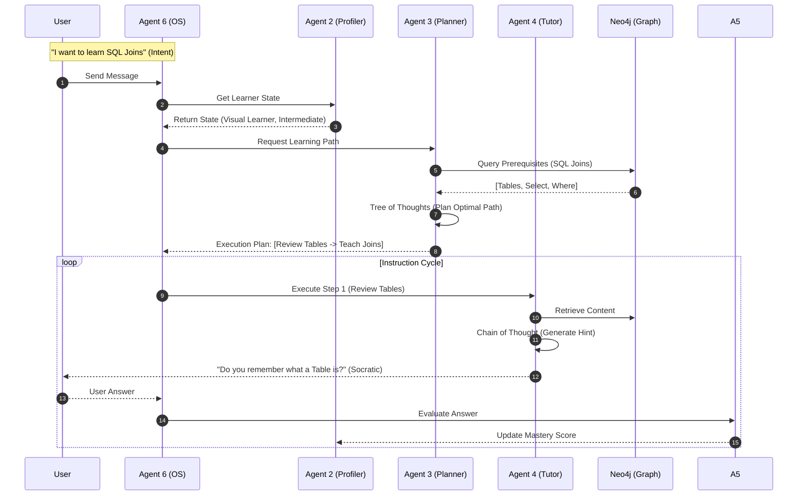

# System Architecture - Agentic Personalized Learning Path

## High-Level Architecture (C4 Container View)

This diagram illustrates the comprehensive architecture of the Multi-Agent System, highlighting the interaction between the User, the API Gateway, the 6 Specialized Agents, and the underlying Data Layer.

```mermaid
graph TD
    %% -- Styles --
    classDef actor fill:#f9f,stroke:#333,stroke-width:2px,color:black
    classDef frontend fill:#d4e1f5,stroke:#333,stroke-width:2px,color:black
    classDef api fill:#ffe6cc,stroke:#d79b00,stroke-width:2px,color:black
    classDef agent fill:#e1d5e7,stroke:#9673a6,stroke-width:2px,color:black
    classDef db fill:#dae8fc,stroke:#6c8ebf,stroke-width:2px,stroke-dasharray: 5 5,color:black
    classDef memory fill:#fff2cc,stroke:#d6b656,stroke-width:2px,color:black

    %% -- Actors --
    User((Learner)):::actor
    Admin((Instructor/Admin)):::actor

    %% -- Frontend --
    subgraph Client [Presentation Layer]
        UI[Chat Interface / Web App]:::frontend
    end

    %% -- Backend API --
    subgraph Backend [Backend API (FastAPI)]
        Router[API Gateway / Router]:::api
        Auth[Auth Middleware (JWT)]:::api
    end

    %% -- The 6 Agents (Core Logic) --
    subgraph Agents [Agentic Core]
        direction TB
        
        %% Agent 1
        A1[Agent 1: Knowledge Extraction <br/><i>(The Hippocampus)</i>]:::agent
        
        %% Agent 2
        A2[Agent 2: Profiler <br/><i>(The State Manager)</i>]:::agent
        
        %% Agent 3
        A3[Agent 3: Path Planner <br/><i>(The Navigator)</i>]:::agent
        
        %% Agent 4
        A4[Agent 4: Tutor <br/><i>(The Socratic Guide)</i>]:::agent
        
        %% Agent 5
        A5[Agent 5: Evaluator <br/><i>(The Judge)</i>]:::agent
        
        %% Agent 6
        A6[Agent 6: KAG / OS Kernel <br/><i>(Working Memory)</i>]:::agent
    end

    %% -- Data Layer --
    subgraph Data [Persistence & Memory]
        Neo4j[(Neo4j: Knowledge Graph)]:::db
        Postgres[(Postgres: User Profile)]:::db
        Redis[(Redis: Cache & Vector)]:::db
        Chroma[(ChromaDB: Ephemeral)]:::db
    end

    %% -- Flows --
    
    %% User Flow
    User <-->|HTTPS/WSS| UI
    UI <-->|REST API| Router
    Router --> Auth
    Auth --> A6
    
    %% Agent 6 Orchestration
    A6 <-->|Orchestrates| A2
    A6 <-->|Orchestrates| A3
    A6 <-->|Orchestrates| A4
    A6 <-->|Orchestrates| A5
    A6 <-->|Context Window| Chroma

    %% Agent 1: Ingestion (Async)
    Admin -->|Upload Docs| A1
    A1 -->|Chunking & Indexing| Neo4j
    A1 -->|Vectorize| Redis

    %% Agent 2: Profiling
    A2 <-->|Read/Write Profile| Postgres
    A2 <-->|Fetch/Update State| Redis
    A2 -->|Cold Start Diagnosis| A4

    %% Agent 3: Planning
    A3 -->|Query Graph| Neo4j
    A3 -->|Read Profile Vector| Redis
    A3 -->|Generate Path| A6

    %% Agent 4: Tutoring
    A4 -->|Retrieve Context| Neo4j
    A4 -->|Scaffolding Strategy| A6

    %% Agent 5: Evaluation
    A5 -->|Compare Response| Neo4j
    A5 -->|Update Bloom Score| A2

    %% -- Logic Grouping --
    linkStyle default stroke-width:2px,fill:none,stroke:#333;
```

## Detailed Data Flow Interaction


