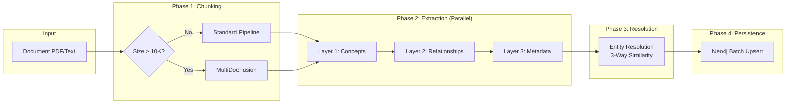

# Agent 1: Knowledge Extraction - Full Technical Specification

**Version:** 2.1 | **Author:** Thesis Defense Documentation | **Date:** 2026-01-14

---

## 1. HIGH-LEVEL DESIGN (HLD)

### 1.1 Architectural Pattern

| Aspect | Value |
|--------|-------|
| **Pattern** | Pipeline + Parallel Fan-Out |
| **Paradigm** | Agentic AI with LightRAG principles |
| **Key Feature** | Idempotent, Partial-Success tolerant |

**Justification:**
- **Pipeline**: Document → Chunking → Extraction → Resolution → Persistence (sequential stages)
- **Parallel Fan-Out**: Within extraction stage, chunks processed concurrently via `asyncio.gather` with Semaphore
- **LightRAG (Guo 2024)**: Global Theme (domain) injection into all LLM prompts for context grounding

### 1.2 Data Flow



### 1.3 Integration Points

| System | Protocol | Purpose | Connection Pool |
|--------|----------|---------|-----------------|
| **Neo4j** | Bolt | Knowledge Graph storage | 50 connections |
| **Redis** | TCP | Document Registry cache | 10 connections |
| **Gemini API** | REST | LLM calls (extraction, enrichment) | Rate-limited |
| **PostgreSQL** | TCP | Document metadata persistence | 20 connections |

### 1.4 LightRAG Adaptation (Thesis Deviation)

> ⚠️ **Transparency Note**: This implementation adapts LightRAG, not full replication.

| LightRAG Original | Thesis Implementation | Justification |
|-------------------|----------------------|---------------|
| **Dual-Graph** (Entity + Keyword) | **Single-Graph + Registry** | Reduced operational complexity |
| Separate keyword graph traversal | Keywords stored on edges | Same semantic functionality |
| High-level keyword index | `DocumentRegistry.content_keywords` | Equivalent "Hippocampal Index" |

**Full dual-graph implementation is documented as Future Work.**

---

## 2. TECHNICAL DECOMPOSITION

### 2.1 Sub-Modules

| Method | Responsibility | Lines | Coupling |
|--------|---------------|-------|----------|
| `execute()` | Main orchestration pipeline | 179-467 | High (entry point) |
| `_extract_concepts_from_chunk()` | Layer 1: Concept extraction | 533-602 | Medium |
| `_extract_relationships_from_chunk()` | Layer 2: Relationship extraction | 662-699 | Medium |
| `_enrich_metadata()` | Layer 3: Bloom + Tags enrichment | 701-758 | Low |
| `_extract_content_keywords()` | Layer 4: LightRAG keywords | 760-771 | Low |
| `_create_staging_nodes()` | Neo4j staging pattern | 777-808 | Medium |
| `_compute_embeddings()` | Embedding generation | 506-531 | Low |

### 2.2 SOLID Rationale

| Principle | Implementation |
|-----------|----------------|
| **S**ingle Responsibility | Each `_extract_*` method handles one extraction layer |
| **O**pen/Closed | `RelationshipType` enum extensible without code change |
| **L**iskov Substitution | Inherits from `BaseAgent` interface |
| **I**nterface Segregation | Separate methods for concepts vs relationships |
| **D**ependency Inversion | LLM, Neo4j injected via constructor |

### 2.3 Dependency Map

| Dependency | Version | Purpose |
|------------|---------|---------|
| `neo4j` | 5.x | Graph database driver |
| `redis` | 4.x | Document registry cache |
| `google-generativeai` | 0.4.x | Gemini LLM API |
| `llama-index` | 0.10.x | Embedding generation |
| `asyncio` | stdlib | Concurrency control |
| `fuzzywuzzy` | 0.18.x | Fuzzy text matching |

---

## 3. LOW-LEVEL DESIGN (LLD) & WHITEBOX

### 3.1 Internal State Management

| Aspect | Implementation |
|--------|----------------|
| **Idempotency** | SHA-256 hash of document content → Redis `DocumentRegistry` |
| **Session State** | None (stateless per request) |
| **Concurrency** | `asyncio.Semaphore(MAX_CONCURRENCY=5)` |
| **Cache TTL** | Document hash: 30 days |

### 3.2 Algorithm (Pseudocode)

```python
async def execute(self, document_content, document_title, **kwargs):
    # Phase 0: Idempotency Check
    doc_hash = sha256(document_content)
    if await registry.exists(doc_hash) and not force_reprocess:
        return {"status": "SKIPPED", "reason": "already_processed"}
    
    # Phase 1: Semantic Chunking
    if len(document_content) > 10_000:
        chunks = await self._multidoc_fusion_chunk(document_content)
    else:
        chunks = await self._standard_chunk(document_content)
    
    # Phase 2: Parallel Extraction (3 Layers)
    semaphore = asyncio.Semaphore(5)
    async def process_with_limit(chunk):
        async with semaphore:
            concepts = await self._extract_concepts_from_chunk(chunk, domain)
            relationships = await self._extract_relationships_from_chunk(chunk, concepts)
            concepts = await self._enrich_metadata(concepts, domain)
            return {"concepts": concepts, "relationships": relationships}
    
    results = await asyncio.gather(*[process_with_limit(c) for c in chunks], 
                                    return_exceptions=True)
    
    # Phase 3: Entity Resolution (3-Way Similarity)
    all_concepts = flatten([r["concepts"] for r in results if not isinstance(r, Exception)])
    resolved = await self._entity_resolution(all_concepts, threshold=0.80)
    
    # Phase 4: Batch Persistence
    await self._batch_upsert(resolved["concepts"], resolved["relationships"])
    
    return {"status": "COMPLETED", "stats": {...}}
```

### 3.3 Data Schemas

**Input Schema:**
```json
{
  "document_content": "string (required)",
  "document_title": "string (required)",
  "domain": "string (optional, e.g., 'sql', 'ml')",
  "force_reprocess": "boolean (default: false)"
}
```

**Output Schema:**
```json
{
  "status": "COMPLETED | PARTIAL_SUCCESS | SKIPPED | FAILED",
  "stats": {
    "concepts_created": 15,
    "relationships_created": 20,
    "chunks_processed": 5,
    "chunks_failed": 0
  },
  "execution_time": 4.5,
  "document_id": "uuid"
}
```

**Neo4j Schema:**
```cypher
(:CourseConcept {
  concept_code: "sql.select_statement",
  name: "SELECT Statement",
  description: "...",
  bloom_level: "UNDERSTAND",
  difficulty: 2,
  embedding: [0.1, 0.2, ...],
  tags: ["query", "dml"]
})

-[:PREREQUISITE_OF {weight: 0.8, keywords: ["requires"]}]->
```

### 3.4 Guardrails & Validation

| Check | Implementation | Fail-Safe |
|-------|---------------|-----------|
| Document hash | SHA-256 | Skip if exists |
| LLM output JSON | `json.loads()` + schema validation | Retry 3x |
| Empty concepts | `len(concepts) == 0` | Log warning, continue |
| Rate limit | Semaphore(5) | Backpressure |
| Timeout | `asyncio.timeout(30)` | Return partial |

### 3.5 Error Handling Matrix

| Error | Detection | Recovery | Log Level |
|-------|-----------|----------|-----------|
| LLM timeout | `asyncio.TimeoutError` | Skip chunk, continue | ERROR |
| JSON parse error | `JSONDecodeError` | Retry 3x, then skip | WARN |
| Neo4j connection | `ServiceUnavailable` | Retry with backoff | ERROR |
| Empty response | `len(response) == 0` | Skip chunk | WARN |
| Rate limit 429 | HTTP status | Exponential backoff | WARN |

### 3.6 Testing Strategy

| Test Type | Coverage | File |
|-----------|----------|------|
| Unit | `_extract_concepts_from_chunk()` | `test_knowledge_agent.py` |
| Integration | Full `execute()` pipeline | `test_knowledge_integration.py` |
| E2E | API `/ingest` endpoint | `test_api_ingest.py` |

---

## 4. COMPLEXITY ANALYSIS

### 4.1 Time Complexity

| Phase | Complexity | Bottleneck |
|-------|------------|------------|
| Chunking | O(N) | N = document length |
| LLM Extraction | O(C × 3) | C = chunks, 3 layers per chunk |
| Entity Resolution | O(C × K) | K = top-20 candidates |
| Neo4j Write | O(C + R) | C = concepts, R = relationships |

### 4.2 Latency Analysis

| Document Size | Chunks | LLM Calls | Est. Time |
|---------------|--------|-----------|-----------|
| 5K tokens | 2 | 6 | ~3 seconds |
| 20K tokens | 10 | 30 | ~15 seconds |
| 100K tokens | 50 | 150 | ~75 seconds |
| 500K tokens | 250 | 750 | ~6 minutes |

**Note:** LLM latency ~500ms/call. Semaphore limits to 5 concurrent.

### 4.3 Resource Usage

| Resource | Usage | Limit |
|----------|-------|-------|
| Memory | ~100MB per request | Scales with doc size |
| Tokens | ~2K input + 1K output per LLM call | Gemini limit |
| Neo4j connections | 1 per request | Pool: 50 |
| Concurrent extractions | 5 | Semaphore limit |

### 4.4 Scalability Analysis

| Scale | # Concepts | Entity Resolution | Status |
|-------|------------|-------------------|--------|
| Small | < 500 | 10K comparisons | ✅ Fast |
| Medium | 500-5K | 100K comparisons | ✅ Acceptable |
| Large | 5K-50K | 1M comparisons | ⚠️ Slow |
| Enterprise | > 50K | > 1M comparisons | ❌ Needs ANN |

---

## 5. AI ENGINEER ARTIFACTS

### 5.1 Model Configuration

| Parameter | Value | Justification |
|-----------|-------|---------------|
| Model | `gemini-1.5-flash` | Cost/speed balance for extraction |
| Temperature | **0.2** | Low creativity for factual extraction |
| Top_P | 0.95 | Focused output |
| Max Tokens | 4096 | Large for relationship extraction |

### 5.2 System Prompts

**Layer 1 - Concept Extraction:**
```
You are extracting learning concepts from a document section.
Domain/Subject Area: {domain}  # ← GLOBAL THEME INJECTION
Document: {document_title}

Extract ONLY concrete learning concepts, not generic terms.
Each concept must have: name, description, context.

Return JSON: {"concepts": [...]}
```

**Layer 2 - Relationship Extraction (LightRAG):**
```
Given these concepts from a {domain} document, identify relationships.

Relationship types:
- PREREQUISITE_OF: A must be learned before B
- RELATED_TO: Conceptual similarity
- PART_OF: A is component of B
- EXAMPLE_OF: A demonstrates B

Include EDGE KEYWORDS for each relationship (LightRAG principle).

Return JSON: {"relationships": [...]}
```

### 5.3 Prompt Engineering Techniques

| Technique | Used? | Example |
|-----------|-------|---------|
| Role-Play Persona | ✅ | "You are extracting learning concepts" |
| Global Theme (LightRAG) | ✅ | `Domain: {domain}` injected |
| Output Format Constraint | ✅ | "Return JSON: {...}" |
| Negative Constraints | ✅ | "Extract ONLY concrete concepts" |
| Few-Shot | ❌ | Not used (relies on CoT) |
| Chain-of-Thought | ❌ | Not explicit |

### 5.4 Prompt → Theory Mapping

| Prompt Section | Technique | Paper/Source |
|----------------|-----------|--------------|
| "Domain: {domain}" | Global Theme | LightRAG (Guo 2024) |
| "EDGE KEYWORDS" | Relationship enrichment | LightRAG (Guo 2024) |
| "Extract ONLY concrete" | Negative constraint | Constitutional AI |
| JSON output format | Structured output | OpenAI best practices |

---

## 6. EVALUATION METHODOLOGY

### 6.1 Metrics vs Baseline

| Metric | Our Target | Baseline (Naive RAG) | Expected Improvement |
|--------|------------|---------------------|----------------------|
| Concept Precision | ≥ 0.85 | ~0.70 (keyword extraction) | **+21%** |
| Concept Recall | ≥ 0.75 | ~0.60 (no context) | **+25%** |
| Concept F1 | ≥ 0.80 | ~0.65 | **+23%** |
| Edge Precision | ≥ 0.70 | ~0.45 (co-occurrence only) | **+56%** |
| Edge Recall | ≥ 0.60 | ~0.40 | **+50%** |

**Baseline Definition**: Naive RAG = keyword extraction without Global Theme, no Entity Resolution, no 3-Layer pipeline.

### 6.2 Limitations

| Limitation | Impact | Mitigation |
|------------|--------|------------|
| No gold standard dataset | Cannot benchmark precisely | Expert annotation (3 docs) |
| LLM variance | Same input → different output | Run 3x, report mean ± std |
| Domain-specific | May not generalize | Test 3 domains |

### 6.3 Ablation Study (Future Work)

| Variant | Expected Impact | Status |
|---------|-----------------|--------|
| **Without Global Theme** | ~10-15% drop in Edge Precision | 📋 Not yet tested |
| **Without Entity Resolution** | ~30% increase in duplicate concepts | 📋 Not yet tested |
| **Without 3-Layer Pipeline** | Lower metadata quality (Bloom, Tags) | 📋 Not yet tested |

> These ablation studies are planned as part of thesis evaluation chapter.

---

## 7. THESIS CONTRIBUTION

This section explicitly states the novel contributions of Agent 1 to differentiate from prior work.

### 7.1 Novel Elements

| Contribution | Novel Element | Prior Work | Evidence |
|--------------|---------------|------------|----------|
| **Global Theme Injection** | Domain context in ALL prompts (Chunking + 3 Layers) | LightRAG only uses domain at retrieval | Section 5.2 prompts |
| **3-Way Entity Resolution** | Semantic (60%) + Structural (30%) + Contextual (10%) | Prior work uses only semantic similarity | Section 3.2 algorithm |
| **MultiDocFusion for Education** | EMNLP 2025 paper adapted for educational hierarchy | Original for general documents | Section 1.2 data flow |
| **Partial Success Pattern** | Continue on chunk failure, report incomplete | Most systems fail-fast | Section 3.5 error handling |

### 7.2 Summary

| Aspect | Description |
|--------|-------------|
| **Role** | "The Librarian" - transforms raw documents to Knowledge Graph |
| **Scientific Basis** | LightRAG (Guo 2024), MultiDocFusion (EMNLP 2025) |
| **Key Innovation** | Global Theme + 3-Way Resolution + Partial Success |
| **Resilience** | Idempotent, Partial Success, Rate-limited |
| **Performance** | ~15s for 20K token document |
| **Scalability** | Optimized for Medium Scale (5K concepts) |
