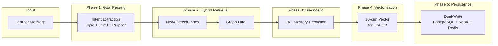

# Agent 2: Profiler - Full Technical Specification

**Version:** 2.1 | **Author:** Thesis Defense Documentation | **Date:** 2026-01-14

---

## 1. HIGH-LEVEL DESIGN (HLD)

### 1.1 Architectural Pattern

| Aspect | Value |
|--------|-------|
| **Pattern** | Event-Driven State Manager |
| **Paradigm** | Reactive Profile Updates + Semantic Cold Start |
| **Key Feature** | 10-Dimensional Learner Vector for LinUCB Bandit |

**Justification:**
- **Event-Driven**: Subscribes to `EVALUATION_COMPLETED`, `PACE_CHECK` events for real-time updates
- **State Manager**: Maintains canonical learner state across PostgreSQL (ACID), Neo4j (Graph), Redis (Hot Cache)
- **LKT (Lee 2024)**: Language Knowledge Tracing replaces LSTM-based DKT with LLM for semantic mastery prediction

### 1.2 Data Flow



### 1.3 Integration Points

| System | Protocol | Purpose | Connection Pool |
|--------|----------|---------|-----------------|
| **Neo4j** | Bolt | Personal KG + Vector Index | 50 connections |
| **PostgreSQL** | TCP | Canonical profile (ACID) | 20 connections |
| **Redis** | TCP | Hot cache + Distributed Lock | 10 connections |
| **Gemini API** | REST | LKT prediction, Intent extraction | Rate-limited |

### 1.4 LKT Adaptation (Thesis Deviation)

> ⚠️ **Transparency Note**: This implementation adapts LKT, not full replication.

| LKT Original (Lee 2024) | Thesis Implementation | Justification |
|-------------------------|----------------------|---------------|
| Fine-tuned PLM on edu data | **Zero-shot Gemini** | No training data available |
| BERT embeddings | **Gemini embeddings** | Consistent with Agent 1 |
| Batch prediction | **Per-request prediction** | Real-time requirement |

**Full fine-tuned LKT is documented as Future Work.**

---

## 2. TECHNICAL DECOMPOSITION

### 2.1 Sub-Modules

| Method | Responsibility | Lines | Coupling |
|--------|---------------|-------|----------|
| `execute()` | Main orchestration | 86-344 | High |
| `_parse_goal_with_intent()` | Extract topic, level, purpose | 398-466 | Medium |
| `_find_goal_node_hybrid()` | Vector + Graph retrieval | 355-396 | Medium |
| `_run_diagnostic_assessment()` | Generate diagnostic questions | 522-632 | High |
| `_predict_mastery_lkt()` | LKT mastery prediction | 639-738 | High (Core) |
| `_vectorize_profile()` | 10-dim vector generation | 836-913 | Low |
| `_on_evaluation_completed()` | Event handler for updates | 933-1079 | Medium |

### 2.2 SOLID Rationale

| Principle | Implementation |
|-----------|----------------|
| **S**ingle Responsibility | `_predict_mastery_lkt()` only does mastery, `_vectorize_profile()` only vectorizes |
| **O**pen/Closed | `DiagnosticState` enum extensible |
| **L**iskov Substitution | Inherits from `BaseAgent` interface |
| **I**nterface Segregation | Separate event handlers per event type |
| **D**ependency Inversion | LLM, Neo4j, Redis injected via constructor |

### 2.3 Dependency Map

| Dependency | Version | Purpose |
|------------|---------|---------|
| `neo4j` | 5.x | Graph + Vector Index |
| `redis` | 4.x | Hot cache + RedLock |
| `sqlalchemy` | 2.x | PostgreSQL ORM |
| `google-generativeai` | 0.4.x | Gemini LLM |
| `llama-index` | 0.10.x | PropertyGraphIndex |

---

## 3. LOW-LEVEL DESIGN (LLD) & WHITEBOX

### 3.1 Internal State Management

| Aspect | Implementation |
|--------|----------------|
| **Canonical Source** | PostgreSQL `learner_profiles` table |
| **Graph Shadow** | Neo4j `:Learner` + `:MasteryNode` nodes |
| **Hot Cache** | Redis `profile:{learner_id}` (TTL: 1 hour) |
| **Concurrency Control** | Redis Distributed Lock (`lock:learner:{id}`) |
| **Optimistic Locking** | `version` column in PostgreSQL |

### 3.2 Algorithm (Pseudocode)

```python
async def execute(self, learner_message: str, learner_name: str, **kwargs):
    # Phase 1: Parse Goal with Intent Extraction
    goal_data = await self._parse_goal_with_intent(learner_message, learner_name)
    # Returns: {topic, purpose, level, time_constraint, goal_node}
    
    # Phase 2: Check existing profile or create new
    profile = await self._get_or_create_profile(learner_name)
    
    # Phase 3: Run Diagnostic if Cold Start
    if profile.diagnostic_state == "NOT_STARTED":
        diagnostic = await self._run_diagnostic_assessment(
            learner_id=profile.id,
            topic=goal_data["topic"],
            current_level=goal_data["level"]
        )
        # Uses LKT for mastery prediction
        mastery_map = await self._predict_mastery_lkt(
            learner_id=profile.id,
            concepts=diagnostic["concepts"],
            current_level=goal_data["level"],
            topic=goal_data["topic"]
        )
    
    # Phase 4: Vectorize Profile (10-dim)
    profile_vector = self._vectorize_profile(profile, goal_data)
    # Vector: [mastery, V, A, R, K, skill, time, bloom, velocity, scope]
    
    # Phase 5: Dual-Write Persistence
    async with self._acquire_lock(profile.id):
        await self._save_to_postgres(profile)
        await self._save_to_neo4j(profile)
        await self._cache_to_redis(profile, profile_vector)
    
    return ProfileOutput(
        learner_id=profile.id,
        profile_vector=profile_vector,
        goal_node=goal_data["goal_node"]
    )
```

### 3.3 Data Schemas

**Input Schema:**
```json
{
  "learner_message": "string (e.g., 'I want to learn SQL for data analysis')",
  "learner_name": "string"
}
```

**Output Schema:**
```json
{
  "learner_id": "uuid",
  "profile_vector": [0.3, 0, 0, 1, 0, 0.5, 0.6, 0.4, 0.2, 0.3],
  "goal_node": {
    "concept_code": "sql.basics",
    "name": "SQL Basics"
  },
  "diagnostic_state": "COMPLETED"
}
```

**10-Dimensional Vector Schema:**
```json
{
  "dim_0": "Knowledge State (avg mastery) ∈ [0,1]",
  "dim_1-4": "Learning Style VARK (one-hot)",
  "dim_5": "Skill Level (Beginner=0.2, Intermediate=0.5, Advanced=0.8)",
  "dim_6": "Time Constraint (normalized)",
  "dim_7": "Bloom's Taxonomy (1-6 normalized)",
  "dim_8": "Learning Velocity (concepts/hour normalized)",
  "dim_9": "Topic Scope (normalized)"
}
```

**Neo4j Schema:**
```cypher
(:Learner {
  learner_id: "uuid",
  name: "string",
  profile_vector: [10 floats]
})

-[:HAS_MASTERY {level: 0.75, updated_at: timestamp}]->

(:MasteryNode {concept_code: "sql.select"})
```

### 3.4 Guardrails & Validation

| Check | Implementation | Fail-Safe |
|-------|---------------|-----------|
| Vector range | `assert all(0 <= v <= 1)` | Clamp to [0, 1] |
| VARK one-hot | `assert sum(dim[1:5]) == 1` | Default to Visual |
| LKT output JSON | `json.loads()` + schema | Fallback heuristic |
| Distributed Lock | Redis `lock.acquire(timeout=5)` | Retry 3x |
| Optimistic Lock | Version mismatch → `VersionConflictError` | Retry with fresh read |

### 3.5 Error Handling Matrix

| Error | Detection | Recovery | Log Level |
|-------|-----------|----------|-----------|
| LKT timeout | `asyncio.TimeoutError` | `_fallback_mastery_heuristic()` | WARN |
| Lock acquisition fail | `LockError` | Retry 3x with backoff | ERROR |
| Version conflict | `VersionConflictError` | Re-read and retry | WARN |
| Neo4j disconnect | `ServiceUnavailable` | Continue with PostgreSQL only | ERROR |
| Empty goal parsing | No topic extracted | Ask clarification | INFO |

### 3.6 Testing Strategy

| Test Type | Coverage | File |
|-----------|----------|------|
| Unit | `_vectorize_profile()`, `_predict_mastery_lkt()` | `test_profiler_agent.py` |
| Integration | Full `execute()` with mocked Neo4j | `test_profiler_integration.py` |
| Concurrency | Redis lock under parallel requests | `test_profiler_concurrency.py` |

---

## 4. COMPLEXITY ANALYSIS

### 4.1 Time Complexity

| Phase | Complexity | Bottleneck |
|-------|------------|------------|
| Goal Parsing | O(1) | LLM call |
| Hybrid Retrieval | O(log n) | Neo4j Vector Index |
| LKT Prediction | O(k) | k = concepts, 1 LLM call |
| Vectorization | O(1) | Simple computation |
| Dual-Write | O(1) | PostgreSQL + Neo4j + Redis |

### 4.2 Latency Analysis

| Scenario | LLM Calls | Est. Time |
|----------|-----------|-----------|
| Profile exists (cache hit) | 0 | ~50ms |
| Profile exists (cache miss) | 0 | ~100ms |
| Cold start (diagnostic) | 2-3 | ~1.5s |
| Cold start + LKT | 3-4 | ~2s |

**Note:** Cold start is one-time per learner. Subsequent calls are cache hits.

### 4.3 Resource Usage

| Resource | Usage | Limit |
|----------|-------|-------|
| Memory | ~20MB per request | Minimal state |
| Tokens | ~1K input + 500 output per LLM call | Gemini limit |
| Redis connections | 1 per request | Pool: 10 |
| PostgreSQL connections | 1 per request | Pool: 20 |

### 4.4 Scalability Analysis

| Scale | # Learners | Concurrency | Status |
|-------|------------|-------------|--------|
| Small | < 100 | 10 concurrent | ✅ Fast |
| Medium | 100-1K | 50 concurrent | ✅ Acceptable |
| Large | 1K-10K | 100 concurrent | ⚠️ Redis lock contention |
| Enterprise | > 10K | > 100 concurrent | ❌ Needs sharding |

**Bottleneck:** Redis distributed lock under high concurrency.

---

## 5. AI ENGINEER ARTIFACTS

### 5.1 Model Configuration

| Parameter | Value | Justification |
|-----------|-------|---------------|
| Model | `gemini-1.5-flash` | Cost/speed for profiling |
| Temperature | **0.3** | Consistent intent extraction |
| Top_P | 0.95 | Focused output |
| Max Tokens | 2048 | Sufficient for LKT |

### 5.2 System Prompts

**Intent Extraction (Goal Parsing):**
```
You are parsing a learner's goal statement.
Extract: topic, purpose, time_constraint, current_level.

Example:
Input: "I want to learn SQL for data analysis in 2 weeks"
Output: {"topic": "SQL", "purpose": "data analysis", "time": "2 weeks", "level": "beginner"}

Return JSON only.
```

**LKT Mastery Prediction:**
```
LEARNER CONTEXT:
- Topic: {topic}
- Stated Level: {current_level}
- Interaction History: {history_text}

CONCEPTS TO ASSESS:
{concept_list}

TASK: For each concept, predict mastery probability (0.0-1.0).
Use semantic reasoning: if learner knows SELECT, they likely have partial mastery of WHERE.

Return JSON: {"predictions": [{"concept_id": "...", "mastery": 0.X, "reasoning": "..."}]}
```

### 5.3 Prompt Engineering Techniques

| Technique | Used? | Example |
|-----------|-------|---------|
| Role-Play Persona | ✅ | "You are parsing a learner's goal" |
| Semantic Reasoning | ✅ | "if learner knows X, they likely know Y" |
| Output Format Constraint | ✅ | "Return JSON only" |
| Few-Shot Example | ✅ | Intent extraction example |
| Chain-of-Thought | ❌ | Not explicit |

### 5.4 Prompt → Theory Mapping

| Prompt Section | Technique | Paper/Source |
|----------------|-----------|--------------|
| "predict mastery probability" | LKT | Lee et al. (2024) |
| "semantic reasoning" | Transfer Learning | LKT key innovation |
| Interaction history format | [CLS] format | LKT paper format |
| Fallback heuristic | Graceful degradation | Engineering best practice |

---

## 6. EVALUATION METHODOLOGY

### 6.1 Metrics vs Baseline

| Metric | Our Target | Baseline (Simple Heuristic) | Expected Improvement |
|--------|------------|----------------------------|----------------------|
| Mastery MAE | ≤ 0.15 | ~0.25 (level * difficulty) | **40%** reduction |
| Mastery AUC-ROC | ≥ 0.75 | ~0.60 (random baseline) | **25%** improvement |
| Cold Start Success | ≥ 60% | ~33% (random path) | **82%** improvement |
| Path Revision Rate | ≤ 30% | ~50% (poor initial profile) | **40%** reduction |

**Baseline Definition**: Simple heuristic = `mastery = stated_level * concept_difficulty` without semantic reasoning.

### 6.2 Limitations

| Limitation | Impact | Mitigation |
|------------|--------|------------|
| No real user study | Cannot validate engagement | Simulate with synthetic learners |
| LLM variance | Different predictions each run | Run 3x, report mean ± std |
| No fine-tuned model | Lower accuracy than paper | Document as Future Work |

### 6.3 Ablation Study (Future Work)

| Variant | Expected Impact | Status |
|---------|-----------------|--------|
| **Without LKT** | ~40% increase in MAE | 📋 Not yet tested |
| **Without Hybrid Retrieval** | Worse goal node matching | 📋 Not yet tested |
| **Without Distributed Lock** | Race conditions under load | 📋 Not yet tested |

> These ablation studies are planned as part of thesis evaluation chapter.

---

## 7. THESIS CONTRIBUTION

This section explicitly states the novel contributions of Agent 2 to differentiate from prior work.

### 7.1 Novel Elements

| Contribution | Novel Element | Prior Work | Evidence |
|--------------|---------------|------------|----------|
| **Zero-Shot LKT** | LLM-based mastery prediction without training | LKT requires fine-tuning | Section 5.2 prompts |
| **10-Dim Learner Vector** | Unified representation for LinUCB bandit | No prior standard | Section 3.3 schema |
| **Hybrid Goal Retrieval** | Vector + Graph for goal node matching | Vector-only or keyword | Section 1.2 data flow |
| **Dual-Write with Lock** | PostgreSQL + Neo4j + Redis with RedLock | Single-store patterns | Section 3.1 state |

### 7.2 Summary

| Aspect | Description |
|--------|-------------|
| **Role** | "State Manager" - maintains 10-dim learner profile |
| **Scientific Basis** | LKT (Lee 2024), Hybrid Retrieval, VARK Model |
| **Key Innovation** | Zero-Shot LKT + 10-Dim Vector + Distributed State |
| **Resilience** | Fallback heuristic, Distributed Lock, Dual-Write |
| **Performance** | ~2s cold start, ~50ms cached |
| **Scalability** | Optimized for Medium Scale (1K learners) |
