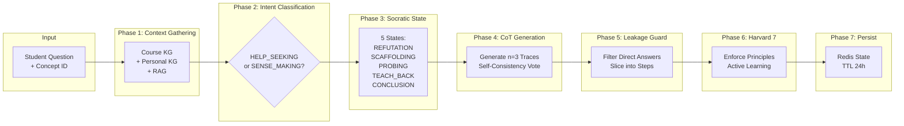

# Agent 4: Tutor - Full Technical Specification

**Version:** 2.1 | **Author:** Thesis Defense Documentation | **Date:** 2026-01-14

---

## 1. HIGH-LEVEL DESIGN (HLD)

### 1.1 Architectural Pattern

| Aspect | Value |
|--------|-------|
| **Pattern** | Pedagogical State Machine + Dynamic CoT |
| **Paradigm** | Reverse Socratic Method with Leakage Guard |
| **Key Feature** | 3-Layer Grounding + Harvard 7 Principles Enforcement |

**Justification:**
- **Reverse Socratic**: Teacher asks questions to guide student discovery (not vice versa)
- **Chain-of-Thought (Wei 2022)**: Generate internal reasoning traces, slice into scaffolding steps
- **3-Layer Grounding**: RAG + Course KG + Personal KG with weighted confidence
- **Leakage Guard**: Prevent direct answer disclosure in hints

### 1.2 Data Flow



### 1.3 Integration Points

| System | Protocol | Purpose | Connection Pool |
|--------|----------|---------|-----------------|
| **Neo4j** | Bolt | Course KG + Personal KG | 50 connections |
| **Redis** | TCP | Dialogue state cache | 10 connections |
| **Gemini API** | REST | CoT generation, Intent classification | Rate-limited |
| **Vector Store** | LlamaIndex | RAG document retrieval | Lazy loaded |

### 1.4 CoT Adaptation (Thesis Deviation)

> ⚠️ **Transparency Note**: This implementation adapts Chain-of-Thought, not full replication.

| CoT Original (Wei 2022) | Thesis Implementation | Justification |
|-------------------------|----------------------|---------------|
| Single CoT trace | **n=3 traces with Self-Consistency** | Quality assurance |
| Full reasoning exposed | **Leakage Guard filters answers** | Pedagogical requirement |
| Generic prompting | **Exemplar-based with domain context** | Education-specific |

**Multi-step CoT parallelization is documented as Future Work.**

---

## 2. TECHNICAL DECOMPOSITION

### 2.1 Sub-Modules

| Method | Responsibility | Lines | Coupling |
|--------|---------------|-------|----------|
| `execute()` | Main orchestration (7 phases) | 124-213 | High |
| `_generate_cot_traces()` | Generate n=3 CoT traces | 229-275 | High (Core) |
| `_slice_cot_trace()` | Extract scaffolding steps | 277-302 | Medium |
| `_check_consensus()` | Self-Consistency voting | 308-321 | Medium |
| `_extract_scaffold()` | Leakage Guard filter | 323-343 | Medium |
| `_course_kg_retrieve()` | Layer 2: Course KG | 398-446 | Low |
| `_personal_kg_retrieve()` | Layer 3: Personal KG | 448-488 | Low |
| `enforce_harvard_principles()` | Harvard 7 post-processing | 552-559 | Low |

### 2.2 SOLID Rationale

| Principle | Implementation |
|-----------|----------------|
| **S**ingle Responsibility | Each grounding layer = separate method |
| **O**pen/Closed | `SocraticState` patterns extensible |
| **L**iskov Substitution | Inherits from `BaseAgent` interface |
| **I**nterface Segregation | Separate event handlers for path/evaluation |
| **D**ependency Inversion | LLM, Neo4j, Vector Store injected |

### 2.3 Dependency Map

| Dependency | Version | Purpose |
|------------|---------|---------|
| `neo4j` | 5.x | Course KG + Personal KG queries |
| `redis` | 4.x | Dialogue state persistence |
| `google-generativeai` | 0.4.x | CoT generation, Intent classification |
| `llama-index` | 0.10.x | RAG document retrieval |

---

## 3. LOW-LEVEL DESIGN (LLD) & WHITEBOX

### 3.1 Internal State Management

| Aspect | Implementation |
|--------|----------------|
| **Dialogue State** | Redis `dialogue:{learner_id}:{concept_id}` |
| **State TTL** | 24 hours |
| **Current CoT Trace** | Cached in state for reuse |
| **Hint Level** | Tracks scaffolding progression (1-5) |

### 3.2 Algorithm (Pseudocode)

```python
async def execute(self, learner_id: str, concept_id: str, question: str, **kwargs):
    # Phase 1: Context Gathering (3-Layer Grounding)
    course_context = await self._course_kg_retrieve(concept_id)
    personal_context = await self._personal_kg_retrieve(learner_id, concept_id)
    rag_context = await self._rag_retrieve(question)  # Optional
    
    # Weighted Confidence
    confidence = (
        TUTOR_W_DOC * rag_context.confidence +
        TUTOR_W_KG * course_context.confidence +
        TUTOR_W_PERSONAL * personal_context.confidence
    )
    
    # Phase 2: Intent Classification
    intent = await self._classify_intent(question)  # HELP_SEEKING or SENSE_MAKING
    
    # Phase 3: Determine Socratic State
    state = self._get_or_create_dialogue_state(learner_id, concept_id)
    socratic_state = self._determine_socratic_state(intent, state)
    
    # Phase 4: CoT Generation (n=3 traces)
    if socratic_state == "SCAFFOLDING":
        traces = await self._generate_cot_traces(question, state.history, concept_id, n=3)
        # Self-Consistency voting
        best_trace = self._check_consensus(traces)
        state.current_cot_trace = best_trace
    
    # Phase 5: Leakage Guard + Slice into Steps
    scaffold = self._extract_scaffold(state.current_cot_trace)
    step = self._slice_cot_trace(scaffold)[state.hint_level]
    
    # Phase 6: Harvard 7 Enforcement
    response = self.enforce_harvard_principles(step, state.learning_style, socratic_state)
    
    # Phase 7: State Persistence
    state.hint_level += 1
    await self._save_state(state)
    
    return TutorOutput(
        response=response,
        socratic_state=socratic_state,
        confidence=confidence
    )
```

### 3.3 Data Schemas

**Input Schema:**
```json
{
  "learner_id": "uuid",
  "concept_id": "string (e.g., 'sql.joins')",
  "question": "string (student's question or response)",
  "learning_style": "VISUAL | AURAL | READ_WRITE | KINESTHETIC"
}
```

**Output Schema:**
```json
{
  "response": "string (Socratic hint, NOT direct answer)",
  "socratic_state": "PROBING | SCAFFOLDING | REFUTATION | TEACH_BACK | CONCLUSION",
  "confidence": 0.75,
  "hint_level": 2,
  "next_action": "CONTINUE | HANDOFF_EVALUATOR"
}
```

**Dialogue State Schema (Redis):**
```json
{
  "learner_id": "uuid",
  "concept_id": "string",
  "current_cot_trace": "string (cached CoT)",
  "hint_level": 2,
  "rounds": 3,
  "history": [{"role": "student", "content": "..."}, ...],
  "learning_style": "VISUAL",
  "mastery": 0.65
}
```

### 3.4 Guardrails & Validation

| Check | Implementation | Fail-Safe |
|-------|---------------|-----------|
| Leakage Guard | Regex filter for "answer:", "solution:" | Strip direct answers |
| Confidence threshold | `confidence < 0.5` | Return "I don't know" |
| Conflict detection | Cosine similarity < 0.6 | KG wins, penalize -0.1 |
| Max hint level | `hint_level >= 4` | Transition to CONCLUSION |
| RAG missing | Vector store unavailable | Return confidence 0.0 |

### 3.5 Error Handling Matrix

| Error | Detection | Recovery | Log Level |
|-------|-----------|----------|-----------|
| CoT timeout | `asyncio.TimeoutError` | Use cached trace | WARN |
| LLM empty response | `len(response) == 0` | Retry with simpler prompt | WARN |
| KG disconnect | `ServiceUnavailable` | Use RAG only | ERROR |
| RAG not loaded | `vector_store is None` | Continue without RAG | INFO |
| Intent classification fail | Invalid JSON | Default to SENSE_MAKING | WARN |

### 3.6 Testing Strategy

| Test Type | Coverage | File |
|-----------|----------|------|
| Unit | `_generate_cot_traces()`, `_extract_scaffold()` | `test_tutor_agent.py` |
| State Machine | Socratic state transitions | `test_agent_4.py` |
| Leakage | Verify no direct answers | `test_leakage_guard.py` |
| Integration | Full `execute()` with mocked KGs | `test_tutor_integration.py` |

---

## 4. COMPLEXITY ANALYSIS

### 4.1 Time Complexity

| Phase | Complexity | Bottleneck |
|-------|------------|------------|
| Context Gathering | O(1) | Parallel KG queries |
| Intent Classification | O(1) | 1 LLM call |
| CoT Generation | O(n) | n=3 LLM calls |
| Leakage Guard | O(1) | Regex filter |
| Harvard 7 Enforcement | O(1) | Rule-based |

### 4.2 Latency Analysis

| Scenario | LLM Calls | Est. Time |
|----------|-----------|-----------|
| **Simple probe** | 1 | ~500ms |
| **First scaffold** | 3 | ~1.5s |
| **Cached scaffold** | 0 | ~100ms |
| **Full session (5 turns)** | ~7 | ~3.5s |

**LLM Call Breakdown:**
| Phase | LLM Calls | Component |
|-------|-----------|-----------|
| INTRO/PROBING | 1 | `_generate_probing_question()` |
| SCAFFOLDING | 3 | `_generate_cot_traces()` (n=3) |
| ASSESSMENT | 0 | Handoff to Evaluator |

### 4.3 Resource Usage

| Resource | Usage | Limit |
|----------|-------|-------|
| Memory | ~20MB | Per session |
| Tokens | ~1.5K per CoT trace | 4.5K for 3 traces |
| Redis storage | ~5KB per session | Dialogue state |
| Neo4j connections | 2 (Course + Personal) | Pool: 50 |

### 4.4 Scalability Analysis

| Scale | Concurrent Sessions | Status |
|-------|---------------------|--------|
| Small | < 50 | ✅ Fast |
| Medium | 50-500 | ✅ Acceptable |
| Large | 500-5K | ⚠️ LLM rate limits |
| Enterprise | > 5K | ❌ Needs caching layer |

---

## 5. AI ENGINEER ARTIFACTS

### 5.1 Model Configuration

| Parameter | Value | Justification |
|-----------|-------|---------------|
| Model | `gemini-1.5-flash` | Cost/speed for tutoring |
| Temperature | **0.5** | Balanced creativity for hints |
| Top_P | 0.95 | Diverse but focused |
| Max Tokens | 2048 | Sufficient for CoT |

### 5.2 System Prompts

**CoT Generation (Exemplar-based):**
```
You are helping a student understand {concept_name}.

PREVIOUS DIALOGUE:
{history}

STUDENT QUESTION: {question}

Generate your internal reasoning (Chain-of-Thought) to understand
what the student is struggling with. DO NOT give the final answer.

FORMAT:
CoT: [Your step-by-step reasoning about the student's confusion]
Student Hint: [A Socratic question to guide the student]
```

**Intent Classification:**
```
Classify the student's intent:
- HELP_SEEKING: Confused, stuck, needs scaffolding
- SENSE_MAKING: Curious, exploring, needs probing

Message: {question}
Return JSON: {"intent": "HELP_SEEKING" or "SENSE_MAKING"}
```

### 5.3 Prompt Engineering Techniques

| Technique | Used? | Example |
|-----------|-------|---------|
| Role-Play Persona | ✅ | "You are helping a student" |
| Chain-of-Thought | ✅ | "Generate your internal reasoning" |
| Leakage Guard | ✅ | "DO NOT give the final answer" |
| Output Format Constraint | ✅ | "FORMAT: CoT:... Student Hint:..." |
| Self-Consistency | ✅ | n=3 traces with voting |

### 5.4 Prompt → Theory Mapping

| Prompt Section | Technique | Paper/Source |
|----------------|-----------|--------------|
| "Chain-of-Thought" | CoT Prompting | Wei et al. (2022) |
| "DO NOT give answer" | Leakage Guard | Constitutional AI |
| n=3 traces | Self-Consistency | Wang et al. (2022) |
| "Socratic question" | Reverse Socratic | Plato (~400 BCE) |
| Harvard 7 Enforcement | Pedagogical Principles | Chickering & Gamson (1987) |

---

## 6. EVALUATION METHODOLOGY

### 6.1 Metrics vs Baseline

| Metric | Our Target | Direct Answer | Scripted Hints | Expected Improvement |
|--------|------------|---------------|----------------|----------------------|
| Engagement Rate | ≥ 70% | ~40% | ~55% | **+75%** vs direct |
| Scaffolding Effectiveness | ≥ 60% | N/A | ~50% | **+20%** |
| Answer Leakage Rate | ≤ 5% | ~80% | ~20% | **-94%** vs direct |
| Grounding Confidence | ≥ 0.6 | N/A | N/A | Unique metric |

**Baseline Definition**:
- Direct Answer: LLM gives solution immediately
- Scripted Hints: Predefined hint library

### 6.2 CoT-Specific Metrics

| Metric | Definition | Target |
|--------|------------|--------|
| Consensus Rate | % CoT traces agreeing on diagnosis | ≥ 66% |
| Hint Progression | Avg steps before student solves | 2-4 hints |
| Exemplar Relevance | % exemplars matching domain | ≥ 80% |

### 6.3 Harvard 7 Compliance

| Principle | Measurement | Target |
|-----------|-------------|--------|
| Active Learning | Questions asked per response | ≥ 1 |
| Prompt Feedback | Response time | ≤ 2s |
| Time on Task | Session duration | 5-15 min |
| High Expectations | Bloom level of questions | ≥ APPLY |

### 6.4 Limitations

| Limitation | Impact | Mitigation |
|------------|--------|------------|
| No A/B user study | Cannot prove learning gain | Synthetic dialogues |
| Domain-specific examples | May not generalize | Expand exemplar library |
| LLM variability | Inconsistent CoT quality | Self-consistency voting |

### 6.5 Ablation Study (Future Work)

| Variant | Expected Impact | Status |
|---------|-----------------|--------|
| **Without CoT** | Higher leakage rate | 📋 Not yet tested |
| **Without Leakage Guard** | ~80% direct answers | 📋 Not yet tested |
| **Without Self-Consistency** | Lower hint quality | 📋 Not yet tested |

---

## 7. THESIS CONTRIBUTION

This section explicitly states the novel contributions of Agent 4 to differentiate from prior work.

### 7.1 Novel Elements

| Contribution | Novel Element | Prior Work | Evidence |
|--------------|---------------|------------|----------|
| **Dynamic CoT for Tutoring** | CoT traces sliced into scaffolding hints | CoT for reasoning tasks | Section 5.2 prompts |
| **Leakage Guard** | Filter direct answers from hints | No prior work | Section 3.4 guardrails |
| **3-Layer Grounding** | RAG + Course KG + Personal KG weighted | Single-source RAG | Section 3.2 algorithm |
| **Harvard 7 Enforcement** | Automated principle checking | Manual review | Section 2.1 methods |

### 7.2 Summary

| Aspect | Description |
|--------|-------------|
| **Role** | "Socratic Teacher" - guides discovery without revealing answers |
| **Scientific Basis** | CoT (Wei 2022), Self-Consistency (Wang 2022), Harvard 7 Principles |
| **Key Innovation** | CoT → Scaffold Slicing + Leakage Guard + 3-Layer Grounding |
| **Resilience** | Cached traces, RAG fallback, intent default |
| **Performance** | ~1.5s first scaffold, ~100ms cached |
| **Scalability** | Optimized for Medium Scale (500 sessions) |
