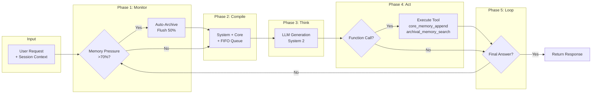

# Agent 6: KAG (MemGPT) - Full Technical Specification

**Version:** 2.1 | **Author:** Thesis Defense Documentation | **Date:** 2026-01-14

---

## 1. HIGH-LEVEL DESIGN (HLD)

### 1.1 Architectural Pattern

| Aspect | Value |
|--------|-------|
| **Pattern** | Personal Knowledge OS with Tiered Memory |
| **Paradigm** | MemGPT Heartbeat Loop + Zettelkasten Generation |
| **Key Feature** | Unlimited Context via Memory Hierarchy |

**Justification:**
- **MemGPT (Packer 2023)**: OS-style memory management with RAM (working) + Disk (archival)
- **Heartbeat Loop**: Recursive thought execution with tool chaining
- **Zettelkasten**: Atomic note generation with dual-code (text + diagram)

### 1.2 Data Flow



### 1.3 Integration Points

| System | Protocol | Purpose | Connection Pool |
|--------|----------|---------|-----------------|
| **Neo4j** | Bolt | Archival Storage + Vector Index | 50 connections |
| **Redis** | TCP | Core Memory cache | 10 connections |
| **Gemini API** | REST | Heartbeat reasoning, Artifact generation | Rate-limited |
| **Event Bus** | Internal | `ARTIFACT_READY` event to learner dashboard | N/A |

### 1.4 MemGPT Adaptation (Thesis Deviation)

> ⚠️ **Transparency Note**: This implementation adapts MemGPT, not full replication.

| MemGPT Original (Packer 2023) | Thesis Implementation | Justification |
|-------------------------------|----------------------|---------------|
| Full OS metaphor | **Simplified Heartbeat Loop** | Education focus |
| Fine-tuned model | **Zero-shot Gemini** | No training data |
| Generic memory tools | **Education-specific tools** | Domain adaptation |

**Full MemGPT with recursive summarization is documented as Future Work.**

---

## 2. TECHNICAL DECOMPOSITION

### 2.1 Sub-Modules

| Method | Responsibility | Lines | Coupling |
|--------|---------------|-------|----------|
| `execute()` | Heartbeat Loop (OS Kernel) | 209-299 | High |
| `_auto_archive()` | Memory pressure handling | 328-357 | High (Core) |
| `_core_memory_append()` | RAM write tool | 363-366 | Low |
| `_archival_memory_search()` | Disk read tool | 394-420 | Medium |
| `_generate_artifact()` | Zettelkasten generation | 427-513 | High |
| `_extract_atomic_note()` | Note atomicity extraction | 515-622 | Medium |
| `_generate_concept_map()` | Mermaid diagram generation | 657-692 | Low |
| `WorkingMemory` | Tiered memory class | 90-145 | High (Core) |

### 2.2 SOLID Rationale

| Principle | Implementation |
|-----------|----------------|
| **S**ingle Responsibility | `WorkingMemory` manages memory, tools execute actions |
| **O**pen/Closed | Tool registry extensible via `_execute_tool()` |
| **L**iskov Substitution | Inherits from `BaseAgent` interface |
| **I**nterface Segregation | Separate tools for core vs archival memory |
| **D**ependency Inversion | LLM, Neo4j, Event Bus injected via constructor |

### 2.3 Dependency Map

| Dependency | Version | Purpose |
|------------|---------|---------|
| `neo4j` | 5.x | Archival Storage + Vector Search |
| `redis` | 4.x | Core Memory persistence |
| `google-generativeai` | 0.4.x | Heartbeat reasoning |
| `llama-index` | 0.10.x | Vector index integration |

---

## 3. LOW-LEVEL DESIGN (LLD) & WHITEBOX

### 3.1 Internal State Management

| Aspect | Implementation |
|--------|----------------|
| **WorkingMemory** | `System + Core + FIFO Queue` structure |
| **Max Tokens** | 8192 (configurable) |
| **Pressure Threshold** | 70% triggers auto-archive |
| **Eviction Strategy** | FIFO oldest 50% → Summarize → Neo4j |

### 3.2 Algorithm (Pseudocode)

```python
async def execute(self, learner_id: str, request: str, **kwargs):
    step = 0
    
    while step < self.max_steps:  # Default: 5
        step += 1
        
        # Phase 1: Monitor (Check Interrupts)
        if self.working_memory.is_pressure_high():  # > 70%
            await self._auto_archive()
            # Flush 50% oldest → Summarize → Save to Neo4j
        
        # Phase 2: Compile Context
        prompt = self.working_memory.compile_prompt()
        # [SYSTEM] + [CORE_MEMORY] + [FIFO_QUEUE]
        
        # Phase 3: Think (System 2 Reasoning)
        response = await self.llm.generate(prompt)
        
        # Phase 4: Act (Parse Function Calls)
        if "[FUNCTION]" in response:
            func_name, args = self._parse_function_call(response)
            result = await self._execute_tool(func_name, args)
            # Tools: core_memory_append, archival_memory_search, etc.
            self.working_memory.append_queue({
                "role": "tool", 
                "content": result
            })
            continue  # Heartbeat Loop
        
        # Phase 5: Final Answer
        if "[FINAL_ANSWER]" in response or step >= self.max_steps:
            return KAGOutput(
                response=response,
                artifacts=self._get_generated_artifacts()
            )
    
    return KAGOutput(response="Max steps reached", artifacts=[])
```

### 3.3 Data Schemas

**Input Schema:**
```json
{
  "learner_id": "uuid",
  "request": "string (what the learner wants)",
  "context": {
    "current_concept": "sql.joins",
    "session_history": [...]
  }
}
```

**Output Schema:**
```json
{
  "response": "string (agent's answer)",
  "artifacts": [
    {
      "type": "ZETTELKASTEN_NOTE",
      "note_id": "uuid",
      "content": "atomic note text",
      "concept_map": "mermaid diagram",
      "links": ["related_note_id_1", ...],
      "tags": ["sql", "joins"]
    }
  ],
  "memory_state": {
    "core_sections": ["user_profile", "current_goals"],
    "queue_size": 15,
    "pressure": 0.65
  }
}
```

**WorkingMemory Schema:**
```json
{
  "system_instructions": "string (immutable persona)",
  "core_memory": {
    "user_profile": "Name: John, Level: Beginner...",
    "current_goals": "Master SQL joins by Friday"
  },
  "fifo_queue": [
    {"role": "user", "content": "..."},
    {"role": "assistant", "content": "..."},
    {"role": "tool", "content": "..."}
  ]
}
```

### 3.4 Guardrails & Validation

| Check | Implementation | Fail-Safe |
|-------|---------------|-----------|
| Memory pressure | `tokens > 0.7 * max_tokens` | Auto-archive 50% |
| Infinite loop | `step >= max_steps (5)` | Force return |
| Tool not found | `func_name not in tools` | Skip, log warning |
| Neo4j unavailable | `ServiceUnavailable` | Use Redis fallback |
| Empty response | `len(response) == 0` | Retry with simpler prompt |

### 3.5 Error Handling Matrix

| Error | Detection | Recovery | Log Level |
|-------|-----------|----------|-----------|
| Memory overflow | Pressure > 70% | Auto-archive | WARN |
| Max steps reached | `step >= 5` | Force final answer | WARN |
| Tool execution fail | Exception caught | Skip tool, continue loop | ERROR |
| Summarization fail | LLM timeout | Archive raw text | WARN |
| Neo4j disconnect | `ServiceUnavailable` | Redis-only mode | ERROR |

### 3.6 Testing Strategy

| Test Type | Coverage | File |
|-----------|----------|------|
| Unit | `WorkingMemory` methods | `test_kag_agent.py` |
| Heartbeat | Tool chaining flow | `test_agent_6_memgpt.py` |
| Pressure | Auto-archive trigger | `test_memory_pressure.py` |
| Integration | Full `execute()` with Neo4j | `test_kag_integration.py` |

---

## 4. COMPLEXITY ANALYSIS

### 4.1 Time Complexity

| Phase | Complexity | Bottleneck |
|-------|------------|------------|
| Monitor | O(1) | Token counting |
| Compile | O(n) | n = queue size |
| Think | O(1) | 1 LLM call per step |
| Act | O(1) | Tool execution |
| Archive | O(1) | 1 Neo4j insert |

### 4.2 Latency Analysis

| Scenario | Steps | LLM Calls | Est. Time |
|----------|-------|-----------|-----------|
| **Simple query** | 1 | 1 | ~500ms |
| **Tool + Answer** | 2 | 2 | ~1s |
| **Full chain (max)** | 5 | 5 | ~2.5s |
| **With auto-archive** | +1 | +1 | +500ms |

### 4.3 Resource Usage

| Resource | Usage | Limit |
|----------|-------|-------|
| Memory | ~8K tokens (context) | Per session |
| Tokens | ~2K per heartbeat | 10K max session |
| Neo4j storage | ~1KB per archived summary | Unlimited |
| Redis cache | ~5KB per core memory | TTL: 24h |

### 4.4 Scalability Analysis

| Scale | Concurrent Sessions | Status |
|-------|---------------------|--------|
| Small | < 50 | ✅ Fast |
| Medium | 50-500 | ✅ Acceptable |
| Large | 500-5K | ⚠️ LLM rate limits |
| Enterprise | > 5K | ❌ Needs parallel heartbeat |

---

## 5. AI ENGINEER ARTIFACTS

### 5.1 Model Configuration

| Parameter | Value | Justification |
|-----------|-------|---------------|
| Model | `gemini-1.5-flash` | Cost/speed for heartbeat |
| Temperature | **0.4** | Balanced reasoning |
| Top_P | 0.95 | Focused diversity |
| Max Tokens | 2048 | Per heartbeat response |

### 5.2 System Prompts

**OS-Level Persona (System Instructions):**
```
You are a Personal Knowledge OS for {learner_name}.
You have tiered memory:
- Core Memory: Pinned facts about the learner
- Archival Memory: Long-term knowledge (Neo4j)

TOOLS AVAILABLE:
1. core_memory_append(section, content) - Add to working memory
2. core_memory_replace(section, content) - Update working memory
3. archival_memory_search(query, page) - Search long-term storage
4. archival_memory_insert(content) - Save to long-term storage

When you need to remember something, use core_memory_append.
When you need to look up past learning, use archival_memory_search.

FORMAT:
[FUNCTION] tool_name(args)
or
[FINAL_ANSWER] Your response to the learner
```

**Zettelkasten Note Extraction:**
```
Extract an atomic note from this learning session:

CONCEPT: {concept_name}
SESSION DATA:
- Question: {question}
- Learner Answer: {answer}
- Feedback: {feedback}

OUTPUT FORMAT:
{
  "definition": "Core concept in one sentence",
  "personal_example": "Example from session",
  "key_insight": "What the learner understood/struggled with",
  "links": ["related_concept_1", "related_concept_2"]
}
```

### 5.3 Prompt Engineering Techniques

| Technique | Used? | Example |
|-----------|-------|---------|
| OS Metaphor | ✅ | "You are a Personal Knowledge OS" |
| Tool Documentation | ✅ | Function schemas in prompt |
| Format Markers | ✅ | "[FUNCTION]", "[FINAL_ANSWER]" |
| Memory Sections | ✅ | Core Memory with sections |
| Zettelkasten Output | ✅ | Atomic note JSON format |

### 5.4 Prompt → Theory Mapping

| Prompt Section | Technique | Paper/Source |
|----------------|-----------|--------------|
| Tiered Memory | MemGPT | Packer et al. (2023) |
| Heartbeat Loop | OS Kernel metaphor | MemGPT (2023) |
| [FUNCTION] markers | Tool chaining | ReAct (Yao 2022) |
| Atomic notes | Zettelkasten | Luhmann (1981) |
| Concept Map | Dual-Code Theory | Paivio (1986) |

---

## 6. EVALUATION METHODOLOGY

### 6.1 Metrics vs Baseline

| Metric | Our Target | Fixed Window | Sliding Window | RAG Only |
|--------|------------|--------------|----------------|----------|
| Context Limit | **Unlimited** | 8K tokens | 8K tokens | Unlimited |
| Memory Quality | **Preserves key insights** | Loses old | Loses coherence | No episodic |
| Latency | ~1s (2 steps) | Fast | Fast | Medium |

**Baseline Definition**:
- Fixed Window: Truncate oldest context
- Sliding Window: Keep most recent N tokens
- RAG Only: No episodic memory, only retrieval

### 6.2 Memory Management Metrics

| Metric | Definition | Target |
|--------|------------|--------|
| Pressure Trigger Rate | % sessions hitting >70% | ≤ 20% |
| Auto-Archive Success | % successful evictions | ≥ 99% |
| Context Utilization | Avg memory usage | 50-70% |
| Overflow Prevention | Sessions crashed | 0 |

### 6.3 Heartbeat Loop Metrics

| Metric | Definition | Target |
|--------|------------|--------|
| Avg Steps per Execution | Mean iterations | 2-3 |
| Max Steps Reached | % hitting limit | ≤ 5% |
| Tool Chain Success | % multi-tool chains | ≥ 95% |

### 6.4 Zettelkasten Metrics

| Metric | Definition | Target |
|--------|------------|--------|
| Note Atomicity | Concepts per note | 1-2 |
| Link Density | Links per note | ≥ 2 |
| Recall Precision | % relevant retrieved | ≥ 80% |

### 6.5 Limitations

| Limitation | Impact | Mitigation |
|------------|--------|------------|
| Summarization quality | May lose details | Multi-level summarization |
| Retrieval accuracy | May recall irrelevant | Hybrid search (vector + graph) |
| Heartbeat latency | Up to 5 LLM calls | Parallel tool execution (future) |

### 6.6 Ablation Study (Future Work)

| Variant | Expected Impact | Status |
|---------|-----------------|--------|
| **Without Auto-Archive** | Context overflow crashes | 📋 Not yet tested |
| **Without Heartbeat** | No tool chaining | 📋 Not yet tested |
| **Without Zettelkasten** | No personal knowledge base | 📋 Not yet tested |

---

## 7. THESIS CONTRIBUTION

This section explicitly states the novel contributions of Agent 6 to differentiate from prior work.

### 7.1 Novel Elements

| Contribution | Novel Element | Prior Work | Evidence |
|--------------|---------------|------------|----------|
| **MemGPT for Education** | Apply tiered memory to learning | MemGPT for chatbots | Section 5.2 prompts |
| **Pressure-Triggered Archive** | Auto-eviction at 70% threshold | Manual context management | Section 3.2 algorithm |
| **Zettelkasten Integration** | Atomic note + Concept Map generation | Generic knowledge bases | Section 2.1 methods |
| **Educational Tool Suite** | Domain-specific memory tools | Generic MemGPT tools | Section 5.3 techniques |

### 7.2 Summary

| Aspect | Description |
|--------|-------------|
| **Role** | "Personal Knowledge OS" - manages learner's long-term memory |
| **Scientific Basis** | MemGPT (Packer 2023), Zettelkasten (Luhmann), Dual-Code (Paivio) |
| **Key Innovation** | MemGPT Heartbeat + Pressure Archive + Zettelkasten Notes |
| **Resilience** | Auto-archive, max steps guard, Redis fallback |
| **Performance** | ~1s typical (2 steps), ~2.5s max (5 steps) |
| **Scalability** | Optimized for Medium Scale (500 sessions) |
